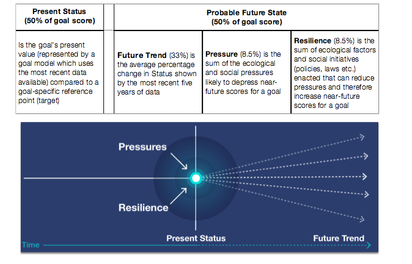

# How is the Index calculated?

Total Index is the weighted average of individual goal scores. Each goal measures the delivery of specific benefits with respect to a sustainable target. A goal is given a score of 100 if its maximum sustainable benefits are gained in ways that do not compromise the ocean’s ability to deliver those benefits in the future.  Lower scores indicate that more benefits could be gained or that current methods are harming the delivery of future benefits. Each goal score has two major components: **current status** and **likely future state**. 

The **current status** is determined by comparing the most recent measure of the goal against a goal-specific sustainable [**Reference Point**](/learn/#reference-points). It represents half of a goal’s total score.  

The other half is the **likely future state**, which is current status modified by the trend, pressures, and resilience: 

* **Trend**: the average rate of change in status during the most recent years. As such, the trend calculation is not trying to predict (or model) the future, but only indicates the likely condition (sustainability) based on a linear relationship. 

* **Pressures**: social and ecological elements that negatively affect the status of a goal

* **Resilience**: social and ecological elements (or actions) that can and reduce pressures, and maintain or raise future benefits (e.g. treaties, laws, enforcement, habitat protection)

 <!---Will edit this figure.--->

**Pressures and resilience** are important for scores, although they have a smaller contribution to the overall scores because we can only approximate their effects. Individual pressures are ranked (weighted) according to their importance to different goals based on scientific literature and expert opinion. From a management intervention perspective, resilience actions are the best way to improve a score, because they can reduce pressures, protect ocean habitats and species, improve status, and optimize benefits to people.

Status, trend, likely future status, pressures, and resilience are called ‘dimensions’ within the Ocean Health Index framework.

**In the figure below**, likely future state (in yellow) is the result of the current status modified by trend, minus the negative effect of pressures (grey), plus the positive effect of resilience (salmon pink).

