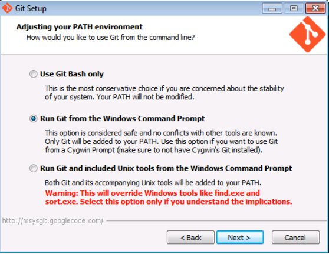
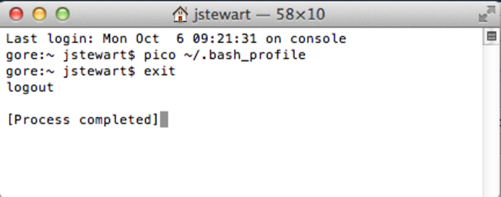

# Setting up Github and RStudio

In this section, you will learn how to successfully set up your _tailored_ toolbox by following these step-by-step instructions:

1. Create your online _Github_ account and set up _git_ on your local computer
2. Install _R_ and _RStudio_ on your local computer
3. Clone your tailored repository from Github to your local computer via RStudio
4. Install `ohi-core` package

Let's get started!

## Set up a Github Account and git

<!-- GitHub has an online interface and a desktop application for the version-control software called ** git**, where your project repository and any changes done to it are kept and recorded. All changes within your local, desktop repository will be tracked by GitHub regardless of the software you use to make the changes, and saved shared via its online interface. This means that you can delete or paste files in the Mac Finder or Windows Explorer and edit *.csv* files in Excel or a text editor, and still sync these changes with the online repository. To do so, you will need to create a GitHub account online and install git, R, and RStudio on your local computer. All are freely available. -->

You can create a GitHub account at http://github.com. Choose a username and password. You will use this username and password when you install and set up *git* on your computer.

### Install *git* software

**git** is available for download at [https://git-scm.com/downloads](https://git-scm.com/downloads). How you install *git* will depend on whether you are working on a Windows or Mac computer. It will also depend on your operating system version. If you have problems following these instructions, it is likely because your operating system requires a previous version of *git*. Previous versions are available from http://www.wandisco.com/git/download (you will need to provide your email address).

**For Windows:**

* Download *git* at http://git-scm.com/downloads and follow the install instructions.

* When running the Windows installer, use all default options except "Adjusting your PATH environment": instead, select "_**Run Git from the Windows Command Prompt**_". This will allow later compatibility with RStudio.  

  > 

**For Mac:**

* Download *git* at http://git-scm.com/downloads and follow the install instructions.
* Apple's [Xcode](https://developer.apple.com/xcode/) has a command line tools option during install which can override the preferred *git* command line tools. To ensure you are using the latest preferred version of *git*, you will need to launch  Terminal and type the following few lines of code:
* Access Terminal from the Applications folder: **Applications > Utilities > Terminal**. When you launch Terminal a window will appear with your computer’s name followed by a `$`. When you type, your commands will appear after the `$`.

Add access your 'bash profile' by typing:

```
pico ~/.bash_profile
```

You are now able to edit your ‘bash profile’ and your screen will change; it will look like this:

> 

Now type:

```
export PATH=/usr/local/git/bin:$PATH
```

Exit pico by entering:

> control-X  
y  
return/enter


Exit Terminal by typing:

```
exit
```

Finally, quit Terminal.




### Set up your Git Identity

After downloading and installing *git*, you will need to set up your **Git Identity**, which identifies you with your work. *Note*: if you have any problems with the following instructions, it is likely because of incompatibility between the version of your operating system and the version of git you downloaded in the previous section. In this case, find and download a compatible version at [www.wandisco.com/git/download](www.wandisco.com/git/download) and then follow the instructions below.

You will set up your GitHub identity using the command line specific to Windows or Mac:

* **Windows**: Start > Run > cmd
* **Mac**: Applications > Utilities > Terminal

In the window, you will see a cursor where you are able to type. Type the following and press return (or enter) at each step. Make sure all spaces and symbols are identical to the example below, including all spaces ( ) and dashes (-).

Substitute your GitHub username instead of jdoe:
```
git config --global user.name jdoe
```
and then: substitute the email address you used to create your GitHub account:
```
git config --global user.email johndoe@example.com
```

You can check settings with the following:

```
git config --list
```

Quit the Terminal after typing:
```
exit
```

<!-- ### Install the GitHub application

There are several options to clone your repository to your local machine. When getting started, we recommend using the GitHub application. This is freely available for download. Follow the default instructions for downloading and installing from the following:

* **Windows**: https://windows.github.com/.

* **Mac**: https://mac.github.com/. -->

### Create a folder called *github* on your computer

Because you will use GitHub to collaborate with your team or request support from the OHI team, it is important you save files in places where the file path that is universal and not specific to your computer. When team members save files in different places, this will create a lot of problems when collaborating, particularly between Macs and Windows machines.

**Please create a folder called github in your root directory**. The file path for this folder will be:

* **Windows**: `Users\[User]\Documents\github\`
* **Mac**: `Users/[User]/github/`

This folder can be identified by any computer as `~/github/`.  

> TIP: You can check the location of your `github` folder by right-clicking the folder icon and selecting 'Get Info' on a Mac or 'Properties' on Windows.


### Update permissions

You need to **email your username to ohi-science@nceas.ucsb.edu** for permission to upload modifications to your GitHub repository (you only need to do this once). Only team members who will be modifying files will need to do this; all other members can view online and download the repository without these permissions.  


## Download R and RStudio

You can download R, and RStudio for free from their perspective websites and install the latest versions allowed by your operating system on your computer:

**R**: [http://cran.r-project.org/](http://cran.r-project.org/)

**RStudio**: [https://www.rstudio.com/](https://www.rstudio.com/)

**R and RStudio update frequently**. If you already have those softwares installed, check on the websites for the most recent version. In general, it's good practice to check periodically for updates. When you run into unexplained errors while modifying contents in RStudio, check first if your versions of R or Rstudio are out-of-date. For R, you can see what you already have on your computer by typing "sessionInfo( )" into your R console.

**If you are working on a _Mac_,** you will need to tell RStudio to use the proper version of Git by doing the updating the preferences for 'Git executable':

**RStudio > Preferences... > Git/SVN > Git executable: /usr/local/git/bin/git**

> TIP: if you are working on a Mac, the git file is hidden. To find it easily, hold *shift+command+g* and paste /usr/local/git/bin/git in the pop-up window. Select git (which should be already preselected) and select Open, then Ok.

## Cloning a repository to your local computer

In order to sync GitHub and RStudio, you need to clone your GitHub repository to RStudio. Here is a guide on how to do so:


## Install `ohicore`

`ohicore` is a R package containing all the essential functions you will use to calculate the final OHI scores. You will install `ohicore` as you would other R pckages and will only need to do this once. You can find the script `install_ohicore.r` in your scenario folder (eg. chn/province2015/). Source it, and now your Toolbox is all set up and ready to go!

> Although `ohicore` is a package you would not normally interact with, it can be useful to have the folder cloned to your computer for debugging, particularly with pressures and resilience calculations for goals that have components in the matrix. To do so, you will clone the repository (https://github.com/OHI-Science/ohicore) as you would your assessment repository.
