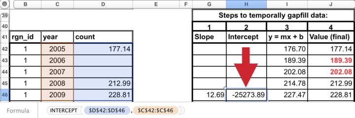
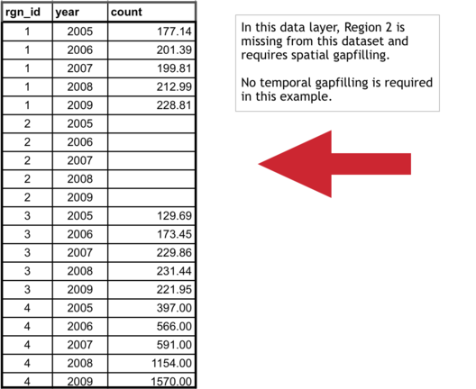
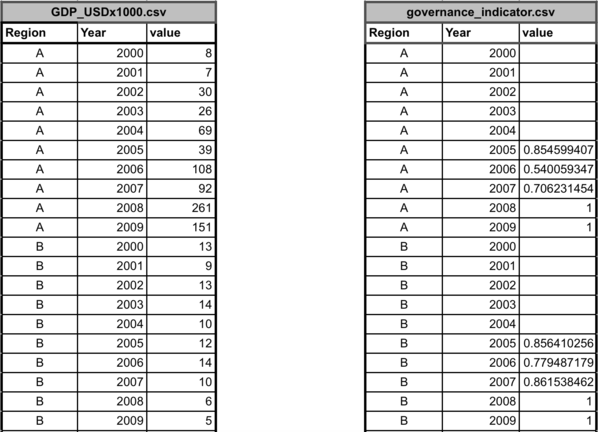
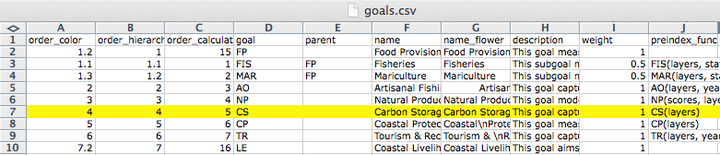
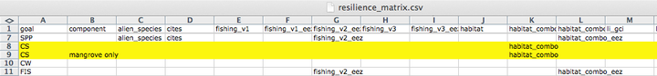

---
output: html_document
---

**Welcome to the _Conduct Phase_ of your OHI+ assessment!** This manual contains all the essential information on how to complete your own independent OHI assessment. It should be used by _goal keepers_ (ie. experts tasked with gathering data and developing goal models), and the _toolbox master_ (ie. technical expert(s) responsible for calculating the scores using the Toolbox).  

**The first four sections will provide conceptual and technical guidance for all participants**. It contains information on OHI philosophy, what to expect when conducting an OHI+ assessment, best practices, and an introduction to the toolbox. More details on Goal Model Development and Pressure and Resilience, How to report data layers and model descriptions, and Frequently Asked Questions are included in the Appendixes. **The remaining sections of the manual provide step-by-step instructions on how to use the toolbox and troubleshoot**, and will be most helpful to the toolbox master. 

This manual should be used in conjuction with our other web materials, including [Four Phases of OHI+](http://ohi-science.org/new-site/phases/), [Presentations](http://ohi-science.org/new-site/resources/downloads/), and our community [Forum](http://ohi-science.org/new-site/forum/). 

<font size = "2">

_**Citation**_: Ocean Health Index. 2016. Ocean Health Index Assessment Manual. National Center for Ecological Analysis and Synthesis, University of California, Santa Barbara. _Available at: ohi-science.org/manual_

_**Download PDF version**_: https://github.com/OHI-Science/ohi-science.github.io/raw/dev/assets/downloads/other/ohi-manual.pdf 

_NOTE: If you are conducting an OHI+ assessment and/or have downloaded the OHI repository prior to 2016, please cite:_

Ocean Health Index. 2015. Ocean Health Index Toolbox Manual [date]. National Center for Ecological Analysis and Synthesis, University of California, Santa Barbara. Available at: https://github.com/OHI-Science/ohi-science.github.io/raw/master/assets/downloads/other/ohi-manual-2015.pdf

</font>

# Introduction

## Where you are in the OHI+ process

The OHI+ process consists of four phases. In the first phase, you **learned** about the OHI to understand the philosophy behind the goals and the motivation for conducting a study. In the second phase, you actively **planned** to conduct your OHI+ assessment. Now you will actively **conduct** the assessment by engaging with the work of finding the data, preparing the goal models, and taking the necessary steps to learn how to use the **OHI Toolbox** and related software to produce the final results. This is where the science of data discovery and goal model development comes in. In the final phase, you will **communicate** the findings and results of your assessment with others.


**The OHI framework** allows you to synthesize the information and priorities relevant to your local context and produce comparable scores. Because the methods of the framework are repeatable, transparent, quantitative, and goal-driven, the process of a carrying out an OHI+ assessment is as valuable as the final results.

The first completed assessment for a study area is valuable because it establishes a baseline and highlights the state of information quality and availability in an area. Any subsequent assessments carried out through time are also valuable because they can be used to track and monitor changes in ocean health. Your assessment will require careful thought and consideration along the way, and we encourage documentation and scripting to be done within the OHI Toolbox to facilitate collaboration and transparency, as well as the reproducibility for future assessments.

Each OHI+ assessment should have a clear purpose. One of the typical reasons for conducting an independent assessment is to inform policy and management decisions. Assessments can be more relevant to management when they are conducted at the spatial scales at which policy decisions are made, such as states, provinces, or counties. The **regions** and the overall **study area** are definitions that will be used throughout the assessment. The study area is the entire spatial boundary of your assessment, while the regions are the smaller subdivisions within the study area. In the OHI framework, goal scores are calculated for regions separately and then combined to produce an overall OHI score for each study area. The number of regions varies with each assessment's study area; completed assessments have had between one and 221 regions.

<!---add calculation fig--->

> The process of conducting an OHI+ assessment is as valuable as the final results. Documenting decisions made, as well as the challenges and successes encountered along the way, can lead to better understanding of the system, help inform management decisions, and guide future assessments to track changes through time.


When conducting an OHI+ assessment, it is important to include information that best represents your study area, and to make science-driven decisions and clearly document what was done and why. Your team should as creative and insightful as you can be while working within the bounds of informational and technical limitations.

There are **key processes and considerations** that will be a part of every assessment. Every assessment should ideally build from the lessons learned of previously completed assessments and identify what local characteristics need to be included in a study. This is done partly by comparing the local situation to situations in previous assessments; it is also done by comparing the default information provided in the WebApp to what is known about local realities. After you have outlined and identified local characteristics and priorities, you should prepare to develop models, set reference points, gather information, and use the Toolbox software to analyze data and calculate scores. You will also visualize the outputs in the WebApp's maps and flower plots that can be shared with other partners and collaborators. Above all, you should be prepared to **know that this process takes time and is iterative, meaning that you often return to previous steps**.

**How long does an assessment take?** Past assessments have taken between two and three years, with the time varying depending the size and composition of the team, the challenges encountered in discovering and gathering information, and how many models are redeveloped. The amount of data processing and goal model development needed before you will be able to use the Toolbox also affects the amount of time it takes to conduct the assessment. The skill sets of the team members and the amount of technical resources available are also hugely important factors. You should think about which team members are needed at what stage of the process, including an R programmer and a spatial analyst. It will take time for the technical team to become familiar with the OHI Toolbox and GitHub.


<!-- The OHI framework was developed through collaboration and iteration. Your assessment can leverage the collective knowledge and insight used in the methods of the global assessment by Halpern *et al*. in *Nature* (2012) as well as the subsequent assessments conducted annually (in 2013, 2014, and ongoing). Each annual global assessment has improved upon some of the goal models based on better data availability or a better understanding of the systems involved. Several smaller-scale assessments have been completed that are highly informative as well, and particularly for regional scale assessments. The following studies have been published with supplemental online materials, and are available at http://ohi-science.org: -->

<!--
* **Global**
  - Halpern et al. (2012) An index to assess the health and benefits of the global ocean. *Nature*.
  - Halpern et al. (2015) Patterns and emerging trends in global ocean health. *PLoS ONE*.
* **Brazil**
  - Elfes et al. (2014) A regional-scale Ocean Health Index for Brazil. *PLoS ONE*.
* **United States West Coast**
  - Halpern et al. (2014) Assessing the health of the U.S. West Coast with a regional-scale application of the Ocean Health Index. *PLoS ONE*.
* **Fiji**
  - Selig et al. (2015) Measuring indicators of ocean health for an island nation: The Ocean Health Index for Fiji. *Ecosystem Services*

Additionally, several OHI+ assessments have been completed. As information becomes available about those assessments they will be posted on http://ohi-science.org.

> TIP: The OHI+ development team is prepared to provide guidance for assessments.  -->

## Best practices for OHI assessments  

Conducting an assessment requires both an understanding of how past assessments have been completed and the innovation to capture important characteristics of your study area using the information available. You can start by understanding the structure of completed assessments at global and smaller scales and the models that were created. Understanding the approaches in different contexts will help you think about what should be done similarly and differently in your local context. Information, publications, and websites for completed OHI+ assessments are listed on the projects page of ohi-science.org, and example approaches for each goal are listed in Appendix 1 of the manual.

<!-- Navigating through the WebApp can help frame your thinking and introduce you to the structure of inputs that will be required for the OHI Toolbox software. -->


### Incorporate core values and characteristics into the OHI assessment framework before gathering information

**Begin your assessment by identifying local socio-cultural-economic characteristics and priorities related to ocean health, and how they would ideally be captured with the existing or modified OHI framework**. This means understanding the rationale behind the components of the OHI framework and identifying what must be added or removed or redefined to ensure that it best represents the local context. Are all goals relevant to your study area? What should be added, removed, or redefined? In this process it is important to identify not only characteristics that could be included in goal models, but also the important stressors (pressures) and resilience elements within the study area. What are the key issues that should be included for your assessment to be credible, useful, and meaningful? How do people typically relate to the ocean in your area in terms of social and cultural patterns? These are the kinds of questions you should consider prior to assembling the available information.

The OHI framework should guide your assessment, but you should not be constrained by it. If a goal is not relevant, it should be removed. If there are elements important to your study area that are not present within the existing framework, how could they be included? Having a clear picture of how the framework should be restructured and what the assessment should include is very important before moving on to assemble information, because otherwise the assessment could be biased by what information is available instead of what is important to include. When specific information is limited there are ways to capture them with indirect measures.

### Maintain core values and characteristics within the assessment framework regardless of limited information quality

The assessment framework can be implemented using the best freely-available existing information, even if the information available is ‘limited’ or not ‘ideal’. ‘Limited’ information may be of low quality, have gaps, or be indirectly obtained through modeling instead of being directly measured. Different methods can be used to work with limited data, such as gap filling, incorporating indirect (proxy) or place-holder information, or using intermediate models.

**Remaining true to the conceptual framework by using those methods, hence developing less-than-ideal goal models, provides a fuller picture than redesigning it to only include characteristics where ideal information is available.** This is because all key characteristics in the system should be represented somehow in a comprehensive assessment, even if assumptions must be made to compensate for missing information. If these methods, including assumptions and rationales, are clearly considered and explained, completed assessments will not only provide the best possible picture of the current system but will also identify information gaps and highlight areas for improvement. Such scrutiny of available knowledge could be lost if important elements were simply excluded from the assessment due to imperfect representation.

### Strategically define spatial boundaries balance information availability and decision-making scales

Identifying the spatial boundaries of the Regions within the Assessment Area is extremely important because OHI scores are calculated for each unique Region, and the boundaries will be used to aggregate or disaggregate input information reported at different spatial
scales. Spatial boundaries should be defined with geographic information system (GIS) mapping software, ideally per management jurisdiction (see _Defining spatial boundaries_ section for technical guidance). **Jurisdictional boundaries are optimal because it is often at these scales where management and policy decisions are made, cultural priorities and management targets are identified, and information is collected in standardized and therefore comparable ways**.

Within the OHI framework, there is no limit to the number of Regions that can exist within the Assessment Area; the number is only constrained by data availability and the utility of having scores calculated for a particular Region. Although it is possible to assess only one region in the study area (i.e. the region is the assessment area), this might not be ideal because it eliminates the possibility of making comparisons or identifying geographic priorities within the study area.

<!-- ### Assemble input information

There are many decisions to be made when searching for and gathering data, and searches should extend beyond any one expertise, discipline, source, or data-type. This is because your data will come from disparate sources, and you will have to engage experts to help identifying good proxies and indicators, deciding reference points, and developing goal models. OHI+ assessments should incorporate higher-resolution information where possible for goal status models and pressures and resilience measures. The process of discovering and gathering so many different kinds of data and indicators is an important step that you will return to as you continue to conduct the assessment. This is where having a collaborative team that can work across disciplines will be key. -->


### Carefully document and share all decisions in writing and computational code

Documentation of all aspects of an assessment process is paramount to ensuring transparency of the decisions made, reproducibility and interpretation of results, repeatability to facilitate and compare future assessments, and the ease of communication throughout the process.

<!-- It is important to plan for future assessments, as repeated assessments enable you to compare and track how scores have changed over time, with the aim of ultimately informing policy to improve ocean health. Assessment methods thus should be repeatable one location through time, using the same methods and reference points, but incorporating updated data. Your methods should also be reproducible in different locations.  -->

Detailed information about how the assessment is conducted will enhance its credibility and reproducibility. Decisions of why information was included and why models were developed in a certain manner are of great importance so that future assessments can incorporate the same logic and understanding of the system — or make improvements. Further, the type of workflow developed and software used to organize and process information will greatly affect the efficiency, transparency, and reproducibility of subsequent assessments. Providing public access to all such information, as well as input data and computational code is becoming the standard for scientific inquiry, so every effort should be made to achieve those aims.

**This means documenting and sharing not only the tools and methods used but also the knowledge gained through the process based on decisions made, what was decided against (e.g. why information was included or excluded, and how it was processed), challenges encountered, and recommendations for improvement**. Frank documentation about the successes and shortcomings makes for greater scientific credibility, enables others to replicate what was done, and allows for the most appropriate interpretations of the results, as well as the highest potential for future improvement of assessment approaches, and ultimately, management towards ocean health.

## The Toolbox software and WebApp

The **OHI Toolbox** is the main software used for organizing and processing information, documenting decisions made, calculating scores, and visualizing results. It was created to facilitate score calculations as well as the organization of information and transparency of the approach. The Toolbox is built with open-source software, meaning that it is freely available for you to use and can be modified to meet your needs. You will access the software from online and will use several free software tools to conduct your assessment in a collaborative, transparent, and reproducible manner.

The Toolbox software should be used when your team has gathered the information necessary for the goal models you have developed. The steps of carefully preparing and gathering data layers, indicators, and developing goal models can be done independently of the actual software use; however, if done within the Toolbox structure these steps will be traceable and collaborative. But of course the assessment can be done without all members of your team becoming familiar with the technical aspects of the Toolbox.

Accompanying the OHI Toolbox is the **OHI+ WebApp**, which is a visualization tool that displays input information and calculated scores in several ways, including interactive maps and flower plots. Most coastal countries have a WebApp that was created to facilitate planning and communication during assessments. The WebApp visually presents inputs, goal models and calculated scores for each defined region through interactive maps, histograms, and tables. All inputs presented in a country's WebApps were extracted for each country from global assessments, and scores were calculated using goal models from global assessments.

The WebApp is a widely useful communication tool. Not all team collaborators may be involved with the technical aspects of the Toolbox, but the WebApp enables everyone to explore inputs and calculated scores.

## Outcomes of conducting an assessment

Your completed assessment will produce OHI scores for each goal for every region in your study area, and scores within the assessment can be compared with each other. These scores will not be quantitatively comparable to those of other OHI assessments because they differ in the underlying inputs, goal models, and reference points. The only *quantitative* comparisons can be made within an assessment's study area, whether between regions or through time. However, *qualitative* comparisons between different OHI assessments can be  made because the scores are an indication of how far a region is to achieving its own targets. For instance, if two study areas have scores of seventy and sixty-five, it should be interpreted that the first study area is closer to its management targets than the second is, but since these management targets are different (in addition to the underlying data and models), they cannot be quantitatively compared.

>While the OHI scores are valuable information, **the process of conducting an OHI assessment can be as valuable as the final results.** This is because during an OHI assessment you will bring together meaningful ocean health information from many disciplines. In doing so, you will have a census of existing information and will also identify knowledge and data gaps. Further, conducting an OHI+ assessment can engage many different groups, including research institutions, government agencies, policy groups, non-governmental organizations, and both the civil and private sectors.

# Defining spatial boundaries

Boundary definitions should match the purpose of the assessment and be informed by the scale at which information is available. The boundaries displayed in your WebApp are provided by default using subcountry region definitions from Global Administrative Areas (GADM: www.gadm.org).
It is possible to redefine the spatial boundaries for your study area and regions.

> Note that the OHI does not take a stance on disputed territories. The boundaries are defined by the original map data providers.

## Drawing spatial boundaries

**Spatial boundaries must be drawn with geographic information system (GIS) mapping software** such as ArcGIS, QGIS, or GRASS. You will need someone with GIS skills to create a **shapefile** that will be used by the Toolbox to display your information. The shapefile will also be used to extract information for each of your defined regions when data are reported in raster format for a different area. For more information see https://en.wikipedia.org/wiki/Geographic_information_system and  http://en.wikipedia.org/wiki/Shapefile.

Regions must be unique (non-overlapping), and boundaries must be drawn offshore, extending to the exclusive economic zone (EEZ) edge in most cases. Offshore boundaries should be made with spatial methods in order to extend boundaries from those designated on land. One possible method is to create boundaries with Thiessen Polygons, and we provide a Python script that can be used, but it requires ArcGIS. The Python script and further details can be found at http://ohi-science.org/pages/create_regions.html. Using Thiessen Polygons, offshore boundaries are created with the following steps.

1. Start with land-based boundaries
2. Draw offshore buffers for each region  
3. But the buffers overlap
4. For the Thiessen Polygon approach, the overlap is divided
5. To produce the borders between the regions


## Buffers

When drawing your regions, it is also a good idea to create _inland and offshore_ buffers that will be used to extract data in your assessment. Buffers are not necessary for display in the WebApp but they will be important for later layer preparation. For example, the global assessment used coastal population information, and raster data were available for entire countries. This meant that 'coastal' had to be defined: for global assessments it was defined as 25 miles from the coast. To extract just the coastal population from the population raster file, we created a 25 mile inland buffer for each reporting region. But to extract mangrove data for each region from raster files, global assessments used 1km inland and 1km offshore as the buffer.  

At this point, you may not know which buffers you will need, as they depend on the data available, your goal models and definitions. Some buffers used in the global assessments were 1km inland, 25miles inland, 1km offshore, 3nm offshore.

## Updating the map in your WebApp

**Once you have created your boundaries with GIS software, you will need to send them to us.** Please send us a .zip file of all files produced. Files with the following extensions are required (but you can send all files):

- `.dbf`
- `.shp`
- `.shx`
- `.prj`

The `.dbf` file needs the following in its attribute table:

- **rgn_id** (unique numeric region identifier)
- **rgn_name** (unique named region identifier)
- **area_km2** or **area_hectare** (area in km2 or hectares)

Note that we can send you the shapefiles used to create your WebApp if you would like to modify them.

<!---From Mel: I just looked at what R produces for shapefiles, and it is: .dbf, .prj, .shp, .shx
shp = boundaries
dbf = database (attribute table)
prj = projection information
not sure what shx is....
So I am guessing that is all that is really needed.--->

# Discovering and gathering input information

A hallmark of the OHI is that it uses freely-available existing information (data and indicators) to create the models that capture the philosophies of individual goals. The quality of the inputs are important because calculated Index scores area only as good ad the inputs on which they are based. Assembling the appropriate input information, which means both discovering and gathering data and indicators, is an important part of any OHI assessment.

Once your team has tailored the OHI framework appropriately for your study area and identified the information that ideally would be included, the data discovery and gathering process can begin. There are many decisions to make when deciding which data are available and appropriate to include in your assessment. Finding appropriate data requires problem-solving abilities and creativity, particularly when ideal data are unavailable. You will need input information to calculate status models as well as pressures and resilience.  

## Thinking creatively

Humans interact with and depend upon the oceans in complex ways, some of which are easy to measure and others of which are harder to define. More familiar measurements include providing seafood, or disposing of waste. A less familiar measurement is how marine-related jobs affect coastal communities, or how different people receive or perceive benefits simply from living near the ocean. Thinking creatively and exploring the information available can make your assessment more representative of reality.

Data used in OHI assessments spans a wide array of disciplines beyond oceanography and marine ecology. It is important to think creatively and beyond the interests of a specific institution or one particular field of study. Therefore, it is necessary to look beyond the most known or obvious data sources to find data relevant for the goals in the study area. Discussions with colleagues, literature searches, emails to experts, and search engines are good ways to understand what kinds of data are collected and to hunt for appropriate data. Investigate what kinds of information are available from government and public records, scientific literature, academic studies, surveys and reports, etc.

## Data sources

Existing data and indicators can be gathered from many sources across environmental, social, and economic disciplines. This includes government reports and project websites, peer-reviewed literature, masters and PhD theses, university websites, and information from non-profit organizations, among others.

All data must be rescaled to specific reference points (targets) before being combined with the Toolbox; therefore setting these reference points at the appropriate scale is a fundamental component of any OHI assessment. This requires your assessment team to capture the philosophy of each Index goal and sub-goal using the best available data and indicators. Indicators that are already scaled (e.g., from 0-1 or 0-10) can easily be incorporated into your assessment; they have already been scaled to some kind of identified target or reference point. Data that have not been scaled in most cases will need to be, whether this is by scaling to the maximum value in the range or to some other understood value. You should think about how you would rescale data during your search.

Because data and indicators will come from different sources, they will also have different formatting. To include these data and indicators in your assessment, you will need to process these files into the format required by the Toolbox, which is explained in the section **Formatting Data for the Toolbox**. When data have been prepared and formatted for the Toolbox, they are called  **layers.** Because creating layers can be quite time-intensive, data should only be prepared for the Toolbox after final decisions have been made to include the data or indicator in your assessment, and after the appropriate goal model and reference points have been finalized.  

## Gathering responsibilities

Gathering appropriate data requires identifying and accessing existing data. It is important that team members responsible for data discovery make thoughtful decisions about whether data are appropriate for the assessment. Data discovery and acquisition are typically an iterative process, as there are both practical and philosophical reasons for including or excluding data.  

## Requirements for data and indicators

There are six requirements to remember when investigating (or ‘scoping’) potential data and indicators that are presented in this section. It is important that data satisfy as many of these requirements as possible. To meet these requirements, you may have use appropriate methods to fill gaps in the data set. Data sources may need to be excluded from the analyses if requirements are not met and gap-filling solutions are not possible. If data cannot be included, you may elect to use layers from the global assessment or identify other data or modeling approaches.

### Relevance to ocean health  

There must be a clear connection between the data and ocean health, and determining this will be closely linked to each goal model.

### Accessibility

The two main points regarding accessibility are whether the source is open access and whether the data or indicators will be updated regularly.  

The Index was created in the spirit of transparency and open-access, using open-source software and online platforms such as GitHub, is to ensure as much accessibility and open collaboration as possible. Data and indicators included should also follow these guidelines, so that anyone wishing to understand more about the Index may be able to see what data were used and how. For this reason we emphasize the importance of using data that may be made freely downloadable, as well as the importance of clearly documenting all decisions and reasons for the choices made in selecting data, indicators, and models.  

Index scores can be recalculated annually as new data become available. This can establish a baseline of ocean health and serve as a monitoring mechanism to evaluate the effectiveness of actions and policies in improving the status of overall ocean health. This is good to keep in mind while looking for data: will it be available again in the future? It is also important to document the sources of all data so that it is both transparent where it came from and you will be able to find it in the future.

### Quality

Understanding how the data or indicators were collected or created is important. Are they collected by a respected organization with quality control? Are there any protocol changes to be aware of? For instance, were there changes in the collection protocol to be aware of when interpreting temporal trends?

### Reference point  

Most data will need to be scaled to a reference point. As you consider different data sources it is important to think about or identify what a reasonable reference point may be. Ask the following types of questions as you explore data possibilities:  

* Has past research identified potential targets for these data? _For example, fisheries goal require a Maximum Sustainable Yield  (MSY)._
* Have policy targets been set regarding these data? _For example, maximum levels of pollutants allowed in beaches._
* Would a historic reference point be an appropriate target? _For example, the percent of habitat coverage before coastal development took place._
* Could a region within the study area be set as a spatial reference point? _For example, a certain region is regarded as the leader in creating protected areas._

### Appropriate spatial scale

Data must be available for every region within the study area. It is not always possible to fully meet the spatial and temporal requirements with each source. In these cases, provided that the gaps are not extensive, it can still be possible to use these data if appropriate gap-filling techniques are used (See: **Formatting Data for Toolbox** section).

### Appropriate temporal scale

Data must be available for ideally the five most-recent years to calculate the recent trend. For some goals, where temporal reference points are desirable, longer time series are preferable.

### The process of information discovery

The most important thing to remember when gathering data and indicators is that they must contribute to measuring ocean health. Not all information that enhances our knowledge of marine processes directly convey information about ocean health and may not be appropriate within the OHI framework. Because of this, compiled indicators can sometimes be more suitable than raw data measuring single marine attributes.

Whether you are working goal-by-goal, or layer by layer, it is important to consider where you can find synergies in data discovery. For example, while you are looking for information for the fisheries goal, you may also find data layers for fishing pressures, such as metrics on bycatch or trawling intensity. This will save you time and allow you to start thinking about how to rank pressures and resilience weights on your goals as well. Conceptually, it will help your team build a picture of how your goals are interlocking in a way that is reflective of the actual linkages that exist in the connected systems you are studying. Some key examples are listed below, and are further explained in the following sections.

You should begin by understanding and comparing the best approaches used in assessments that have been completed, including the global assessments (Halpern *et al*, 2012; 2013), Brazil (Elfes *et al*. 2014), Fiji (Selig *et al*., 2014), and the U.S. West Coast Assessment (Halpern *et al*., 2014). For OHI+ assessments, if finer-resolution local data were available in the study area, these data were either incorporated into modified goal models that used locally appropriate and informed approaches or into the existing global goal model. When local data were not available, the global-scale data and global goal models were used, which is least desirable because it does not provide more information than the global study.

When looking for data, the following decision tree may be useful when going goal-by-goal for discovering data and developing models:


### Example: U.S. West Coast data discovery

Below are examples of some decisions made when exploring available data for the U.S. West Coast assessment. Determining whether certain data could be included began with a solid understanding of the layers and models included in the global assessment. Since the U.S. West Coast is a data-rich region, finer-resolution local data could be used in place of many of the global data layers. The U.S. West Coast assessment had five regions: Washington, Oregon, Northern California, Central California, and Southern California.

There are a lot of existing data that contribute to our scientific understanding of ocean processes and interactions but are not ideal for the OHI. Reasons to exclude data are both due to practical requirements (e.g., spatial or temporal resolution) and philosophical requirements (i.e., they do not help capture the attributes of interest for assessing ocean health). **Some common reasons for excluding data** are:  

* **The data do not cover the entire area of the reporting region**. The state of California had excellent, long-term data on public attendance at state parks that would have been quite useful in the calculation of the tourism and recreation goal. However, data were only available for three of the five regions (the three California regions but not Oregon and Washington), so they could not be used.  

* **There is not a clear and scientifically observed relationship between the data and ocean health**. Along the U.S. West Coast, kelp beds are a very important habitat because of their contribution to biodiversity and coastal protection. However, kelp coverage variation is driven primarily by abiotic natural forcing (wave or storm disturbance and temperature) and thus is not a good indicator of kelp forest health, particularly in the case of anthropogenic impacts. For these reasons kelp coverage was not included in the assessment.  

* **The feature being measured may provide benefits to people, but this feature is not derived from marine or coastal ecosystems**. Sea walls and riprap provide coastal protection to many people along the U.S. West Coast. However, these structures are not a benefit that is derived from the marine ecosystems, so only coastal habitats were included in the calculation of this goal. These data can be included as a pressure due to habitat loss. They were not used as a resilience measure because they can often have negative side effects (e.g., by altering sedimentation dynamics), and because they have limited long-term sustainability (i.e., they need maintenance).  

* **Data collection is biased and might misrepresent ocean health**. The U.S. Endangered Species Act identifies a species list focused on species of concern within the US. As such, these data are biased in the context of ocean health since they only assess species whose populations may be in danger. For the calculation of the biodiversity goal, using these data would be inappropriate because this goal represents the status of all species in the region, not just those that are currently of conservation concern. Using these data may have shown the status of biodiversity to be lower than it really is because the selection of species to assess was already biased towards species of concern.

* **Time series data are not long enough to calculate a trend or a reference point** (when a historical reference point is most appropriate). For the U.S. West Coast, the current extent of seagrass habitats was available, however, these do not exist for previous points in time in most areas, so could not be used to calculate the trend or set a historical reference point. Therefore, we estimated the trend in health of seagrass habitats using as a proxy the trend in the main stressor (i.e., turbidity). In other words, we assumed that the rate of seagrass loss was directly proportional to the rate of increase in turbidity. Similar solutions may be used to estimate trends in your own assessment, if there is scientific support for assuming that the trend of what we want to assess (or the relationship between the current state and the state in the reference year) has a strong relationship with the trend of the proxy data available.

<!---Option: JSL develop the discussion of searching not only for strict data within your country to use, but studies that have been done anywhere in the world, demonstrating relationships between different things (eg camaroneras effects on mangrove condition)--->

## Formatting Data for the Toolbox

### Introduction

The OHI Toolbox is designed to work in the programming language **R** using input data stored in text-based **_.csv files_** (*csv* stands for 'comma-separated value'; these files can be opened as a spreadsheet using Microsoft Excel or similar programs). Each data layer (data input) has its own *.csv* file, which is combined with others within the Toolbox for the model calculations. These data layers are used for calculating goal scores, meaning that they are inputs for status, trend, pressures, and resilience. The global analysis included over 100 data layer files, and there will probably be as many in your own assessments. This section describes and provides examples of how to format the data layers for the Toolbox.

OHI goal scores are calculated at the scale of the reporting unit, which is called a ‘**region**’ and then combined using an area-weighted average to produce the score for the overall area assessed, called a ‘**study area**’. The OHI Toolbox expects each data file to be in a specific format, with data available for every region within the study area, with data layers organized in 'long' format (as few columns as possible), and with a unique region identifier (*rgn_id*) associated with a single *score* or *value*. In order to calculate trend, input data must be available as a time series for at least 5 recent years (and the longer the time series the better, as this can be used in setting temporal reference points).

The example below shows information for a study area with 4 regions. There are two different (and separate) data layer files: tourism count (`tr_total.csv`) and natural products harvested, in metric tonnes (`np_harvest_tonnes.csv`). Each file has data for four regions (1-4) in different years, and the second has an additional 'categories' column for the different types of natural products that were harvested. In this example, the two data layers are appropriate for status calculations with the Toolbox because:

1. At least five years of data are available,
2. There are no data gaps
3. Data are presented in 'long' or 'narrow' format (not 'wide' format -- see "**Long Formatting**"" section).

### Uploading and formatting raw data files

Unformatted data files can be uploaded to the `pre-proc` folder in your github repository and processed with R. Saving raw data in the same repository helps to keep track of how the data has been treated. Raw files can be uploaded as `.csv` or `.xlsx`. However, formatted data has to be saved as `.csv` in the `layers` folder.  

In addition to `pre-proc`, a `prep` folder has been set up for data formatting. Inside the folder:
- several sub-folders exist to house formatted data files for each goal/sub-goal
- `prep.r` is where formatting occurs for each goal/sub-goal.
- `README` is where you can record information on raw data files and processing for future reference

**Example of data in the appropriate format:**


### Gapfilling

It is important that data prepared for the Toolbox have no missing values or 'gaps'. Data gaps can occur in two main ways: 1) **temporal gaps**: when several years in a time series in a single region have missing data, and 2) **spatial gaps**: when all years for a region have missing data (and therefore the whole region is 'missing' for that data layer).

How these gaps are filled will depend on the data and regions themselves, and requires thoughtful, logical  decisions to most reasonably fill gaps. Each data layer can be gapfilled using different approaches. Some data layers will require both temporal and spatial gapfilling. The examples below highlight some example of temporal and spatial gapfilling.  

All decisions of gapfilling should be documented to ensure transparency and reproducibility. The examples below are in Excel, but programming these changes in software like R is preferred because it promotes easy transparency and reproducibility.

#### Temporal gapfilling

Temporal gaps occur when a region is missing data for some years. The Toolbox requires data for each year for every region. It is important to make an informed decision about how to temporally gapfill data.


Often, regression models are the best way to estimate data and fill temporal gaps. Here we give an example that assumes a linear relationship between the year and value variables within a region. If data do not fit a linear framework, other models may be fit to help with gapfilling. Here we give an example assuming linearity.

Using a linear model can be done in most programming languages using specific functions, but here we show this step-by-step using functions in Excel for Region 1.

**Temporal gapfilling example (assumes linearity: able to be represented by a straight line on a graph)):**

There are four steps to temporally gapfill with a linear model, illustrated in the figures with four columns.

**1. Calculate the slope for each region**

The first step is to calculate the slope of the line that is fitted through the available data points. This can be done in Excel using the **SLOPE(known_y's,known_x's)** function as highlighted in the figure below. In this case, the x-axis is *years* (2005, 2006, etc...), the y-axis is *count*, and the Excel function automatically plots and fits a line through the known values (177.14 in 2005, 212.99 in 2008, and 228.81 in 2009), and subsequently calculates the slope (12.69).


**2. Calculate the y-intercept for each region**

The next step is to calculate the intercept of the line that is fitted through the available data points. This can be done in Excel similarly as for the slope calculation, using the the **INTERCEPT(known_y's,known_x's)** function that calculates the y-intercept (-25273.89) of the fitted line.



**3. Calculate y for all years**

The slope and y-intercept that were calculated in steps 1 and 2 can then be used along with the year (independent variable) to calculate the unknown 'y-values'. To do so, simply replace the known three values into the **y = mx + b** equation (m=slope, x=year, b=intercept), to calculate the unknown 'count' for a given year (189.39 in 2006, and 202.08 in 2007).


**4. Replace modeled values into original data where gaps had occurred**

Substitute these modeled values that were previously gaps in the timeseriew. *The data layer is now ready for the Toolbox, gapfilled and in the appropriate format.*


#### Spatial gapfilling

Spatial gaps are when no data are available for a particular region. The Toolbox requires data for each region. It is important to make an informed decision about how to spatially gapfilling data.



To fill gaps spatially, you must assume that one region is like another, and data from another region is adequate to be substituted in place of the missing data. This will depend on the type of data and the properties of the regions requiring gapfilling. For example, if a region is missing data but has similar properties to a different region that does have data, the missing data could be 'borrowed' from the region with information. Each data layer can be gapfilled using a different approach when necessary.  

**Characteristics of regions requiring gapfilling that can help determine which type of spatial gapfilling to use:**

1. proximity: can it be assumed that nearby regions have similar properties?

2. study area: are data reported for the study area, and can those data be used for subcountry regions?

3. demographic information: can it be assumed a region with a similar population size has similar data?


**Spatial gapfilling example:**

For a certain data layer, suppose the second region (*rgn_id 2*) has no data reported, as illustrated in the figure above. How to spatially gapfill *rgn_id 2* requires thinking about the properties and characteristics of the region and the data, in this case, tourist count.

Here are properties that can be important for decision making:

*rgn_id 2*:

- is located between *rgn_id 1* and 3
- is larger than *rgn_id 1*
- has similar population size/demographics to *rgn_id 3*
- has not been growing as quickly as *rgn_id 4*

There is no absolute answer of how to best gapfill *rgn_id 2*. Here are a few reasonable possibilities:

Assign *rgn_id 2* values from:

- *rgn_id 1* because it is in close proximity to *rgn_id 2*
- *rgn_id 3* because it is in close proximity to *rgn_id 2* and has similar population size/demographics
- *rgn_id 1* and 3 averaged since they are in close proximity to *rgn_id 2*

Suppose the decision was made to gapfill *rgn_id 2* using the mean of *rgn_id 1* and *3* since this would use a combination of both of those regions. Again, other possibilities could be equally correct. But some form of spatial gapfilling is required so a decision must be made. The image below illustrates this in Excel.


The data layer is now ready for the Toolbox, gapfilled and in the appropriate format.  

### Long formatting

The Toolbox expects data to be in 'long' or 'narrow' format. Below are examples of correct and incorrect formatting, and tips on how to transform data into the appropriate format.

**Example of data in an incorrect format:**


With 'wide' format, data layers are more difficult to combine with others and more difficult to read and to analyze.

**Transforming data into 'narrow' format:**

Data are easily transformed in a programming language such as R.

In R, the `tidyr` package has the `gather` command, which will gather the data from a wide format into a narrow format. It also can `spread` the data back into a wide format if desired. R documentation:

- http://blog.rstudio.org/2014/07/22/introducing-tidyr/
- http://www.rstudio.com/resources/cheatsheets/

<!-- Change the example to gather:  -->
Example code using the *melt* command in the *reshape2* library. Assume the data above is in a variable called *data_wide*:


This will melt everything except any identified columns (*Region* and *DataLayer*), and put all other column headers into a new column named *Year*. Data values will then be found in a new column called *value*.

The final step is optional: ordering the data will make it easier for humans to read (R and the Toolbox can read these data without this final step):

**Example of data in the appropriate (long) format:**



### Rescaling your data

<!---Notes from Github issue 389. Katie, develop--->

An important consideration is how to rescale your data when preparing it for use in the Toolbox. Rescaling involves turning a distribution of data into a value from zero to one. This is based on finding a highest observed or theoretical point in the distribution of the data, and from there, the relative value of the data can be calculated.

<!---Insert example: Data normalization; example with you rescaling to max, or to higher than max.--->

#### Example: Global Data Approach

You should base your decision on whether your consider it more appropriate to decide the reference point based on the data distribution of all data points, be they observed or interpolated, or whether we think we should only consider the observed data. If the interpolation covers large areas, and these get assigned values that aren't very frequent in the observed data, then the two distributions will be very different, and what value is in the 99.99th percentile is different too.

In theory, one would favor deciding the reference point based on as many observations as possible (i.e., interpolate first, then obtain the percentile). In practice, if we think that large interpolated areas are very unreliable, we might prefer to use real observations only (i.e., percentile first, then interpolate).


# The Ocean Health Index Toolbox

**The OHI Toolbox** is an ecosystem of small files and scripts that are the tools needed to calculate OHI scores. These files and scripts are stored in two Github '*repositories*': folders that are synchronized with collaborators. The first repository is your **tailored repository** identified by a three-letter code, such as *esp* for Spain or *ecu* for Ecuador. You will edit this repository with your data, goal models, and updated pressures and resilience matrix tables. The second repository is called **ohicore** and it contains core functions for combining your data and goal models to calculate OHI scores. You will not edit `ohicore`, but you are able to explore it to understand the calculations.


## Obtaining a Tailored Repository 

**Your repository will be created specifically for your assessment, which requires that the spatial boundaries of your assessment area and regions are finalized for your repository to be created.** Once your spatial boundaries are finalized, please prepare spatial files following [prepared shape files](http://ohi-science.org/manual/#defining-spatial-boundaries) and request your repository by emailing info@ohi-science.org.

We recommend that you start using the repository _after_ you have planned all your goal models and identified good data to avoid preparing information or models that are ultimately excluded from your assessment. 

## What's in your Tailored Repository

Your **tailored assessment repository** contains data input layers, configuration files, and scripts. These files are organized in the same way within a *scenario folder* called `subcountry2014`, with data layers, goal model equations, and configuration files from the global 2014 assessment. Files within the scenario folder are comma-separated-value (*.csv*) files and scripts written in the programming language *R*.

**Each OHI+ assessment repository has inputs and goal models based on the 2014 global assessment**. This means that each assessment repository isolates the information used for each region in the global assessment and stores it in a separate OHI+ assessment repository. Therefore, it can be an easy way to explore the inputs used in the global assessment for one specific place. When conducting an assessment, you will replace and modify as much of this information with local information that better represents your study area, since information reported at a national scale cannot always be attributed to its subcountry regions, as has been done in most cases in each OHI+ assessment repository. See more details in the discussion of the **layers folder**.

## File system organization

This section is an orientation to the files within your _tailored_ assessment repository. The file system organization is the same for all assessment repositories, and can be viewed at `github.com/OHI-Science` or on your computer. While reading this section it is helpful to explore a repository at the same time to become familiar with its contents and structure. The following uses the assessment repository for Ecuador (*ecu*) as an example, available at www.github.com/OHI-Science/ecu.

**Most of your time will be spent preparing input layers and developing goal models**. You will also register prepared layers to be used in the goal models. This all will be an iterative process, but generally speaking you will work goal-by-goal, preparing the layers first, registering them, and then developing the goal models in *R*. to calculate the scores.

### Main folders within your tailored repository

The **scenario folder** is the most important folder within the repository; by default it is named `subcountry2014` to indicate that the assessment is conducted at the subcountry scale (province, state, district, etc.), based on input layers and goal models used in the 2014 global assessment. It contains all of the inputs needed to calculate OHI scores, and you will modify these inputs when conducting your assessment. The scenario folder is explained in detail in this section.
<!-- * All other files in the assessment repository are accessory files. Files with names beginning with a ‘.’ are required for versioning capabilities by GitHub and do not appear when the assessment repository is viewed on your computer. -->


When conducting your assessment, you can rename your scenario folder to reflect the subcountry regions in your study area and year the assessment was completed. For example, `province2015` would indicate the assessment was conducted for coastal provinces in the year 2015.

Once you complete your assessment with the `subcountry2014` (or equivalent) scenario, further assessments can be done simply by copying the `subcountry2014` folder and renaming it. This can be done for future assessments, for example `subcountry2016` or `subcountry2018`, which eventually would enable you to track changes in ocean health over time. You can also copy scenario folders to explore different policy and management scenarios, for example `subcountry2014_policy1`.

This figure illustrates the files contained within the assessment repository's `subcountry2014` scenario folder, and in which step of the Toolbox workflow they are associated with. Important files are either *.csv* text files or *.R* script files. Files are organized into different folders within the `subcountry2014` folder, and you will modify some of these files while leaving others as they are.


The **conf** folder within the `subcountry2015` scenario folder, the `conf` folder includes important configuration files required to calculate OHI scores. Most of the maneuvering in this phase is done within this folder. There are both *.R* scripts (`config.R` and `functions.R`) and *.csv* files (`goals.csv`, `pressures_matrix.csv`, `resilience_matrix.csv`, and `resilience_weights.csv`), which will be introduced individually in the next section.


The **prep** folder is important in the beginning of your assessment, as it is where you will store and manipulate raw data to get them ready for calculations.

Over all, all the main files you will encounter are either of the two file types:

- ** _.csv_ files** contain data inputs or configuration information.
- ** _.R_ scripts** are written in the programming language R and use data inputs for processing and calculations.

We will introduce those files below roughly in the order and the frequency of use:  

### Data layers

* raw data files in `prep` folder
* `layers` folder
* `layers.csv`
* `goals.csv`
* `layers-empty_swampping-global-mean.csv`
* `pressures_matrix.csv`
* `resilience_matrix.csv`
* `resilience_weights.csv`
* `scores.csv`

**raw data layers in "prep" folder**

This is where you will store (and manipulate) raw data files before modifying goal models. We recommend separating data layers into different folders by goal.  

*layers* folder

This folder contains all layers required to calculate goal scores, and each layer is an individual *.csv* file. _The names of the *.csv* files within the layers folder correspond to those listed in the *filename* column of the `layers.csv`._ All *.csv* files can be read in R, or with text editors or spreadsheet editors like Microsoft Excel.


Note that each *.csv* file within the `layers` folder has been formatted consistently. The Toolbox expects all data layers to be in the correct ['long format'](http://ohi-science.org/manual/#long-formatting) and in separate files. Each file also has a column with unique region identifier (*rgn_id*). These numeric region identifiers have region names associated with them, that are set in `rgn_labels.csv` and can be modified.  

> TIP: You can check your region identifiers (*rgn_id*) in the `rgn_labels.csv` file in the `layers` folder.

*/gl2014* and */sc2014* suffixes

In your repository, layers are provided for your country based on input information from the 2014 global assessment. The global assessment had information for your country at the the spatial scale of the entire country, whereas your assessment has information for each subcountry region within your country. In most cases, layers from the global assessment was allocated equally to all regions in your study area (country). When this occurred, the layer was given a suffix of `_gl2014` to indicate that information is equal across all regions in the study area. While these layers may not provide much useful information to your assessment, the proper input structure is provided in these layers. Some layers contain information such as km2 of habitat that could not be equally allocated across all regions since this would provide a sum much greater than reality. In these cases, layers were down-weighted based on the proportion of offshore area or coastal population density. These layers have the suffix `_sc2014` with an indication of what was used to downweight. While this method removes any error of inflated sums and provides the Toolbox with functioning layers, the allocation of these values may not be sensical to your study (i.e. if corals are only present in some regions of your study area but they are allocated to all).


**layers.csv**

The `layers.csv` file is the registry and directory that manages all data required for you assessment. All relevant input information is prepared as individual data layers and then registered in this file. The Toolbox uses `layers.csv` to access the proper input information and display information on the WebApp.

`layers.csv` is easiest to view in spreadsheet software (i.e. Microsoft Excel). When you open it, you will see that each row of information represents an individual input layer that has been prepared for the Toolbox. The first columns contain information that will be updated by your team as you [incorporate modified or new layers](http://ohi-science.org/manual/#register-data-layers-in-layers.csv): *targets, layer, name, description, fld_value, units, filename*.; all other columns are generated later by the Toolbox as it confirms data formatting and content and alerts you of any formatting inconsistencies.

* **targets** indicates which goal or dimension uses the layer. Goals are indicated with two-letter codes and sub-goals are indicated with three-letter codes (see the table just below). Pressures, resilience, and spatial layers indicated separately.
* **layer** is the identifying name of the input layer that will be used in R scripts like `functions.R` and *.csv* files like `pressures_matrix.csv` and `resilience_matrix.csv`. This is also displayed on the WebApp under the drop-down menu when the variable type is ‘input layer’.
* **name** is a longer title of the input layer; this is displayed on the WebApp under the drop-down menu when the variable type is ‘input layer’.
* **description** is further description of the input layer, including the source of the original data. This is also displayed on the WebApp under the drop-down menu when the variable type is ‘input layer’.
* **fld_value** the values' units in the input layer. The information in this column must match the column header in the input layer.
* **units** the values' units in the input layer. This differs from *fld_value* above as the *units* column is displayed on the WebApp and can have more descriptive naming.
* **filename** is the input layer itself. This file has input information for each region within the study area, and is located in the `subcountry2014/layers` folder.

<span style="font-size:0.8em">

| Goal | Subgoal | 2- or 3- letter code|
|----|----|----|
|Food Provision                | |FP |
| |Fisheries                     |FIS|
| |Mariculture                   |MAR|
|Artisanal Fishing Opportunity | |AO |
|Natural Products              | |NP |
|Coastal Protection            | |CP |
|Carbon Storage                | |CS |
|Livelihoods and Economies     | |LE |
| |Livelihoods                   |LIV|
| |Economies                     |ECO|
|Tourism and Recreation        | |TR |
|Sense of Place                | |SP |
| |Lasting Special Places        |LSP|
| |Iconic Species                |ICO|
|Clean Waters                  | |CW |
|Biodiversity                  | |BD |
| |Habitats                      |HAB|
| |Species                       |SPP|

</span>

**goals.csv**

`goals.csv` is a table with information about goals and sub-goals. This includes the weight of each goal that is used to calculate the final Index scores when all goals are combined. Other information includes the goal description that is also presented in the WebApp. `goals.csv` also indicates the arguments passed to `functions.R`. These are indicated by two columns: *preindex_function* (functions for all goals that do not have sub-goals, and functions for all sub-goals) and *postindex_function* (functions for goals with sub-goals).

> TIP: It's important to check `goals.csv`'s weightings and preindex functions when you change goal or sub-goal model equations in `functions.r`.

**pressures_matrix.csv**

It is a table that indicates which individual pressures (stressors) affect which goal, sub-goals, or components, and weights them from 1-3 (a weight of 0 is shown as a blank). These weights are relative to each row of the matrix (goal, sub-goal, or component). These weights are used in global assessments based on scientific literature and expert opinion, and you can modify the weightings if necessary for your assessment. The pressures matrix is the same as Table S25 in the Supplementary Information for Halpern *et al.* 2012.

Each pressure (column) of the pressures matrix is the layer name of the pressures layer file that is saved in the `layers` folder and is registered in `layers.csv`. Pressures layers have values for every region in the study area and the filenames have prefixes to indicate the pressure category (for example: `po_` for the pollution category). Pressures values are scaled such that all values range from 0-1.


**resilience_matrix.csv**

It is a table that indicates which individual resilience measures affect which goal, sub-goals, or components. Like the pressures matrix, the resilience matrix also has weights, but these weights depend on the level of information available. These weights are stored in a separate file in the `conf` folder: `resilience_weights.csv`. The resilience matrix is the same as Table S26 in the Supplementary Information for Halpern *et al.* 2012.

Each resilience measure (column) of the resilience matrix is the layer name of the resilience layer file that is saved in the `layers` folder and is registered in `layers.csv`. Resilience layers have values for every region in the study area. Resilience values are scaled such that all values range from 0-1.

**resilience_weights.csv**

`resilience_weights.csv` is a table that indicates the weight of each resilience layer based on the level of information available.

**scores.csv**

`scores.csv` is a text file containing the calculated scores for each dimension (future, pressures, resilience, score, status, trend) for each region in the study area. Regions have the numeric identifiers set in `subcountry2014/layers/rgn_labels.csv` and the study area has the numeric identifier of 0. Scores are calculated with registered layers in `layers.csv`: when you begin an assessment this will be information for your country from the global 2014 assessment and goal models from the global 2014 assessment. Scores from `scores.csv` are viewed through the WebApp using the ‘Output Score’ pulldown menu on the 'App' page.

**layers-empty_swapping-global-mean.csv**
`layers-empty_swapping-global-mean.csv` contains a list of layers where information for your country was not available for the global assessment. For the Toolbox to be able to run, these layers were filled with averages from all other countries included in the global assessment. This file is not used anywhere by the Toolbox but is a registry of layers that should prioritized to be replaced with your own local layers if you require these layers for the models you develop.

### R scripts

* `install_ohicore.R`
* `pre_scores.R`
* `calculate_scores.R`
* `data_prep.R` in prep folders
* `functions.R`
* `config.R`
* `launch_app_code.R`

**install_ohicore.R**

This script installs `ohicore`, which is the second repository required for the Toolbox and is the engine behind all OHI calculations. You will need to run this script only once when you [first install the toolbox](http://ohi-science.org/manual/#install-ohicore).

**pre_scores.R**

This script does the pre-checks before running goal models and calculate dimension scores. It loads "ohicore", calls all goal functions and data
layers in the "conf" folder, and check that all data layers are registered properly. You are encouraged to use this script when you're working on individual goal models. After you register data layers for a goal, or make any changes to the data layers, source this script before running model-specific functions in functions.R.

**calculate_scores.R**

It runs everything required to calculate OHI scores using the prepared layers the `layers` folder that are registered in `layers.csv`. Scores will be saved in `scores.csv`.

**functions.R`**

This script contains the equations for each goal and sub-goal model. Each goal and sub-goal equation is stored as a separate function within the script. These functions calculate the _status_ and _trend_ using prepared layers saved in the ‘layers’ folder and registered in `layers.csv`. You will need to code in R to modify or develop new models, and it is best to work on one goal at a time.

**config.R** in "conf" folder

It configures labeling and constants appropriately. You will only need to modify this file when working with goals that have categories (example: habitat types or economy sectors) that are affected differently by pressures and resilience measures.

**launch_app_code.R**

It will launch a version of the App on your computer so that you can visualize any edits you make before synching to *github.com*.

### Other

* reports
* session.txt
* spatial
* temp

**reports** folder

The `reports` folder contains flower plots and tables for every region in the study area and for the study area itself, which by convention is called 'GLOBAL' in these files.

**session.txt**

`session.txt` is not used in OHI calculations but stores information about how the Toolbox was installed which may be useful for debugging purposes.

**spatial** folder
The `spatial` folder contains two spatial files: `regions_gcs.geojson` and `regions_gcs.js`. These files spatially identifies the study area and regions for the assessment and are stored in the JSON and GeoJSON formats that can be displayed by the App. If you plan to redefine the spatial boundaries for your assessment, you will need to provide a shapefile to the OHI+ development team and we will create the proper `regions_gcs.geojson` and `regions_gcs.js` files for you. You will need a spatial analyst to do this: see the **Defining spatial boundaries** section for instruction.

**temp** or **tmp** folders

Contents within the `temp` or `tmp` folders are not used to calculate scores but can be used for temporary organization for your assessment.

## Toolbox Software

The Toolbox is open-source and can be downloaded and installed for free. It is comprised of several software systems: 

<!-- You are able to navigate through these files both at `www.github.com/OHI-Science` and on your own computer once you have cloned the repository to your computer. Your assessment repository is located at *github.com/OHI-Science* and we recommend saving it to your computer so that you can sync changes back online to save versions and facilitate collaboration. Conducting an OHI assessment using GitHub enables collaboration and transparency, and will provide access to the latest developments in the Toolbox software, allowing the OHI team to provide support remotely if necessary. 
This section explains the GitHub workflow and how to access and setup required software. You can use GitHub to upload any modifications you make so that you can work collaboratively with your team.  --> 
  
  **Required:**
  
  1. **GitHub**
  2. **git**
  3. **R**
  4. **RStudio**
  
  > 
  
The Tailored Assessment Repository and `ohicore` are stored and managed with all the above software systems. Here is a quick introduction to the software and how they work together.

### GitHub and git

GitHub has an online interface and a desktop application for the version-control software called ** git**, where your project repository and any changes done to it are kept and recorded. It is an open-source development platform that enables easy collaboration and versioning, which means that all saved versions are archived and attributed to each user. It can be accessed remotely by all members of your team and enables team members to synchronize their work together. Because all versions are saved, you can return to previous work and also compare different points in history to track how changes you make affect the output scores.

To allow multiple users to work on the same repository at the same time, there are steps involved to 'check in' your modifications so they can merge with the work of others without problems. GitHub has specific words for each of these steps. 

**GitHub Vocabulary:**
  
* **clone** ~ download an online repository to your computer to your local machine with synching capabilities enabled
* **commit** ~ message associated with your changes at a point in time, before being able to sync back to the online repository
* **pull** ~ pull changes from an online repository to your computer
* **push** ~ push committed changes back to the online repository with your version, only possible after committing
* **sync** = pull + commit + push

> TIP: While you can edit files in the online GitHub repository, we do not recommend this. It is good practice to track changes through commits and syncing.

The example below illustrates GitHub's collaborative workflow:


There are also many great resources available online with more in-depth information:

* **Git and GitHub** by Hadley Wickham: [r-pkgs.had.co.nz/git.html](http://r-pkgs.had.co.nz/git.html)
* **Collaboration and Time Travel: Version Control with Git, GitHub and RStudio** video tutorial by Hadley Wickham: [www.rstudio.com/resources/webinars](http://www.rstudio.com/resources/webinars/)
* **Good Resources for Learning Git and GitHub** by GitHub: [help.github.com/articles/good-resources-for-learning-git-and-github/](https://help.github.com/articles/good-resources-for-learning-git-and-github/)


### R and RStudio

**R and RStudio allow you to work locally on your own computer**, modifying the files in the repository to reflect the desired modifications your team has identified for your assessment. All changes within your local repository will be tracked by GitHub regardless of the software you use to make the changes. This means that you can delete or paste files in the Mac Finder or Windows Explorer and edit *.csv* files in Excel or a text editor, and still sync these changes with the online repository. We recommend doing as much data manipulation as possible in a programming language like R, to maximize transparency and reproducibility.

* **R** is a free computing and graphical software where all the modifications to your OHI repository are done. 

* **RStudio** is a user-friendly R interface that can be used to synchronize any modifications you make to files in your assessment’s repository. It is where model modifications and calculations occur. 

Through RStudio, you can perform all the steps mentioned before (_clone, commit, push, and pull_) and _sync_ with the online Github repository. 

### Syncing Github and RStudio

RStudio can sync files with Github directly. It will capture the changes made to any files within the repository, no matter which software was used to modify them. In RStudio, you sync by first pulling and then pushing (separately). 

Launch your project in RStudio by double-clicking the `.Rproj` file in the assessment folder on your local hard drive.


When you modify or add a file, the file will appear in the 'Git' window once it has been saved. In the example below, the file `test.R` was created.

<span style="font-size:0.9em">

1. Clicking the '_Staged_' (checked) box and the '_Commit_' button opens a new window where you can review changes.
2. Type a commit message that is informative to the changes you've made.
  - Note 1: there will often be multiple files 'staged' at the same time, and so the same commit message will be associated with all of the updated files. It is best to commit changes often with informative commit messages.
  - Note 2: clicking on a staged file will identify additions and deletions within that file for your review
3. Click '_Commit_' to commit the changes and the commit message.
4. "Pull" any changes that have been made to the online repository. This is important to ensure there are no conflicts with updating the online repository, espeically if you are working with collaborators who might be working on the same files as you are.
5. "Push" your committed changes to the online repository. Your changes are now visible online.
</span>

> TIP: If you aren't seeing your changes in the 'Git' window, try saving the file again.


_Note_: Another option to syncing your edits on a repo with the online version is to use **Command Lines**, if you are familiar with it. There are resources available online on how to do so.    

## GitHub repository architecture

GitHub stores all data files and scripts for your assessment in a repository (a folder). Different copies or complements to these folders, called *branches* can also exist, which aid with versioning and drafting. Your repository has four branches, two of which are displayed on your website (e.g., ohi-science.org/ecu):

1. **draft** branch is for editing. This is the default branch and the main working area where existing scenario data files can be edited and new scenarios added.

1. **published** branch is a vetted copy of the draft branch, not for direct editing. This branch is only updated by automatic calculation of scores if:

    1. no errors occur during the calculation of scores in the draft branch, and

    2. publishing is turned on. During the draft editing and testing phases of development, it is typically desirable to turn this off.

1. **gh-pages** branch is this website. The results sections of the site (regions, layers, goals, scores per branch/scenario) are overwritten into this repository after automatic calculation of scores. The rest of the site can be manually altered.

1. **app** branch is the interactive layer and map viewer application. The user interface and server-side processing use the [Shiny](http://shiny.rstudio.com/) R package and are deployed online via [ShinyApps.io](https://www.shinyapps.io/) to your website. Once deployed, the WebApp pulls updates from the data branches (draft and published) every time a new connection is initiated (i.e., browser refreshes).

> TIP: When looking at files on GitHub, note that the timestamps are associated with the 'commit' time rather than the 'push' time.

# Installing the Toolbox

In this section, you will learn how to successfully set up your _tailored_ toolbox by following these step-by-step instructions:

1. Create your online _Github_ account and set up _git_ on your local computer
2. Install _R_ and _RStudio_ on your local computer
3. Clone your tailored repository from Github to your local computer via RStudio
4. Install `ohi-core` package 

Let's get started!

## Set up a Github Account and git

<!-- GitHub has an online interface and a desktop application for the version-control software called ** git**, where your project repository and any changes done to it are kept and recorded. All changes within your local, desktop repository will be tracked by GitHub regardless of the software you use to make the changes, and saved shared via its online interface. This means that you can delete or paste files in the Mac Finder or Windows Explorer and edit *.csv* files in Excel or a text editor, and still sync these changes with the online repository. To do so, you will need to create a GitHub account online and install git, R, and RStudio on your local computer. All are freely available. -->

You can create a GitHub account at http://github.com. Choose a username and password. You will use this username and password when you install and set up *git* on your computer.

### Install *git* software

**git** is available for download at [https://git-scm.com/downloads](https://git-scm.com/downloads). How you install *git* will depend on whether you are working on a Windows or Mac computer. It will also depend on your operating system version. If you have problems following these instructions, it is likely because your operating system requires a previous version of *git*. Previous versions are available from http://www.wandisco.com/git/download (you will need to provide your email address).

**For Windows:**

* Download *git* at http://git-scm.com/downloads and follow the install instructions.

* When running the Windows installer, use all default options except "Adjusting your PATH environment": instead, select "_**Run Git from the Windows Command Prompt**_". This will allow later compatibility with RStudio.  

  > 

**For Mac:**

* Download *git* at http://git-scm.com/downloads and follow the install instructions.
* Apple's [Xcode](https://developer.apple.com/xcode/) has a command line tools option during install which can override the preferred *git* command line tools. To ensure you are using the latest preferred version of *git*, you will need to launch  Terminal and type the following few lines of code:
* Access Terminal from the Applications folder: **Applications > Utilities > Terminal**. When you launch Terminal a window will appear with your computer’s name followed by a `$`. When you type, your commands will appear after the `$`.

Add access your 'bash profile' by typing:

```
pico ~/.bash_profile
```

You are now able to edit your ‘bash profile’ and your screen will change; it will look like this:

> 

Now type:

```
export PATH=/usr/local/git/bin:$PATH
```

Exit pico by entering:

> control-X  
y  
return/enter


Exit Terminal by typing:

```
exit
```

Finally, quit Terminal.


### Set up your Git Identity

After downloading and installing *git*, you will need to set up your **Git Identity**, which identifies you with your work. *Note*: if you have any problems with the following instructions, it is likely because of incompatibility between the version of your operating system and the version of git you downloaded in the previous section. In this case, find and download a compatible version at [www.wandisco.com/git/download](www.wandisco.com/git/download) and then follow the instructions below.

You will set up your GitHub identity using the command line specific to Windows or Mac:

* **Windows**: Start > Run > cmd
* **Mac**: Applications > Utilities > Terminal

In the window, you will see a cursor where you are able to type. Type the following and press return (or enter) at each step. Make sure all spaces and symbols are identical to the example below, including all spaces ( ) and dashes (-).

Substitute your GitHub username instead of jdoe:
```
git config --global user.name jdoe
```
and then: substitute the email address you used to create your GitHub account:
```
git config --global user.email johndoe@example.com
```

You can check settings with the following:

```
git config --list
```

Quit the Terminal after typing:
```
exit
```

<!-- ### Install the GitHub application

There are several options to clone your repository to your local machine. When getting started, we recommend using the GitHub application. This is freely available for download. Follow the default instructions for downloading and installing from the following:

* **Windows**: https://windows.github.com/.

* **Mac**: https://mac.github.com/. -->

### Create a folder called *github* on your computer

Because you will use GitHub to collaborate with your team or request support from the OHI team, it is important you save files in places where the file path that is universal and not specific to your computer. When team members save files in different places, this will create a lot of problems when collaborating, particularly between Macs and Windows machines.

**Please create a folder called github in your root directory**. The file path for this folder will be:

* **Windows**: `Users\[User]\Documents\github\`
* **Mac**: `Users/[User]/github/`

This folder can be identified by any computer as `~/github/`.  

> TIP: You can check the location of your `github` folder by right-clicking the folder icon and selecting 'Get Info' on a Mac or 'Properties' on Windows.


### Update permissions

You need to **email your username to ohi-science@nceas.ucsb.edu** for permission to upload modifications to your GitHub repository (you only need to do this once). Only team members who will be modifying files will need to do this; all other members can view online and download the repository without these permissions.  


## Download R and RStudio

You can download R, and RStudio for free from their perspective websites and install the latest versions allowed by your operating system on your computer: 

**R**: [http://cran.r-project.org/](http://cran.r-project.org/) 

**RStudio**: [https://www.rstudio.com/](https://www.rstudio.com/)

**R and RStudio update frequently**. If you already have those softwares installed, check on the websites for the most recent version. In general, it's good practice to check periodically for updates. When you run into unexplained errors while modifying contents in RStudio, check first if your versions of R or Rstudio are out-of-date. For R, you can see what you already have on your computer by typing "sessionInfo( )" into your R console.

**If you are working on a _Mac_,** you will need to tell RStudio to use the proper version of Git by doing the updating the preferences for 'Git executable':

**RStudio > Preferences... > Git/SVN > Git executable: /usr/local/git/bin/git**

> TIP: if you are working on a Mac, the git file is hidden. To find it easily, hold *shift+command+g* and paste /usr/local/git/bin/git in the pop-up window. Select git (which should be already preselected) and select Open, then Ok.

## Cloning a repository to your local computer

In order to sync GitHub and RStudio, you need to clone your GitHub repository to RStudio. Here is a guide on how to do so:


## Install `ohicore`

`ohicore` is a R package containing all the essential functions you will use to calculate the final OHI scores. You will install `ohicore` as you would other R pckages and will only need to do this once. You can find the script `install_ohicore.r` in your scenario folder (eg. chn/province2015/). Source it, and now your Toolbox is all set up and ready to go!

> Although `ohicore` is a package you would not normally interact with, it can be useful to have the folder cloned to your computer for debugging, particularly with pressures and resilience calculations for goals that have components in the matrix. To do so, you will clone the repository (https://github.com/OHI-Science/ohicore) as you would your assessment repository. 


# Using the Toolbox

>In this section, you will learn about the most common modifications made to repositories. You will be given examples to follow to help with your own assessment. The most common modifications are changing or creating data layers, changing or removing goals models, and changing the pressures and resilience matrices. All the work will be contained within your `subcountry201x` folder.

We recommend that you work on one goal at a time as data becomes available and goal model created. For each goal and sub-goal, there are multiple dimensions of the OHI scores: _status, trend, pressures, resilience, likely future state,_ and the _goal score_. Goal and sub-goal index scores are then combined to calculate the _overall OHI index score_. The general workflow is to:

1. check that the functions within pre-loaded, template scenario folder work well by running `subcountry201x/calculate_scores.R`
2. prepare and register data for a goal
3. modify goal models with R to calcualte _status_ and _trend_ (in functions.R and pre_scores.R)
4. update pressures and resilience matrix and data layers
5. remove goal(s) if neccesary 
6. calculate the other dimensions (pressures, resilience, likely future state, goal score, and overall OHI index score) with ohicore

Step 2-5 can occur simultaneously. Below are instructions for each step. 

## Check pre-loaded, template data and models

As a starting point, your tailored repository is populated with data and functions based on global 2014 OHI study, which you can then modify directly. To check that your repository is set up properly, you can check by running `subcountry2014/calculate_scores.R`. It will produce scores for each dimension in `subcountry2014/scores.csv`. When it's all set up, you can begin adding your own data and goal models. 


## Data layer preparation 

It is recommended that you construct a useful workflow with your team to incorporate local information into the Toolbox. Adding data to the Toolbox will require working with GitHub and the [Toolbox file system structure](http://ohi-science.org/manual/#file-system-organization). The overall process involves preparing the layers (which can be done in the `prep` folder), saving them in the `layers` folder, and registering the layers. The layer preparation process can occur in tandem with the model modification process.


Data layers are *.csv* files and are located in the `[assessment]/subcountry.year/layers` folder (example: gye/subcountry2014/layers). Remember that all data layers provided in your repository are extracted from the global 2014 assessment.

  

* Layers with the suffix `_gl2014.csv` (*gl* for *global*) have been exactly copied from the global assessment and applied equally to each region, and therefore the values will be the same across all subcountry regions.
* Layers with the suffix `_sc2014.csv` (*sc* for *subcountry*) have been spatially-extracted from global data or adjusted with spatially-extracted data so that each  region in your assessment has a unique value. For example, gross domestic product (GDP) used in the global assessment was reported at the national (most often country) level. Instead of being applied equally across all subcountry regions (which would incorrectly increase the nation's GDP several times), national GDP was down-weighted by the proportion of coastal population in each region compared with the total coastal population.

Both types of default data layers are of coarse-resolution and should be replaced with local, high-resolution data when possible. The priority should be to replace as much of the `_gl2014.csv` data as possible.

**There are several steps to follow when creating with your own data layers:**

1. Modify or create data layer with proper formatting
2. Save the layer in the `layers` folder
3. Register the layer in `layers.csv`
4. Check (and update when appropriate) `pressures_matrix.csv` and `resilience_matrix.csv` (located in: `[assessment]/subcountry2014/conf`)

### Create data layers with proper formatting

The OHI Toolbox expects each data layer to be in its own *.csv* file and to be in a specific format, with data available for every region within the study area, with data organized in 'long' format (as few columns as possible), and with a unique region identifier (*rgn_id*) associated with a single score or value. See the [Formatting data for the Toolbox](http://ohi-science.org/manual/#formatting-data-for-the-toolbox) section for more information.

It is highly recommended that layer preparation occurs in your repository's `prep` folder as much as possible, as it will also be archived by GitHub for future refrence. The folder is divided into sub-folders for each goal and sub-goal, where you will upload the raw data and manipulate the data in `data_prep.R` scripts. 

Note that you can upload raw data as _.xls_ or _.xlsx_ files to Github, but they must be converted to _.csv_ for toolbox calculations. 

### Save data layers in the *layers* folder

When you modify existing or create new data layers, we recommend saving this as a new *.csv* file with a suffix identifying your assessment (example: `_sc2014.csv`). Modifying the layer name provides an easy way to track which data layers have been updated regionally, and which rely on global data. Then, the original layers (`_gl2014.csv` and `_sc2014.csv`) can be deleted.  

\* Note: filenames should not have any spaces: use an underscore ('_')_ instead. This will reduce problems when R reads the files.

### Register data layers in `layers.csv`  

When there are new filenames associated with each layer, they will need to be registered in `[assessment]/subcountry2014/layers.csv`. If a layer simply has a new filename, only the *filename* column needs to be updated:

  

> TIP: This part is done manually. If you prefer not to manipulate your file by hand, you can generate a script that automates this.

However, if a new layer has been added (for example when a new goal model is developed), you will need to add a new row in the registry for the new data layer and fill in the first eight columns (columns A-H):

 + **targets:** Add the goal/dimension that the new data layer relates to. Goals are indicated with two-letter codes and sub-goals are indicated with three-letter codes, with pressures, resilience, and spatial layers indicated separately.
 + **layer:** Add an identifying name for the new data layer, which will be referenced in R scripts like `functions.R` and *.csv* files like `pressures_matrix.csv` and `resilience_matrix.csv`.
 + **name:** Add a longer title for the data layer--this will be displayed on your WebApp.
 + **description:** Add a longer description of the new data layer--this will be displayed on your WebApp.
 + **fld_value:** Add the appropriate units for the new data layer. It is _the same as the column name in the data file_, which will be referenced in R scripts in subsequent calculations. (example: area_km2)
 + **units:** Add a description about the *units* chosen in the *fld_value* column above. Think about what units you would like to be displayed on the WebApp when filling out "units." (example: km^2)
 + **filename:** Add a filename for the new data layer that matches the name of the *.csv* file that was created previously in the `layers` folder.
 + **fld_id_num:** Area designation that applies to the newly created data layer, such as: *rgn_id* and *fao_id*.

 It is important to check that you have filled you the fields correctly, for instance, if "fld_value" does not match the header of the source data layer, you will see an error message when you try to calculate scores. Other columns are generated later by the Toolbox as it confirms data formatting and content.

<!-- ### Check pressures and resilience matrices

If the new or modified layer is a pressures layer, check that `pressures_matrix.csv` and `resilience_matrix.csv` have been properly modified to register the new data layers. -->

## Modify goal models

After you have registered the data layers for a goal and created a goal model, you are ready calculate the _status_ and _trend_ of this goal. The basic sequence of events are as follows: 

1. load ohicore and check data layers
2. load and combine data layers for this goal
3. calculate status
4. calculate trend
5. combine status and trend
6. update `goals.csv` 

> Tip: Check that you have installed the latest versions of R and RStudio before starting. If an unexplained error occurs during calculation, it could be due to a software update, which could happen every month or so. Sometimes simply updating your software could fix the error.  

### Load ohicore and check data layers
These steps will help you set up for goal modifications:  

1. Run `pre_scores.R` _This will load ohicore, check data layers, and call the R functions for your next step_.
1. In `conf` sub-folder, open `functions.R`. _This is where all the status and trend calculations occur._
1. Go to the appropriate goal section. 

`functions.R` is pre-loaded with r codes for calculations from the 2014 Global assessment as a reference. Each goal is set up as a function (eg. ``` HAB = functions(layers) {...} ```) and you will make modifications for each goal within its function (ie. the { }).

### Load data
1. **Identify and select the data layers** we need. _(Note that the layer names are what was set up in layers.csv. Now the toolbox will look for those layers)_

```
lyrs = c('cs_condition',
           'cs_contribution',
           'cs_extent',
           'cs_extent_trend')

  D = SelectLayersData(layers, layers=lyrs)
  # SelectLayersData is an `ohicore` function that will call the layers from layers folder you just named

  head(D); summary(D)
```

It is good practice to use _**head()**_ and _**summary()**_ after each step to make sure the data looks the way it is supposed to. Alternatively, you can click the file name in Rstudio `Environment` to see the entire dataset you just created. Here is what the _head_ and _summary_ look like:

```
  id_num    category val_num        layer id_name val_name category_name                      
       1 saltmarshes     0.8 cs_condition  rgn_id    value       habitat id_num | category | val_num
       2 saltmarshes     0.8 cs_condition  rgn_id    value       habitat id_num | category | val_num
... ...

     id_num              category     val_num             layer             id_name            val_name         category_name          flds                year
 Min.   : 1.000   mangroves  :20   Min.   :     -0.1   Length:84          Length:84          Length:84          Length:84          Length:84          Min.   :2007  
 1st Qu.: 4.000   saltmarshes:44   1st Qu.:      0.4   Class :character   Class :character   Class :character   Class :character   Class :character   1st Qu.:2007  
 Median : 8.000   seagrasses :20   Median :      0.7   Mode  :character   Mode  :character   Mode  :character   Mode  :character   Mode  :character   Median :2010  
 Mean   : 6.952                    Mean   :  70215.0                                                                                                  Mean   :2010  
 3rd Qu.:10.000                    3rd Qu.:     25.8                                                                                                  3rd Qu.:2012  
 Max.   :11.000                    Max.   :2513980.0                                                                                                  Max.   :2013                                                                                                                                                        NA's   :63
```                                                                                                                                                       

2. **Combine all the data layers into one formatted data file**. Select only the columns we need with _select_, change the row format to columns with _spread_, and change the column names to something easier to use with _rename_.

```
rk = D %>%
    select(region_id = id_num,
           layer,
           habitat = category,
           val_num) %>%
    spread(layer, val_num) %>%  # spread is a tidyr funtion
    rename(contribution = cs_contribution, # rename is a dplyr function
                  condition    = cs_condition,
                  extent       = cs_extent,
                  extent_trend = cs_extent_trend); head(rk)
```

_This is what head(rk) looks like:_

```
    region_id     habitat contribution condition  extent extent_trend
            1 saltmarshes          1.0       0.8 1188600         -0.1
            1  seagrasses          0.5       0.8     100          0.0
            2 saltmarshes          1.0       0.8   81551         -0.1
...
```

_Note: the %>% is a chain operator from dplyr used to simplify coding writing. To read more about it: http://cran.rstudio.com/web/packages/dplyr/vignettes/introduction.html on chaining_

<!-- narrative for video: we select only the columns we need: the province id, layer, habitat, and values. note that those names have been written differently in github than the original data file, as shown in the summary (point to summary). we’ll change the names to something we can easily recognize. and we can do so in the select command (region_id to id_num, etc)
right now, the data are in rows, and we want to make each layer into a column (show data on R of what this means). We use spread in the tidyr package to do that. (note that we wrote tidyr:: spread, to show that the command spread comes from tidyr package). in this command, the key= variable to become column headers, which is layer. value= data, which is val_num. for more info on spread, see cheat sheet, and ?spread
now the data is in a nice and clean format in one table, we can do the status calculation. The model is written out according to the data description file. -->

3. **Select only the habitats that contribute to CS** (Not all habitats included in the raw data files are used for carbon storage). You can select specific rows with _filter_.

```
rk = rk %>%
  filter(habitat %in% c('mangroves','saltmarshes','seagrasses'))
```

### Status Calculation
For easy reference, write down the equation as a comment before calculations.

```
## status model calculations
 #  xCS = sum(ck           * Cc/Cr     * Ak) / At
 #      = sum(contribution * condition * extent_per_habitat) / total_extent_all_habitats
```

1. **Calculate status for all reported years**. Most frequently used functions are _mutate_, _group_by_, and _summarize_. To learn more, see Appendix 5.

```
StatusData = rk %>%
    mutate(c_c_a = contribution * condition * extent) %>%  # mutate adds a new column
    group_by(region_id) %>%                     # signifies the following calculations are done within each region
    summarize(sum_c_c_a  = sum(c_c_a),          # summarize also adds a new column, but gives one aggregated result
              total_extent = sum(extent)) %>%   # for each region
    ungroup() %>%                               # always a good practice to ungroup before next operation
    mutate(xCS_calc = sum_c_c_a/total_extent,
           score = pmax(-1, pmin(1, xCS_calc)) * 100)     #score can't exceed 100
```

2. **Select only the status of the most recent year, and add a column for dimension "status"**. For final reporting, the toolbox will need four pieces of information: _goal, region_id, dimension, and score_, although they don't need to be listed in a certain order at this step.

```
status <-  StatusData %>%
   filter(year==status_year) %>%
   mutate(score     = round(Status*100),                # score is 0-100
          dimension = 'status') %>%
   select(region_id=rgn_id, dimension, score) %>%       # select the correct columns
   data.frame()
```

### Trend Calculation
For CS, a variable `extent-trend` has been prepared to calculate the trend:

```
trend = rk %>%
  group_by(region_id) %>%
  summarize(trend_raw = sum(extent * extent_trend) / sum(extent),
            score = max(min(trend_raw, 1), -1)) %>%
  mutate(dimension = "trend")
```
However, for most other goals, **trends are calculated in a regression model based on the most recent 5 years of status**:

```
trend = StatusData %>%
   filter(year > (max(year)-4)) %>%                  # select the most recent 5 years of data
   group_by(rgn_id) %>%
   do(mdl = lm(Status ~ year, data = .)) %>%         # regression model
   summarize(region_id = rgn_id,
             score = coef(mdl)['year'] * 5) %>%      # trend is the coefficient of year x 5
   ungroup() %>%
   mutate(score = round(score, 2),
          dimension = "trend") %>%
   select(region_id, dimension, score) %>%
   data.frame()
```

### Combine Status and Trend Scores
To report the results, you'll assemble status and trend scores you just calculated above into one data frame. Now the your results would contain region_id, score, dimension, and goal, which will be combined with the results of other goals and produce one results table:

```    
scores = rbind(status, trend) %>% mutate(goal='CS')
```

### Update goal call in `goals.csv`

`goals.csv` in the `conf` folder provides input information for `functions.R`, particularly about function calls. These are indicated by two columns: *preindex_function* (functions for all goals that do not have sub-goals, and functions for all sub-goals) and *postindex_function* (functions for goals with sub-goals).

In the `preindex_fuction`, you could specify variables such as _status_year_ and _trend_year_, which you can call in your goal function. Note that it is not necessary to specify those variables. If you do not use them in your function as in the CS example, you could delete those variables in `preindex_fuction`.

> Changing goal weights will be done here by editing the value in the *weight* column. Weights do not need to be 0-1 or add up to 10; weights will be scaled as a proportion of the number of goals assessed. The ten goals are weighted equally by default.

> `goals.csv` also includes descriptions about goals and sub-goals, which is presented on the WebApp.


<!-- eventually we want a score for each region. to do so, we group the data by region, with group_by, by rgn_id (show new data table grouped by region)
next we calculate the sum of extent*condition*contribution in each region, and the sum of all extents. we use summarize this time, which adds a new column automatically, and aggregate different habitats in each region into one combined score. note that summarize acts based on the group_by command we just did. then we ungroup before the next command, which is always a good practice.
now we have calculated the sum of extent*condition*contribution, and the sum of extents (point to the model equation), we can calculate the final score for each region. again, to add a new column, we use mutate. since the score can’t exceed 100, we’ll use the function min(1, xCS_calc), which takes the minimum of the two numbers.
after we calculate the score, there is one more step to create a new table for the status score called r.status and format the it to match the style of the other goals. (show the outcome table in green). again we’ll use the mutate function to add in two new columns: goal and dimension. Then we select only the columns we need, with the select function. now, the status calculation is done!
in addition to status, we also need to calculate trend. we use the first table we made today, rk, which contains the raw data for all habitats in all regions. we first aggregate the data by region using group_by, then add two new columns for the trend calculation and the score, using summarize.
similar to status, trend scores need to be properly formatted to match the rest of the goal trends. we’ll create a new table called r.trend with the scores we just calculated. again, we use mutate and select, as shown here.
now we’ve successfully calculated status and trend, the last thing we need to do is combine them into one table called scores. we combine r.status and r.trend by first binding by rows (rbind). -->

## Modifying pressures matrices

Your team will identify if any pressures layers should be added to the pressures matrices, and if so, which goals the pressure affects and what weight they should have (see Appendix 6 for guidance on Pressure and Resilience). You can transfer this information in `pressures_matrix.csv` (located in the `[assessment]/subcountry2014/conf` folder). It is important to note that the matrix identifies the pressures relevant to each goal, and which weight will be applied in the calculation. Each pressure is a data layer, located in the `subcountry2014/layers` folder. This means that pressure layers need information for each region in the study area, and some layers will need to be updated with local data. In modifying pressures, you will need to consider whether data layers can be updated or added, and whether data layers map onto goals appropriately in the local context.

Adding a new pressure to the pressures matrix requires the following steps:

> 1. Create new pressure layer(s) and save in the `layers` folder
> 2. Register pressure layer(s) in `layers.csv`
> 3. Register pressure layer(s) in `pressures_matrix.csv`
  + a. Set the pressure category  
  + b. Identify the goals affected and set the weighting
  + c. Modify the resilience matrix (if necessary)

The following is an example of adding two new pressures layers.

### Create the new pressure layers and save in the `layers` folder

If you create a new data layer, give it a short but descriptive name that also includes a prefix that signifies the pressure category (for example: *po_* for the pollution category). There are five physical categories and one social category:

* *po_* = pollution
* *hd_* = habitat destruction
* *fp_* = fishing pressure
* *sp_* = species pollution
* *cc_* = climate change
* *ss_* = social pressure  

So for example, `po_trash` is a pollution layer with trash on beaches, and `sp_alien` is species pollution due to alien (invasive) species.

In the current example, the two new layers created to account for the input and output effects of desalination operations will be called *po_desal_in*, and *po_desal_out*.

These new layers will have scores from 0 to 1, with values for each region in your study area, and will be saved in the `layers` folder.

### Register the new pressure layers in `layers.csv`

Add two new rows in `layers.csv`, and register the new pressure layers by filling out the first eight columns for *po_desal_in*, and *po_desal_out*.


### Register the new layers in `pressure_matrix.csv`  

`pressures_matrix.csv` identifies the different types of ocean pressures (columns) with the goals that they affect (rows). Adding a new pressures layer to `pressures_matrix.csv` requires adding a new column with the pressure layer name.

#### Set the pressure category

This step requires transferring previous decisions made by your team into `pressures_matrix.csv`. Each pressure category is calculated separately before being combined with the others, so it is important to register the new pressure with the appropriate category prefix decided by your regional assessment team.  

#### Identify the goals affected and set the weighting

This step also requires transferring prior decisions into `pressures_matrix.csv`. Mark which goals are affected by this new pressure, and then set the weighting. Pressures weighting by goal should be based on scientific literature and expert opinion (3 = highly influential pressure, 2 = moderately influential pressure, 1 = not very influential pressure). Remember that the rankings in the pressures matrix are separate from the actual data within the pressures data layers. The rankings ensure that within a particular goal (e.g. within a row of the pressures matrix), the stressors that more strongly influence the goal’s delivery have a larger contribution to that goal’s overall pressure score. Therefore, the rankings are assigned independently of the actual pressure scores, and only determine their importance within the calculations.


## Modify the resilience matrix (if necessary)

Resilience is included in OHI as the sum of the ecological factors and social initiatives (policies, laws, etc.) that can positively affect goal scores by reducing or eliminating pressures. The addition of new pressure layers may therefore warrant the addition of new resilience layers that were not previously relevant. Similarly, the removal of pressure layers may warrant the removal of now irrelevant resilience layers. You can then transfer this information into `resilience_matrix.csv` (located in the `[assessment]/subcountry2014/conf` folder).

`resilience_matrix.csv` maps the different types of resilience (columns) with the goals that they affect (rows). New resilience layers may be added to `resilience_matrix.csv` based on finer-scale local information either in response to a new pressures layer, or as a new independent measure. Any added layer must be associated with a pressures layer that has a weight of 2 or 3 in the OHI framework so that resilience measures can mitigate pressures in each region.

Each goal must have a resilience measure associated with it. In the figure below, the Toolbox would give an error because there are no resilience layers indicated for the natural products (NP) goal.

  

### Updating resilience matrix with local habitat information

In this example we will borrow from the experience of `ohi-israel`, where they assessed habitats in the Habitats (HAB) sub-goal that were not included in global assessments `ohi-global`. Therefore, the resilience matrix needed some revision.  

The habitats assessed for `ohi-israel` are:

> `rocky_reef`, `sand_dunes`, `soft_bottom`

Updates are required for the following files:

* *layers.csv*
* *resilience_matrix.csv*
* *resilience_categories.csv* (only if adding new resilience layers)

### Global resilience layers and categoreis

The first step is to determine which resilience layers from the global assessment are relevant to your assessment, and whether others need to be added. The full list of layers included in the global resilience matrix are:


### Determining how to modify these resilience layers

* To determine whether `species_diversity_3nm` or `species_diversity` should be used:
    + `sand_dunes` should use `species_diversity_3nm`,
    + `soft_bottom` should use `species_diversity`,
    + is `rocky_reef` mainly coastal? if so it should use `tourism` and `species_diversity_3nm`.
* If the habitats can be affected by mariculture plants (e.g. eutrophication and decreased water quality can occur if mariculture plants are close by and have poor wastewater treatment), then the `mariculture` resilience score should be added.
    + are there any mariculture plants in Israel? If yes, on which habitats do they occur?
* The remaining layers are the `fishing_v...` and `habitat..` layers, which are composite indicators obtained from different combinations of the following indicators:

> `Mora, Mora_s4, CBD_hab, MPA_coast, MPA_eez`,

where:

* `Mora` is a fisheries governance effectiveness indicator by Mora *et al* (2009)
* `Mora_s4` is another indicator from Figure S4 of the supplementary material of the same publication that focuses on regulations of artisanal and recreational fisheries
* `CBD_hab` is a score assigned based on answers to a questionnaire compiled by countries that committed to Rio's Convention on Biological Diversity (CBD) to establish their progress towards habitat biodiversity protection
* `MPA_coast` is an indicator obtained as the proportion of coastal (3nm) waters that are in a marine protected area (MPA), with the maximum being 30% of coastal waters
* `MPA_eez` is an indicator obtained as the proportion of the whole EEZ that is in a marine protected area, with the maximum being 30% of the whole EEZ.  

This table shows which indicators are used by each combo layer:

Layer | Mora | Mora_s4 | CBD_hab | MPA_coast | MPA_eez
------|------|---------|---------|-----------|--------
fishing_v1 | Mora | | CBD_hab | MPA_coast |
fishing_v1_eez | Mora | | CBD_hab | | MPA_eez
fishing_v2_eez | Mora | Mora_s4 | CBD_hab | | MPA_eez
fishing_v3 | | Mora_s4 | CBD_hab |  MPA_coast |
fishing_v3_eez | | Mora_s4 | CBD_hab | | MPA_eez
habitat | | | CBD_hab | |
habitat_combo | | | CBD_hab |  MPA_coast |
habitat_combo_eez | | | CBD_hab | | MPA_eez

**Questions to consider**:

The first objective is to determine whether the general `fishing_v..` or `habitat_...` categories are relevant to each of the habitats.  For example, fisheries regulations do not affect the conservation of sand dunes, so this habitat should not use any of the fisheries combos.
If the general resilience categories are relevant to the habitat, the next step is to select one resilience layer within the `fishing_v…` and `habitat...` categories that most adequately captures the suite of combined resilience variables that affect the habitat.  For example, the sand dune habitat is a strictly coastal habitat, so the most appropriate resilience layer would be the one that uses the MPA_coast (i.e., `habitat_combo`). The rocky reef and soft bottom, on the other hand, should definitely include fisheries and habitat regulations. So, you'll need to choose a fisheries and a habitat combo for these two habitats.  To do so, consider:

1) For which habitats should you use both a fishery and a habitat combo, or just use a habitat combo?
* fisheries regulations do not affect the conservation of sand-dunes, so this habitat should not use any of the fisheries combos. Also, this is a strictly coastal habitat, so choose the habitat layer that uses the `MPA_coast` instead of the `MPA_eez`, i.e. `habitat_combo` (and, as mentioned above, choose the coastal version of biodiversity, i.e. `species_diversity_3nm`).
* The rocky reef and soft bottom, on the other hand, should definitely include fisheries regulations. So you'll need to choose a fisheries and a habitat combo for these two habitats.
2) Which fisheries and habitat combos for `rocky_reef` and `soft_bottom`? The choice depends on two things:
* whether they are coastal habitats (within 3nm of the coast) or EEZ-wide habitats
      + if coastal, use the fisheries and habitat combos with `MPA_coast` (`fishing_v1`, `fishing_v3`, `habitat_combo`), and the `species_diversity_3nm` layer
      + if EEZ-wide, use the fisheries and habitat combos with `MPA_eez` (`fishing_v1_eez`, `fishing_v2_eez`, `fishing_v3_eez`, `habitat_combo_eez`), and the `species_diversity` layer
* whether the fisheries occurring on that habitat are mainly artisanal, mainly commercial, or both
    + if only commercial fisheries, use a layer that only uses the `Mora` data `fishing_v1..`)
    + if only artisanal/small-scale fisheries, use a layer that only uses the `Mora_s4` data (`fishing_v3..`)
    + if both, use a layer that uses both `Mora` and `Mora_s4` data (`fishing_v2..`)
3) It may also be that the existing global combo layers are not appropriate for your habitats.  For example, if rocky reef is mainly coastal, and it is fished by both commercial and artisanal methods, then we need a new combo that uses `Mora`, `Mora_s4`, `CBD_hab`, and `MPA_coast` (this is the same as `fishing_v2_eez`, but we use the `MPA_coast` layer instead of the `MPA_eez`). All other combinations are already present.
4) Another issue to consider is whether local data are available to improve the pressure layers (that are based on global data).  For example, if  there are local data on Marine Protected Areas (MPAs) and any areas with special regulations, this should be used to generate the `MPA_coast` and `MPA_eez` layers.You may know that only certain types of protected areas are closed to fisheries, and may want to only include those. Also, local datasets may be more accurate and regularly updated. **NOTE: in the global study, these are the same datasets used to calculate the status of Lasting Special Places (LSP).

5) How to update `resilience_matrix.csv`?
* write the complete list of layers you want to use for each habitat. Based on the above, for example, `soft bottom` in Israel matches the combination of layers called *soft bottom, with corals* in the default `resilience_matrix.csv`. But the `rocky_reef` and `sand_dunes` don't seem to match any existing combination, so you'll probably need to delete some of the rows, e.g. the *coral only*, and replace with new ad-hoc rows.

## Modifying the pressures matrix for goals with categories

### Background

The pressures and resilience matrix tables identify which pressures and resilience measures (layers) are relevant to which goals and how they are weighted. But pressures and resilience measures can also affect the components within a goal differently. When that is the case, those components can have individual entries (rows) in the pressures and resilience matrix tables and will have pressures and resilience scores calculated individually for each component.

The Toolbox calls these components of a goal 'categories', and knows to calculate pressures and resilience for category elements separately because they are identified in three places: in `pressures_matrix.csv`, `resilience_matrix.csv`, and `config.r`. These files are all located in the `conf` folder. To calculate the pressures and resilience scores, the Toolbox uses `config.r` to identify which categories to expect in the matrix tables, and will give a warning if they do not match. `config.r` relies upon the data layers identified in the `pressures_components` and `resilience_components` variables.

In global assessments, there are several goals that have categories indicated in the matrix tables and `config.r` file:

Goal | Category         | layer indicated in `config.r`
-----|------------------|---------------
NP   | product types    | np_harvest_product_weight
CS   | habitat types    | cs_habitat_extent
CP   | habitat types    | cp_habitat_extent_rank
HAB  | habitat types    | hab_presence
LIV  | industry sectors | le_sector_weight
ECO  | industry sectors | le_sector_weight


If you have modified any of the category types in the matrix tables of the above goals, or added new category types to any goals, you will likely need to update the layer indicated in `config.r`. It is also possible to identify individual categories in other goals than those listed above. For example, in the mariculture sub-goal, you could specify the pressures on nearshore mariculture separately from offshore mariculture.

It is important that the file identified in `config.r` does not contain any NA values.  

### Example 1: Pressures
Here is an example of how to modify existing category types for the natural products goal.

In the China OHI+ assessment there are three natural product types (seasalt, sea chemicals, and sea medicine), which differ from those assessed in the global assessments (corals, fish_oil, ornamentals, seaweeds, sponges). After modifying and registering the appropriate data layers and updating the NP function in `functions.r`, it is time to update the natural product types in `pressures_matrix.csv`, `resilience_matrix.csv`, and `config.r`.

* to update `pressures_matrix.csv` and `resilience_matrix.csv`, make sure that each product type has a separate row, with the appropriate pressures identified and weights attributed.
* to update `config.r`, check that the data layer identified in the `pressures_components` and `resilience_components` has the same category types.

When you run `calculate_scores.r`, the following warning will alert you that there is a mis-match between category types identified in the matrix and `config.r`:

```
Calculating Pressures...
The following components for NP are not in the
aggregation layer np_harvest_product_weight categories
(corals, fish_oil, ornamentals, seaweeds, sponges):
seasalt, sea_chemicals, sea_medicine
```

This message indicates that the `np_harvest_product_weight` layer identifies five categories (corals, fish_oil, ornamentals, seaweeds,
sponges) but the `pressures_matrix.csv` indicates three (seasalt, sea_chemicals, sea_medicine).

To ensure that pressures are calculated correctly for the categories in your assessment, you will need to change the layer identified in `config.r`.

Note that more subtle examples of these mismatch between the categories identified in `pressures_matrix.csv` and `config.r` can also occur. For example, after updating the carbon storage layers and goal model in the China OHI+ assessment, the following warning message appeared when running `calculate_scores.r`:

```
Calculating Pressures...
The following components for CS are not in the aggregation layer
cs_extent categories (saltmarshes, seagrasses, mangroves):
mangrove, saltmarsh, seagrass
```

The problem here is that the categories identified in `config.r` (saltmarshes, seagrasses, mangroves) are plural, whereas the categories identified in the pressures matrix (mangrove, saltmarsh, seagrass) are singular, and the Toolbox needs exact matches. To fix this warning, you need to update the pressures matrix with the plural names.


### Example 2: Resilience

For resilience calculations, the proper categories also need to be identified both in `resilience_matrix.csv` and `config.r`. If there is a mismatch, you will see the following message:

```
Calculating Resilience...
Note: each goal in resilience_matrix.csv
must have at least one resilience field
Based on the following components for NP:
corals
fish_oil
ornamentals
seaweeds
shells
sponges
```

With resilience, if we update only the `resilience_matrix.csv` but not `config.r`, we get the following error message instead of the warning message we saw for pressures above.

```
Based on the following components for NP:
  seasalt
  sea_chemicals
  sea_medicine
Error in subset.default(SelectLayersData(layers, layers = lyrs),
id_num ==  : object 'id_num' not found
In addition: Warning messages:
1: Grouping rowwise data frame strips rowwise nature
2: In left_join_impl(x, y, by$x, by$y) :
  joining factors with different levels, coercing to character vector
```

This error can be fixed by updating `config.r` with a layer identifying the appropriate categories.

## Removing goals

If a goal is not relevant in your region, it is possible to remove the goal completely from the calculation. There are four places where you will need to remove the reference to this goal. Failing to delete all referenced layers after the goal is deleted will result in errors. To remove goals from your assessment, you will have to do the following:

1. Remove the goal model from `functions.R`
2. Remove the goal’s row from `goals.csv`
3. Remove the goal’s row from `pressures_matrix.csv`
4. Remove the goal’s row from `resilience_matrix.csv`


**Example: Removing carbon storage (CS) goal**

To completely remove the carbon storage goal from Index calculations, you will do the following.

1) Remove the carbon storage (CS) goal model from `functions.R`. Delete the highlighted text in the figure below that references the CS layers and calculates CS goal status, trend, and scores.


2) Remove the CS row from `goals.csv`. Delete the highlighted row in the figure below that contains the CS goal.



3) Remove all CS rows from `pressures_matrix.csv`. Delete the highlighted rows in the figure below that contain CS pressures.


4) Remove all CS rows from `resilience_matrix.csv`. Delete the highlighted rows in the figure below that contain CS resilience.



## Calculate overall OHI Index Scores

Congratulations if you've finished all goal model modifications as they are the most time-consuming part of the Index calculation process! In the goal model modification step, you've calculated goal status and trend, there are only a couple of more steps to do to calculate the overall index score, including calculating pressures and resilience.

### Additional data layers for pressures and resilience calculations

So far you would have prepared the pressure and resilience matrices, as well as the appropriate data layers, a few more data layers are needed to complete the calculation. They are identified in `sub-country/conf/config.R` as follows:

```
# components describe the layer and level with which to aggregate resilience and pressures matrices for goals with categories
resilience_components = list('NP'  = c('layer'='np_harvest_product_weight' , 'level'='region_id-category'),  
                             'CS'  = c('layer'='cs_habitat_extent'         , 'level'='region_id'),
                             'CP'  = c('layer'='cp_habitat_extent_rank'    , 'level'='region_id'),          
                             'HAB' = c('layer'='hab_presence'              , 'level'='region_id'))
pressures_components  = list('NP'  = c('layer'='np_harvest_product_weight' , 'level'='region_id-category'),
                             'CS'  = c('layer'='cs_habitat_extent'         , 'level'='region_id'),
                             'CP'  = c('layer'='cp_habitat_extent_rank'    , 'level'='region_id'),
                             'LIV' = c('layer'='le_sector_weight'          , 'level'='region_id'),
                             'ECO' = c('layer'='le_sector_weight'          , 'level'='region_id'),
                             'HAB' = c('layer'='hab_presence'              , 'level'='region_id'))
```

`np_harvst_product_weight` is also used in NP and CS status calculations, and thus do not require special preparations. The rest of the data layers need additional preparations, which can be done in the `prep` folder). 

`cs_habitat_extent` is calculated as `habitat_extent * rank`. Rank refers to relative contributions of each type of habitats to carbon storage. Here is an example calculation:

```
# cs_habitat_extent = Habitat extent * rank, per Carbon Storage habitat
#                   = extent * contribution

extent = layers$data[['cs_extent']] %>%
  select(rgn_id, habitat, extent = hectare)

contribution = layers$data[['cs_contribution']] %>%
  select(rgn_id, habitat, contribution = value)

result = full_join(extent, contribution, by = c('rgn_id', 'habitat')) %>%
  mutate(hectare = extent*contribution) %>%
  select(rgn_id, habitat, hectare)

```

`cp_habitat_extent_rank` is calculated as `habitat_extent * weight`. Weight refers to relative contributions of each type of habitats to coastal protection. See this example:

```
# cp_habitat_extent_rank = Habitat extent * rank, per Coastal Protection habitat
#                        = extent * weight

habitat.wt = c('saltmarshes' = 3,
               'mangroves' = 4,
               'seagrasses' = 1,
               'coral reef' = 4)

m = layers$data[['cp_extent']] %>%
  group_by(rgn_id, habitat) %>%
  filter(year == max(year)) %>% #choose the most recent year's data
  select(-layer,
         -year,
         extent = hectare) %>%
  mutate(weight = habitat.wt[habitat],
         extent_rank = extent * weight) %>%
  select(rgn_id, habitat, extent_rank)

```

`hab_presence` is calculated on a binary basis. All regions with a habitat is assigned "1". Example:

```
# hab_presence: 1 for presence

m = layers$data[['hab_extent']] %>%
  group_by(rgn_id, habitat) %>%
  filter(year == max(year)) %>%  #choose the most recent year's data
  select(-layer,
         -year,
         extent = hectare) %>%
  mutate(boolean = 1) %>%
  select(rgn_id, habitat, boolean)

```

`le_sector_weight` assigns relative importance of each sector listed in Livelihood & Economies goal. By default, all sectors are considered equal and assigned a weight of "1". One thing to pay special attention to is the `sector` names, which should match `component` names that were listed in the pressures matrix.

### Final calculation

Go back to `calculate_scores.r`, now you are ready for the final calculations:

```
# calculate scenario scores
scores = CalculateAll(conf, layers, debug=F)

# save scores as .csv file, tables and figures
write.csv(scores, 'scores.csv', na='', row.names=F)

```

After the calculation is done, you should be able to see the compiled score sheet for all goals in all regions in `sub-country/scores.csv`.

It is very likely that during the CalculateAll process you'll encounter problems and see error messages. In most cases, the error messages can specify what the error is and in which step it occurs, which should be helpful for trouble shooting. Some commonly occurring errors and how to fix them can be found in the Troubleshooting section of the manual.

