---
output: html_document
---

**Welcome to the _Conduct Phase_ of your OHI+ assessment!** This manual contains essential information on how to complete your own OHI+ assessment. It should be used by the technical team that will gather and organize data, prepare data, and develop goal models to then calculate OHI scores. Transparency, collaboration, and communication are important throughout the entire process, and the OHI Toolbox workflow facilitates these important principles.

**The first sections will provide conceptual and technical guidance for all participants**. It contains information on OHI philosophy, what to expect when conducting an OHI+ assessment, best practices, and an introduction to the OHI Toolbox. Transparency and repeatability is critical during the data gathering, organization, and preparation stage, not only to successfully complete and communicate the current assessment, but to enable repeated assessments through time. More details on Goal Model Development and Pressure and Resilience, How to report data layers and model descriptions, and Frequently Asked Questions are included in the Appendixes. **The remaining sections of the manual provide step-by-step instructions on how to use the toolbox and troubleshoot**, and will be most helpful to the toolbox master.

This manual should be used in conjuction with our other web materials, including [Four Phases of OHI+](http://ohi-science.org/phases/), [Presentations](http://ohi-science.org/resources/downloads/), and our community [Forum](http://ohi-science.org/forum/).

<font size = "2">

_**Citation**_: Ocean Health Index. 2016. Ocean Health Index Assessment Manual. National Center for Ecological Analysis and Synthesis, University of California, Santa Barbara. _Available at: ohi-science.org/manual_. **[Download PDF version](https://github.com/OHI-Science/ohi-science.github.io/raw/dev/assets/downloads/other/ohi-manual.pdf)**  

_NOTE: If you are conducting an OHI+ assessment and/or have downloaded the OHI repository prior to 2016, please cite:_
Ocean Health Index. 2015. Ocean Health Index Toolbox Manual [date]. National Center for Ecological Analysis and Synthesis, University of California, Santa Barbara. Available at: https://github.com/OHI-Science/ohi-science.github.io/raw/master/assets/downloads/other/ohi-manual-2015.pdf

</font>

# Introduction

## Where you are in the OHI+ process

The OHI+ process consists of four phases. In the first phase, you **learned** about the OHI to understand the philosophy behind the goals and the motivation for conducting an assessment. In the second phase, you actively **planned** to conduct your OHI+ assessment. Now you will actively **conduct** the assessment by engaging with the work of finding the data, preparing the goal models, and taking the necessary steps to learn how to use the **OHI Toolbox** and related software to produce final scores. This is where the science of data discovery and goal model development comes in, with important emphasis on transparency, collaboration, and communication. In the final phase, you will **communicate** the findings and results of your assessment with others.


**The OHI framework** allows you to synthesize the information and priorities relevant to your local context and produce comparable scores. Because the methods of the framework are repeatable, transparent, quantitative, and goal-driven, the process of a carrying out an OHI+ assessment is as valuable as the final results.

The first completed assessment for a study area is valuable because it establishes a baseline and highlights the state of information quality and availability in an area. Any subsequent assessments carried out through time are also valuable because they can be used to track and monitor changes in ocean health. Your assessment will require careful thought and consideration along the way, and the OHI Toolbox and workflow facilitates collaboration and transparency. Transparency throughout the OHI workflow will help track the decisions made during assessment calculations and will enable repeatability for future assessments.

Each OHI+ assessment should have a clear purpose. One of the typical reasons for conducting an independent assessment is to inform policy and management decisions. Assessments can be more relevant to management when they are conducted at the spatial scales at which policy decisions are made, such as states, provinces, or counties. **Regions** and **study area** are terms that will be used throughout the assessment. The study area is the entire spatial boundary of your assessment, while the regions are the smaller subdivisions within the study area. In the OHI framework, goal scores are calculated for regions separately and then combined to produce an overall OHI score for each study area. The number of regions varies with each assessment's study area; completed assessments have had between one and 220 regions.

<!---add calculation fig--->

> The process of conducting an OHI+ assessment is as valuable as the final results. Documenting decisions made, as well as the challenges and successes encountered along the way, can lead to better understanding of the system, help inform management decisions, and guide future assessments to track changes through time.


When conducting an OHI+ assessment, it is important to include information that best represents your study area, and to make science-driven decisions and clearly document what was done and why. Your team should as creative and insightful as you can be while working within the bounds of informational and technical limitations.

There are **key processes and considerations** that will be a part of every assessment. Every assessment should ideally build from the lessons learned of previously completed assessments and identify what local characteristics need to be included in a study. This is done partly by comparing local characteristics to characteristics in previous assessments, including Global and OHI+ assessments. After you have outlined and identified local characteristics and priorities, you will gather information, prepare data, begin to develop models and set reference points, and then calculate scores. This will be done with the OHI Toolbox and workflow that will help you collaboratively organize and complete your assessment transparently, in part through your own OHI+ website that can be shared with other partners and collaborators. Above all, you should be prepared to **know that this process takes time and is iterative, meaning that you often return to previous steps**.

**How long does an assessment take?** Past assessments have taken between two and three years, with the time varying depending the size and composition of the team, the challenges encountered in discovering and gathering information, and how many models are redeveloped. The amount of data processing and goal model development needed before you will be able to use the Toolbox also affects the amount of time it takes to conduct the assessment. The skill sets of the team members and the amount of technical resources available are also hugely important factors. You should think about which team members are needed throughout the process, including R programmers and spatial analysts. It will take time for the technical team to become familiar with the OHI Toolbox and GitHub.


<!-- The OHI framework was developed through collaboration and iteration. Your assessment can leverage the collective knowledge and insight used in the methods of the global assessment by Halpern *et al*. in *Nature* (2012) as well as the subsequent assessments conducted annually (in 2013, 2014, and ongoing). Each annual global assessment has improved upon some of the goal models based on better data availability or a better understanding of the systems involved. Several smaller-scale assessments have been completed that are highly informative as well, and particularly for regional scale assessments. The following studies have been published with supplemental online materials, and are available at http://ohi-science.org: -->

<!--
* **Global**
  - Halpern et al. (2012) An index to assess the health and benefits of the global ocean. *Nature*.
  - Halpern et al. (2015) Patterns and emerging trends in global ocean health. *PLoS ONE*.
* **Brazil**
  - Elfes et al. (2014) A regional-scale Ocean Health Index for Brazil. *PLoS ONE*.
* **United States West Coast**
  - Halpern et al. (2014) Assessing the health of the U.S. West Coast with a regional-scale application of the Ocean Health Index. *PLoS ONE*.
* **Fiji**
  - Selig et al. (2015) Measuring indicators of ocean health for an island nation: The Ocean Health Index for Fiji. *Ecosystem Services*

Additionally, several OHI+ assessments have been completed. As information becomes available about those assessments they will be posted on http://ohi-science.org.

> TIP: The OHI+ development team is prepared to provide guidance for assessments.  -->

## Outcomes of conducting an assessment

**Your completed assessment will produce OHI scores for each goal for every region in your study area, and scores within the assessment can be compared with each other.** These scores will not be quantitatively comparable to those of other OHI assessments because they differ in the underlying inputs, goal models, and reference points. The only *quantitative* comparisons can be made within an assessment's study area, whether between regions or through time (following repeated assessments). However, *qualitative* comparisons between different OHI assessments can be  made because the scores are an indication of how far a region is to achieving its own targets. For instance, if two study areas have scores of seventy and sixty-five, it should be interpreted that the first study area is closer to its management targets than the second is, but since these management targets are different (in addition to the underlying data and models), they cannot be quantitatively compared.

>While final OHI scores are valuable information, **the process of conducting an OHI assessment can be as valuable as the final results.** This is because during an OHI assessment you will bring together meaningful ocean health information from many disciplines. In doing so, you will have a census of existing information and will also identify knowledge and data gaps. Further, conducting an OHI+ assessment can engage many different groups, including research institutions, government agencies, policy groups, non-governmental organizations, and both the civil and private sectors.

## Best practices for OHI assessments  

Conducting an assessment requires both an understanding of how past assessments have been completed and the innovation to capture important characteristics of your study area using the information available. You can start by understanding the structure of completed assessments at global and smaller scales and the models that were created. Understanding the approaches in different contexts will help you think about what should be done similarly and differently in your local context. Information, publications, and websites for completed OHI+ assessments are listed at [ohi-science.org/projects](http://ohi-science.org/projects), and example approaches for each goal are listed at [ohi-science.org/goals](http://ohi-science.org/goals).  

The following **Best Practices** are from our publication [Best practices for assessing ocean health in multiple contexts using tailorable frameworks](https://peerj.com/articles/1503/) which is important to read before beginning your assessment.


### Incorporate core values and characteristics into the OHI assessment framework before gathering information

**Begin your assessment by identifying local socio-cultural-economic characteristics and priorities related to ocean health, and how they would ideally be captured with the existing or modified OHI framework**. This means understanding the rationale behind the components of the OHI framework and identifying what must be added or removed or redefined to ensure that it best represents the local context. Are all goals relevant to your study area? What should be added, removed, or redefined? In this process it is important to identify not only characteristics that could be included in goal models, but also the important stressors (pressures) and resilience elements within the study area. What are the key issues that should be included for your assessment to be credible, useful, and meaningful? How do people typically relate to the ocean in your area in terms of social and cultural patterns? These are the kinds of questions you should consider prior to assembling the available information.

The OHI framework should guide your assessment, but you should not be constrained by it. If a goal is not relevant, it should be removed. If there are elements important to your study area that are not present within the existing framework, how could they be included? Having a clear picture of how the framework should be restructured and what the assessment should include is very important before moving on to assemble information, because otherwise the assessment could be biased by what information is available instead of what is important to include. When specific information is limited there are ways to capture them with indirect measures.

### Maintain core values and characteristics within the assessment framework regardless of limited information quality

The assessment framework can be implemented using the best freely-available existing information, even if the information available is ‘limited’ or not ‘ideal’. ‘Limited’ information may be of low quality, have gaps, or be indirectly obtained through modeling instead of being directly measured. Different methods can be used to work with limited data, such as gap filling, incorporating indirect (proxy) or place-holder information, or using intermediate models.

**Remaining true to the conceptual framework by using those methods, hence developing less-than-ideal goal models, provides a fuller picture than redesigning it to only include characteristics where ideal information is available.** This is because all key characteristics in the system should be represented somehow in a comprehensive assessment, even if assumptions must be made to compensate for missing information. If these methods, including assumptions and rationales, are clearly considered and explained, completed assessments will not only provide the best possible picture of the current system but will also identify information gaps and highlight areas for improvement. Such scrutiny of available knowledge could be lost if important elements were simply excluded from the assessment due to imperfect representation.

### Strategically define spatial boundaries balance information availability and decision-making scales

Identifying the spatial boundaries of the Regions within the Assessment Area is extremely important because OHI scores are calculated for each unique Region, and the boundaries will be used to aggregate or disaggregate input information reported at different spatial
scales. Spatial boundaries should be defined with geographic information system (GIS) mapping software, ideally per management jurisdiction (see _Defining spatial boundaries_ section for technical guidance). **Jurisdictional boundaries are optimal because it is often at these scales where management and policy decisions are made, cultural priorities and management targets are identified, and information is collected in standardized and therefore comparable ways**.

Within the OHI framework, there is no limit to the number of Regions that can exist within the Assessment Area; the number is only constrained by data availability and the utility of having scores calculated for a particular Region. Although it is possible to assess only one region in the study area (i.e. the region is the assessment area), this might not be ideal because it eliminates the possibility of making comparisons or identifying geographic priorities within the study area.

<!-- ### Assemble input information

There are many decisions to be made when searching for and gathering data, and searches should extend beyond any one expertise, discipline, source, or data-type. This is because your data will come from disparate sources, and you will have to engage experts to help identifying good proxies and indicators, deciding reference points, and developing goal models. OHI+ assessments should incorporate higher-resolution information where possible for goal status models and pressures and resilience measures. The process of discovering and gathering so many different kinds of data and indicators is an important step that you will return to as you continue to conduct the assessment. This is where having a collaborative team that can work across disciplines will be key. -->


### Carefully document and share all decisions in writing and computational code

Documentation of all aspects of an assessment process is paramount to ensuring transparency of the decisions made, reproducibility and interpretation of results, repeatability to facilitate and compare future assessments, and the ease of communication throughout the process.

<!-- It is important to plan for future assessments, as repeated assessments enable you to compare and track how scores have changed over time, with the aim of ultimately informing policy to improve ocean health. Assessment methods thus should be repeatable one location through time, using the same methods and reference points, but incorporating updated data. Your methods should also be reproducible in different locations.  -->

Detailed information about how the assessment is conducted will enhance its credibility and reproducibility. Decisions of why information was included and why models were developed in a certain manner are of great importance so that future assessments can incorporate the same logic and understanding of the system — or make improvements. Further, the type of workflow developed and software used to organize and process information will greatly affect the efficiency, transparency, and reproducibility of subsequent assessments. Providing public access to all such information, as well as input data and computational code is becoming the standard for scientific inquiry, so every effort should be made to achieve those aims.

**This means documenting and sharing not only the tools and methods used but also the knowledge gained through the process based on decisions made, what was decided against (e.g. why information was included or excluded, and how it was processed), challenges encountered, and recommendations for improvement**. Frank documentation about the successes and shortcomings makes for greater scientific credibility, enables others to replicate what was done, and allows for the most appropriate interpretations of the results, as well as the highest potential for future improvement of assessment approaches, and ultimately, management towards ocean health.

## The OHI Toolbox

The **OHI Toolbox** is made to organize and process data, document decision making, calculate scores, and share results within or outside your team. It was created to facilitate score calculations as well as the organization of information and transparency of the entire workflow. The Toolbox is built with **open-source, freely available software**, particularly **_Github_** and **_RStudio_**.

**Github and RStudio are a highly effective combination for your team to conduct your OHI+ assessment in a collaborative, transparent, and reproducible manner.** _**RStudio**_ is the coding environment for the programming language `R` and is where all the data processing, calculations, and writing are done. _**Github**_ is a online version-control system where each change you save in RStudio is recorded through time and easily traceable. Multiple people can therefore collaborate on the same project and view the changes done by one another. Github also provides a platform for decision-making conversations, similar to email threads but better kept and organized.


> Read [APPENDIX 1: Toolbox Software](http://ohi-science.org/manual/#appendix-1-toolbox-software) for more details on their features, how they work together, and **how to set them up your own computer**.

**Treat the toolbox as your notebook, calculator, and presentation of your work.** No more endless email chains or passing spreadsheets back and forth! If someone wants to see where your data comes from, how you have processed the data, the rationale for including or excluding certain data, and how the scores are calculated, they can find the answers from your work. It increases the credibility and reproducibility of your assessment.

 It also makes your technical team more stable.

**The Toolbox will also preserve team memory.** If there are personnel changes, it is easy for any new member to pick up where it was left when your data preparation has been documented clearly and kept in one place. It will also help your "future self": months or years later you can revisit your work and understand what you have done.

Your Toolbox is organized into **two sequential repositories** where you will store all your work. They will be tailor-made for your OHI+ assessment upon request.

<!-- Accompanying the OHI Toolbox is the **OHI+ WebApp**, which is a visualization tool that displays input information and calculated scores in several ways, including interactive maps and flower plots. Most coastal countries have a WebApp that was created to facilitate planning and communication during assessments. The WebApp visually presents inputs, goal models and calculated scores for each defined region through interactive maps, histograms, and tables. All inputs presented in a country's WebApps were extracted for each country from global assessments, and scores were calculated using goal models from global assessments.

The WebApp is a widely useful communication tool. Not all team collaborators may be involved with the technical aspects of the Toolbox, but the WebApp enables everyone to explore inputs and calculated scores. -->

# Requesting your repositories

 Using the OHI Toolbox for your assessment is divided into two steps. When you decide to conduct an OHI+ assessment, and even before you have defined your regions, we can immediately provide you with a Starter Github repository (_Starter Repo_) to get you familiar with the Github/RStudio workflow, and to help you through the data exploration and region-defining stage.

Once you have finalized your regions and provide us with appropriate files (see next section), we will upgrade you with a Full repository (_Full Repo_) with pre-populated data layers extracted from the most recent [Global OHI assessment](http://ohi-science.org/ohi-global).

## The Starter Repo

### Why a Starter Repo?

The purpose of this repository is to help you learn the Github/RStudio workflow, and to organize and explore available data to help finalize the spatial boundaries you are considering. We highly encourage you to code this exploration in `R`.

**_Learn Github/RStudio and collaborate with your team_**

OHI promotes open science where detailed information about how the assessment is conducted is documented and shared. Providing public access to your input data, computational code, as well as rationales of each step of the assessment is becoming the standard for scientific inquiry, so every effort should be made to achieve those aims. Github/RStudio is a powerful combination that organizes and processes information for this purpose and greatly increases the efficiency of conducting repeated and reproducible assessments, and is the backbone of the OHI Toolbox.

The Starter Repo will get you familiar with this system, and help you develop an efficient workflow to script data exploration and document your decision-making process at once. Furthermore, the scripting language can be directly rendered as webpages, PDFs, presentations, or Word documents for internal and public communication!

**_Prepare and Organize Data_**

**Data preparation (formatting, exploring, plotting data) takes the largest amount of time in all OHI assessments.** An OHI assessment deploys from dozens to more than a hundred data layers coming from as many public data sources. Very rarely can raw data be used in the format you receive them; they require a significant amount of cleaning and formatting before they become usable OHI data layers. During that exploration process, you'll likely need input from colleagues or outside experts and go through rounds of revisions. Instead of trying to track changes between dozens of data files and long email chains yourself, use Github's version control system that saves each version automatically. You can document conversations and decisions alongside your R code.

> Scripted data exploration (e.g. done in `R`) is useful whether you decide to use the data in your assessment or not. If you use the data, you have already begun preparing it for the Toolbox. And if you don't use the data, it can be very important to be able to communicate why.

<!---
@ningningj TODO:
**_Example data prep scripts in .Rmd and .r with data are included as a quick guide._**
--->

**_Finalize spatial boundaries_**

**OHI scores are calculated for regions with _clearly defined boundaries_**, and you will use your Starter Repo to finalize them. Spatial boundaries are often set based on jurisdictions (i.e. within which boundaries would OHI scores be of interest) and data availability (i.e. within which boundaries are data reported) [See above section for more details](http://ohi-science.org/manual/#strategically-define-spatial-boundaries-balance-information-availability-and-decision-making-scales). The [Defining Spatial Boundaries section](http://ohi-science.org/manual/#defining-spatial-boundaries) provides instructions of what you need to consider and the files you need to provide to the OHI Team. Once you provide final files, the OHI Team will be able to create your Full Repo.

> You could also start **exploring goal models**, which will reduce the amount of work you will do when you receive the Full Repo for scores calculation.

### What’s in the Starter Repo?

The Starter Repo simply contains a `prep` folder, which includes folders to organize, document, and explore data for:

- _each goal or subgoal_
- _pressures_
- _resilience_  

<!---
JSL: until we have these done don't list:
- _Example Data Prep Tutorials_ with data and scripts
--->

Within each folder, it's up to you how to populate and organize the contents. We recommend that within each folder you save the raw data files if possible, and create a data preparation script (eg. `CW_data_prep.R` or `CW_data_prep.Rmd` for Clean Water) to explore data and document decision making.

### How to request a Starter Repo?

You can create a GitHub account at http://github.com with a username and password. To request a repo, email info @ohi-science.org with three things:

- your Github username
- the name of your assessment area (eg. the Gulf of Guayaquil)
- a shortened name for the repository (our convention is a **3-letter code**). For example, the Gulf of Guayaquil assessment had `gye` as their code.


## The Full Repo

### Why a Full Repo?

After you have explored your data and finalized spatial boundaries, the Full Repo offers the rest of the scripts and files you need to complete your OHI+ assessment.

**The Full Repo is a repository pre-populated with _R scripts_ and _data layers_ disaggregated from the most recent global OHI assessment, structured in the same way as the global OHI assessments.** This way you don't need to start your assessment from scratch; you can explore a working repository and build from there. For example, instead of writing scripts for goal models from the beginning, you can modify existing scripts to suit your own needs. Data layers disaggregated from the global assessments are available to use, however, we do recommend that you replace as many global data with higher-resolution local data as possible.

### What's in the Full Repo?

**The Full Repo contains all the files you need to calculate scores, and produce figures and reports:**  

- _data layers_ are organized into one folder (`layers`), with a registry that lists attributes about them and what they are for (`layers.csv`)  <!--- to add: `layers_meta.csv` --->
- _goal models_ are organized in one file (`functions.r`) in the configure (`conf`) folder
- _pressures_ and _resilience_ matrices that indicate which pressures/resilience apply to which goal, also in the configure (`conf`) folder
- scripts that use `ohicore`, an `R` package built by the OHI Team to calculate OHI scores, create visuals and other core operations.

You can see a full description of each file and script and how they are organized in the [File System](http://ohi-science.org/manual/#file-system-organization) section.

### How to request a Full Repo?

To request a Full Repository, you will need to email info @ohi-science.org with:

- [shape files of your finalized spatial boundaries](http://ohi-science.org/manual/#request-a-full-repository-with-offshore-boundaries)
- the name of your scenario, which is often the definition of your assessment region and the year (e.g. province2016, region2015)

We can then provide you with a Full Repo with the regions defined and pre-populated data layers extracted from the most recent global assessment according to your regional boundaries.

# Starter Repository

In the Starter Repo, you will have one main **_prep_** folder, where you will organize and explore available data and finalize spatial boundaries while learning the Github/RStudio workflow. To be transparent and repeatable, all files should be written in _R_ (or _R Markdown_).

## Discovering and gathering input information

To promote transparent communication and aid in reproducibility, it is always a good practice to record information about data sources (i.e. 'metadata') and explanation of how they are processed in the script. For example, it is important to include:

- data source
- data url or website
- date accessed, contact information
- processing plan

A hallmark of the OHI is that **it uses freely-available existing information (data and indicators) to create the models that capture the philosophies of individual goals.** The quality of the inputs are important because calculated OHI scores area only as good as the inputs on which they are based, and it is important to identify what was included (and excluded). Assembling the appropriate input information, which means discovering, gathering, and processing data and indicators, is critical to any OHI assessment.

Reading [Best practices for assessing ocean health in multiple contexts using tailorable frameworks](https://peerj.com/articles/1503/) can help you plan what information to look for. Then, after your team has tailored the OHI framework for your study area and identified the information that ideally would be included, the data discovery and gathering process can begin. There are many decisions to make when deciding which data are available and appropriate to include in your assessment. Finding appropriate data requires problem-solving abilities and creativity, particularly when ideal data are unavailable. You will need input information to calculate status models as well as pressures and resilience.  

### Thinking creatively

Humans interact with and depend upon the oceans in complex ways, some of which are easy to measure and others of which are harder to define. More familiar measurements include providing seafood, or disposing of waste. A less familiar measurement is how marine-related jobs affect coastal communities, or how different people receive or perceive benefits simply from living near the ocean. Thinking creatively and exploring the information available can make your assessment more representative of reality.

Data used in OHI assessments spans a wide array of disciplines beyond oceanography and marine ecology. It is important to think creatively and beyond the interests of a specific institution or one particular field of study. Therefore, it is necessary to look beyond the most known or obvious data sources to find data relevant for the goals in the study area. Discussions with colleagues, literature searches, emails to experts, and search engines are good ways to understand what kinds of data are collected and to hunt for appropriate data. Investigate what kinds of information are available from government and public records, scientific literature, academic studies, surveys and reports, etc.

### Data sources

Existing data and indicators can be gathered from many sources across environmental, social, and economic disciplines. This includes government reports and project websites, peer-reviewed literature, masters and PhD theses, university websites, and information from non-profit organizations, among others.

All data must be rescaled to specific reference points (targets) before being combined with the Toolbox; therefore setting these reference points at the appropriate scale is a fundamental component of any OHI assessment. This requires your assessment team to capture the philosophy of each Index goal and sub-goal using the best available data and indicators. Indicators that are already scaled (e.g., from 0-1 or 0-10) can easily be incorporated into your assessment; they have already been scaled to some kind of identified target or reference point. Data that have not been scaled in most cases will need to be, whether this is by scaling to the maximum value in the range or to some other understood value. You should think about how you would rescale data during your search.

Because data and indicators will come from different sources, they will also have different formatting. To include these data and indicators in your assessment, you will need to process these files into the format required by the Toolbox, which is explained in the section **Formatting Data for the Toolbox**. When data have been prepared and formatted for the Toolbox, they are called  **layers.** Because creating layers can be quite time-intensive, data should only be prepared for the Toolbox after final decisions have been made to include the data or indicator in your assessment, and after the appropriate goal model and reference points have been finalized.  

### Gathering responsibilities

Gathering appropriate data requires identifying and accessing existing data. It is important that team members responsible for data discovery make thoughtful decisions about whether data are appropriate for the assessment. Data discovery and acquisition are typically an iterative process, as there are both practical and philosophical reasons for including or excluding data.  

### Requirements for data and indicators

There are six requirements to remember when investigating (or ‘scoping’) potential data and indicators that are presented in this section. It is important that data satisfy as many of these requirements as possible. To meet these requirements, you may have use appropriate methods to fill gaps in the data set. Data sources may need to be excluded from the analyses if requirements are not met and gap-filling solutions are not possible. If data cannot be included, you may elect to use layers from the global assessment or identify other data or modeling approaches.

### Relevance to ocean health  

There must be a clear connection between the data and ocean health, and determining this will be closely linked to each goal model.

### Accessibility

The two main points regarding accessibility are whether the source is open access and whether the data or indicators will be updated regularly.  

The Index was created in the spirit of transparency and open-access, using open-source software and online platforms such as GitHub, is to ensure as much accessibility and open collaboration as possible. Data and indicators included should also follow these guidelines, so that anyone wishing to understand more about the Index may be able to see what data were used and how. For this reason we emphasize the importance of using data that may be made freely downloadable, as well as the importance of clearly documenting all decisions and reasons for the choices made in selecting data, indicators, and models.  

Index scores can be recalculated annually as new data become available. This can establish a baseline of ocean health and serve as a monitoring mechanism to evaluate the effectiveness of actions and policies in improving the status of overall ocean health. This is good to keep in mind while looking for data: will it be available again in the future? It is also important to document the sources of all data so that it is both transparent where it came from and you will be able to find it in the future.

### Quality

Understanding how the data or indicators were collected or created is important. Are they collected by a respected organization with quality control? Are there any protocol changes to be aware of? For instance, were there changes in the collection protocol to be aware of when interpreting temporal trends?

### Reference point  

Most data will need to be scaled to a reference point. As you consider different data sources it is important to think about or identify what a reasonable reference point may be. Ask the following types of questions as you explore data possibilities:  

* Has past research identified potential targets for these data? _For example, fisheries goal require a Maximum Sustainable Yield  (MSY)._
* Have policy targets been set regarding these data? _For example, maximum levels of pollutants allowed in beaches._
* Would a historic reference point be an appropriate target? _For example, the percent of habitat coverage before coastal development took place._
* Could a region within the study area be set as a spatial reference point? _For example, a certain region is regarded as the leader in creating protected areas._

### Appropriate spatial scale

Data must be available for every region within the study area. It is not always possible to fully meet the spatial and temporal requirements with each source. In these cases, provided that the gaps are not extensive, it can still be possible to use these data if appropriate gap-filling techniques are used (See: **Formatting Data for Toolbox** section).

### Appropriate temporal scale

Data must be available for ideally the five most-recent years to calculate the recent trend. For some goals, where temporal reference points are desirable, longer time series are preferable.

### The process of information discovery

**The most important thing to remember when gathering data and indicators is that they must contribute to measuring ocean health.** Not all information that enhances our knowledge of marine processes directly convey information about ocean health and may not be appropriate within the OHI framework. Because of this, compiled indicators can sometimes be more suitable than raw data measuring single marine attributes.

Whether you are working goal-by-goal, or layer by layer, it is important to consider where you can find synergies in data discovery. For example, while you are looking for information for the fisheries goal, you may also find data layers for fishing pressures, such as metrics on bycatch or trawling intensity. This will save you time and allow you to start thinking about how to rank pressures and resilience weights on your goals as well. Conceptually, it will help your team build a picture of how your goals are interlocking in a way that is reflective of the actual linkages that exist in the connected systems you are studying. Some key examples are listed below, and are further explained in the following sections.

You should begin by understanding and comparing the best approaches used in assessments that have been completed, including the global assessments (Halpern *et al*, 2012; 2013), Brazil (Elfes *et al*. 2014), Fiji (Selig *et al*., 2014), and the U.S. West Coast Assessment (Halpern *et al*., 2014). For OHI+ assessments, if finer-resolution local data were available in the study area, these data were either incorporated into modified goal models that used locally appropriate and informed approaches or into the existing global goal model. When local data were not available, the global-scale data and global goal models were used, which is least desirable because it does not provide more information than the global study.

When looking for data, the following decision tree may be useful when going goal-by-goal for discovering data and developing models:


#### Example: U.S. West Coast data discovery

Below are examples of some decisions made when exploring available data for the U.S. West Coast assessment. Determining whether certain data could be included began with a solid understanding of the layers and models included in the global assessment. Since the U.S. West Coast is a data-rich region, finer-resolution local data could be used in place of many of the global data layers. The U.S. West Coast assessment had five regions: Washington, Oregon, Northern California, Central California, and Southern California.

There are a lot of existing data that contribute to our scientific understanding of ocean processes and interactions but are not ideal for the OHI. Reasons to exclude data are both due to practical requirements (e.g., spatial or temporal resolution) and philosophical requirements (i.e., they do not help capture the attributes of interest for assessing ocean health). **Some common reasons for excluding data** are:  

* **The data do not cover the entire area of the reporting region**. The state of California had excellent, long-term data on public attendance at state parks that would have been quite useful in the calculation of the tourism and recreation goal. However, data were only available for three of the five regions (the three California regions but not Oregon and Washington), so they could not be used.  

* **There is not a clear and scientifically observed relationship between the data and ocean health**. Along the U.S. West Coast, kelp beds are a very important habitat because of their contribution to biodiversity and coastal protection. However, kelp coverage variation is driven primarily by abiotic natural forcing (wave or storm disturbance and temperature) and thus is not a good indicator of kelp forest health, particularly in the case of anthropogenic impacts. For these reasons kelp coverage was not included in the assessment.  

* **The feature being measured may provide benefits to people, but this feature is not derived from marine or coastal ecosystems**. Sea walls and riprap provide coastal protection to many people along the U.S. West Coast. However, these structures are not a benefit that is derived from the marine ecosystems, so only coastal habitats were included in the calculation of this goal. These data can be included as a pressure due to habitat loss. They were not used as a resilience measure because they can often have negative side effects (e.g., by altering sedimentation dynamics), and because they have limited long-term sustainability (i.e., they need maintenance).  

* **Data collection is biased and might misrepresent ocean health**. The U.S. Endangered Species Act identifies a species list focused on species of concern within the US. As such, these data are biased in the context of ocean health since they only assess species whose populations may be in danger. For the calculation of the biodiversity goal, using these data would be inappropriate because this goal represents the status of all species in the region, not just those that are currently of conservation concern. Using these data may have shown the status of biodiversity to be lower than it really is because the selection of species to assess was already biased towards species of concern.

* **Time series data are not long enough to calculate a trend or a reference point** (when a historical reference point is most appropriate). For the U.S. West Coast, the current extent of seagrass habitats was available, however, these do not exist for previous points in time in most areas, so could not be used to calculate the trend or set a historical reference point. Therefore, we estimated the trend in health of seagrass habitats using as a proxy the trend in the main stressor (i.e., turbidity). In other words, we assumed that the rate of seagrass loss was directly proportional to the rate of increase in turbidity. Similar solutions may be used to estimate trends in your own assessment, if there is scientific support for assuming that the trend of what we want to assess (or the relationship between the current state and the state in the reference year) has a strong relationship with the trend of the proxy data available.

<!---Option: JSL develop the discussion of searching not only for strict data within your country to use, but studies that have been done anywhere in the world, demonstrating relationships between different things (eg camaroneras effects on mangrove condition)--->

## Formatting Data for the Toolbox

>The OHI Toolbox expects each data layer to be
- in its own *.csv* file,
- with data available for every region within the study area,
- with data organized in 'long' format (as few columns as possible), and
- with a unique region identifier (*rgn_id*) associated with a single score or value.

As you discover and gather potential data sources, they can be prepared and explored in the Starter Repo. Data preparation is done in **R** using input data stored in **_.csv files_** (or 'comma-separated value'). These files can be opened as a spreadsheet using Microsoft Excel or similar programs. Each data layer (data input) has its own *.csv* file, which is combined with others within the Toolbox for the model calculations. These data layers are used for calculating goal scores, meaning that they are inputs for status, trend, pressures, and resilience. The global analysis included over 100 data layer files, and there will probably be as many in your own assessments. This section describes and provides examples of how to format the data layers for the Toolbox.

> It is highly recommended that layer preparation occurs in your repository's `prep` folder as much as possible, as it will also be archived by GitHub for future reference. The folder is divided into sub-folders for each goal and sub-goal, where you will upload the raw data and manipulate the data in `data_prep.R` scripts.

**OHI goal scores are calculated at the scale of the reporting unit**, which is called a ‘**region**’ and then combined using an area-weighted average to produce the score for the overall area assessed, called a ‘**study area**’. In order to calculate trend, input data should be available as a time series for at least 5 recent years (and the longer the time series the better, as this can be used in setting temporal reference points).

>Finalized data layers have at least two columns: the `rgn_id` column and a column with data that is best identified by its units (eg. _km2_ or _score_). There often may be a `year` column or a `category` column (for natural product categories or habitat types).

The example below shows information for a study area with 4 regions. There are two different (and separate) data layer files: tourism count (`tr_total.csv`) and natural products harvested, in metric tonnes (`np_harvest_tonnes.csv`). Each file has data for four regions (1-4) in different years, and the second has an additional 'categories' column for the different types of natural products that were harvested. In this example, the two data layers are appropriate for status calculations with the Toolbox because:

1. At least five years of data are available,
2. There are no data gaps
3. Data are presented in 'long' or 'narrow' format (not 'wide' format -- see "**Long Formatting**"" section).

### Uploading and formatting raw data files

Unformatted data files can be uploaded to the `pre-proc` folder in your github repository and processed with R. Saving raw data in the same repository helps to keep track of how the data has been treated.

Raw files can be uploaded as `.csv` or `.xlsx`. However, formatted data has to be saved as `.csv` in the `layers` folder.  

In addition to `pre-proc`, a `prep` folder has been set up for data formatting. Inside the folder:

- several sub-folders exist to house formatted data files for each goal/sub-goal
- `prep.r` is where formatting occurs for each goal/sub-goal.
- `README` is where you can record information on raw data files and processing for future reference

**Example of data in the appropriate format:**

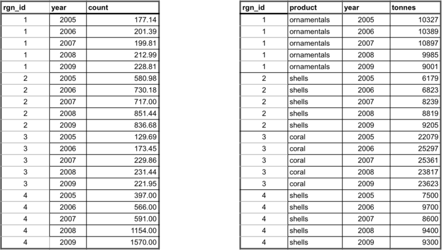

### Gapfilling

It is important that data prepared for the Toolbox have no missing values or 'gaps'. Data gaps can occur in two main ways: 1) **temporal gaps**: when several years in a time series in a single region have missing data, and 2) **spatial gaps**: when all years for a region have missing data (and therefore the whole region is 'missing' for that data layer).

How these gaps are filled will depend on the data and regions themselves, and requires thoughtful, logical  decisions to most reasonably fill gaps. Each data layer can be gapfilled using different approaches. Some data layers will require both temporal and spatial gapfilling. The examples below highlight some example of temporal and spatial gapfilling.  

All decisions of gapfilling should be documented to ensure transparency and reproducibility. The examples below are in Excel, but programming these changes in software like R is preferred because it promotes easy transparency and reproducibility.

#### Temporal gapfilling

Temporal gaps occur when a region is missing data for some years. The Toolbox requires data for each year for every region. It is important to make an informed decision about how to temporally gapfill data.


Often, regression models are the best way to estimate data and fill temporal gaps. Here we give an example that assumes a linear relationship between the year and value variables within a region. If data do not fit a linear framework, other models may be fit to help with gapfilling. Here we give an example assuming linearity.

Using a linear model can be done in most programming languages using specific functions, but here we show this step-by-step using functions in Excel for Region 1.

**Temporal gapfilling example (assumes linearity: able to be represented by a straight line on a graph)):**

There are four steps to temporally gapfill with a linear model, illustrated in the figures with four columns.

**1. Calculate the slope for each region**

The first step is to calculate the slope of the line that is fitted through the available data points. This can be done in Excel using the **SLOPE(known_y's,known_x's)** function as highlighted in the figure below. In this case, the x-axis is *years* (2005, 2006, etc...), the y-axis is *count*, and the Excel function automatically plots and fits a line through the known values (177.14 in 2005, 212.99 in 2008, and 228.81 in 2009), and subsequently calculates the slope (12.69).


**2. Calculate the y-intercept for each region**

The next step is to calculate the intercept of the line that is fitted through the available data points. This can be done in Excel similarly as for the slope calculation, using the the **INTERCEPT(known_y's,known_x's)** function that calculates the y-intercept (-25273.89) of the fitted line.


**3. Calculate y for all years**

The slope and y-intercept that were calculated in steps 1 and 2 can then be used along with the year (independent variable) to calculate the unknown 'y-values'. To do so, simply replace the known three values into the **y = mx + b** equation (m=slope, x=year, b=intercept), to calculate the unknown 'count' for a given year (189.39 in 2006, and 202.08 in 2007).

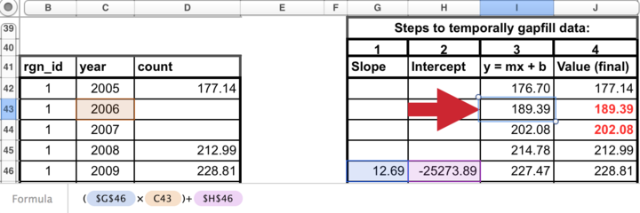

**4. Replace modeled values into original data where gaps had occurred**

Substitute these modeled values that were previously gaps in the timeseries. *The data layer is now ready for the Toolbox, gapfilled and in the appropriate format.*


#### Spatial gapfilling

Spatial gaps are when no data are available for a particular region. The Toolbox requires data for each region. It is important to make an informed decision about how to spatially gapfilling data.


To fill gaps spatially, you must assume that one region is like another, and data from another region is adequate to be substituted in place of the missing data. This will depend on the type of data and the properties of the regions requiring gapfilling. For example, if a region is missing data but has similar properties to a different region that does have data, the missing data could be 'borrowed' from the region with information. Each data layer can be gapfilled using a different approach when necessary.  

**Characteristics of regions requiring gapfilling that can help determine which type of spatial gapfilling to use:**

1. proximity: can it be assumed that nearby regions have similar properties?

2. study area: are data reported for the study area, and can those data be used for your regions?

3. demographic information: can it be assumed a region with a similar population size has similar data?


**Spatial gapfilling example:**

For a certain data layer, suppose the second region (*rgn_id 2*) has no data reported, as illustrated in the figure above. How to spatially gapfill *rgn_id 2* requires thinking about the properties and characteristics of the region and the data, in this case, tourist count.

Here are properties that can be important for decision making:

*rgn_id 2*:

- is located between *rgn_id 1* and 3
- is larger than *rgn_id 1*
- has similar population size/demographics to *rgn_id 3*
- has not been growing as quickly as *rgn_id 4*

There is no absolute answer of how to best gapfill *rgn_id 2*. Here are a few reasonable possibilities:

Assign *rgn_id 2* values from:

- *rgn_id 1* because it is in close proximity to *rgn_id 2*
- *rgn_id 3* because it is in close proximity to *rgn_id 2* and has similar population size/demographics
- *rgn_id 1* and 3 averaged since they are in close proximity to *rgn_id 2*

Suppose the decision was made to gapfill *rgn_id 2* using the mean of *rgn_id 1* and *3* since this would use a combination of both of those regions. Again, other possibilities could be equally correct. But some form of spatial gapfilling is required so a decision must be made. The image below illustrates this in Excel.

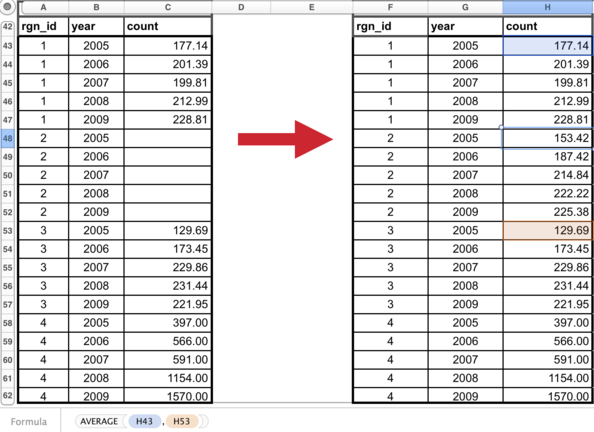

The data layer is now ready for the Toolbox, gapfilled and in the appropriate format.  

### Long formatting

The Toolbox expects data to be in 'long' or 'narrow' format. Below are examples of correct and incorrect formatting, and tips on how to transform data into the appropriate format.

**Example of data in an incorrect format:**

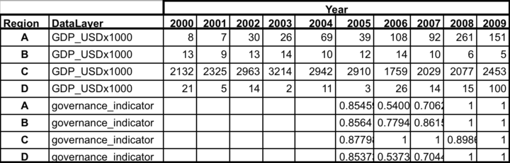

With 'wide' format, data layers are more difficult to combine with others and more difficult to read and to analyze.

**Transforming data into 'narrow' format:**

Data are easily transformed in a programming language such as R.

In R, the `tidyr` package has the `gather` command, which will gather the data from a wide format into a narrow format. It also can `spread` the data back into a wide format if desired. R documentation:

- http://blog.rstudio.org/2014/07/22/introducing-tidyr/
- http://www.rstudio.com/resources/cheatsheets/

The final step is optional: ordering the data will make it easier for humans to read (R and the Toolbox can read these data without this final step):

**Example of data in the appropriate (long) format:**


### Rescaling your data

<!---Notes from Github issue 389. Katie, develop--->

An important consideration is how to rescale your data when preparing it for use in the Toolbox. Rescaling involves turning a distribution of data into a value from zero to one. This is based on finding a highest observed or theoretical point in the distribution of the data, and from there, the relative value of the data can be calculated.

<!---Insert example: Data normalization; example with you rescaling to max, or to higher than max.--->

#### Example: Global Data Approach

You should base your decision on whether your consider it more appropriate to decide the reference point based on the data distribution of all data points, be they observed or interpolated, or whether we think we should only consider the observed data. If the interpolation covers large areas, and these get assigned values that aren't very frequent in the observed data, then the two distributions will be very different, and what value is in the 99.99th percentile is different too.

In theory, one would favor deciding the reference point based on as many observations as possible (i.e., interpolate first, then obtain the percentile). In practice, if we think that large interpolated areas are very unreliable, we might prefer to use real observations only (i.e., percentile first, then interpolate).

### Naming data layers

Please name each data layer with the following format so it is easy to keep all data organized:

`prefix_layername_regionYEAR_suffix.extension`

>There cannot be any white spaces in any part of the filename: instead, use underscores ('_').

The **prefix** will be the letters identifying each goal (two letters) or sub-goal (three letters):

|Goal           | Code | Subgoal   | Code |
|---------------|------|------------|-----|
|Food Provision                | FP   | Fisheries | FIS |
|                              |      | Mariculture | MAR|
|Artisanal Fishing Opportunity | AO   |             ||
|Natural Products              | NP   |             ||
|Coastal Protection            | CP   |             ||
|Carbon Storage                | CS   |             ||
|Livelihoods and Economies     | LE   | Livelihoods | LIV|
|                              |      | Economies   | ECO|
|Tourism and Recreation        | TR   |             ||
|Sense of Place                | SP   | Iconic Species | ICO|
|                              |      | Lasting Special Places | LSP|
|Clean Waters                  | CW   |      ||
|Biodiversity  | BD | Habitats | HAB  |
|                              | | Species | SPP|

The **layername** should be made of words or abbreviations to identify what the layer is (eg. unemployment)

The **regionYEAR** should identify the assessment scenario: **chn2015**. This will help separate updated data layers from global data layers ('glYEAR').

The **suffix** of the filename should identify who prepared the data so any questions can easily to sent to the correct person (eg. JL).

The **extension** identifies the filetype and is separated by a period (.). _You must save your files as comma separated values (*.csv*)_ since this is the format used by the OHI Toolbox.  

Here is an example of a properly named data layer for the  tourism and recreation goal, where the data are the percent of unemployment prepared by Julia Lowndes.

`tr_unemployment_chn2015_JL.csv`

## Defining spatial boundaries

**Spatial boundaries of your assessment regions dictate how your data will be aggregated or disaggregated, and are required for getting a Full Repository.** OHI scores are calculated for each _assessment region_, and the region boundaries will be used to aggregate or disaggregate input information reported at different spatial scales. There is no limit to the number of regions in  your assessment. However, the number of regions is usually constrained by two things: data availability for those regions, and the utility of having scores calculated for those regions. Ideally, boundaries are drawn per management jurisdiction, and are informed by the scale at which information is available.

The _Starter Repository_ will help you organize preliminary data and make sure data availability matches your desired region assignments. Once you've defined your regions and drawn spatial boundaries, the OHI team can create a **Full Repository** for your assessment.  

### Balancing geopolitical boundaries and data limitation

The spatial boundaries of OHI regions are typically set based on:

- _Management boundaries_: geopolitical boundaries, where policy decisions are made (countries, provinces, etc)
- _Biogeographic boundaries_: based on natural geography (bay, seas, gulf, etc)
- _Data_: information availability (spatial scale where are data collected)

OHI utilizes data from dozens to >100 data layers collected by many agencies. Some data are collected within boundaries suitable for your desired geopolitical boundaries. Often they are not. For example, you may wish to assess ocean health for each of the ten states along the coast. However, some measurements are taken on the national level and it is difficult to disaggregate data to the state level, or some measurements might only make sense at the watershed level across a few states.

Data disaggregation and gap-filling are possible methods of dealing with missing data, but can dilute the information quality within your assessment. If many data layers don't fit your desired boundaries, you may consider changing your boundaries. Exploring the data sources in the **Starter Repo** can help you balance jurisdictional boundaries and information availability, and finalize spatial boundaries that make the most sense for the purpose of your assessment.

> Note that the OHI does not take a stance on disputed territories. The boundaries are defined by the original map data providers.

### Drawing spatial boundaries

**Regions must be unique (non-overlapping), and boundaries must be drawn offshore**. Offshore boundaries should be made with spatial methods in order to extend boundaries from those designated on land.  

Spatial boundaries must be drawn with geographic information system (GIS) mapping software such as ArcGIS, QGIS, or GRASS. You will need someone with GIS skills to create a shapefile that will be used by the Toolbox to display your information. The shapefile will also be used to extract information for each of your defined regions when data are reported in raster format for a different area. For more information see Wikipedia for [Geographic information systems](https://en.wikipedia.org/wiki/Geographic_information_system) and [Shapefiles](http://en.wikipedia.org/wiki/Shapefile).

Illustrated below are the conceptual steps required for creating a spatial file with your offshore boundaries. You will ultimately decide where to draw the offshore boundaries. The example below shows a simple example of extending the land boundaries in a straight line; you should consult with a GIS specialist to make sure any extensions make sense with the coastline and natural features, and also make sure they does not conflict with important [jurisdictional boundaries](http://ohi-science.org/manual/#strategically-define-spatial-boundaries-balance-information-availability-and-decision-making-scales).


> Data for different goals often cover different spatial extents offshore. For example, Fisheries might use data from the entire EEZ, while Carbon Storage might only cover 3nm from shore. When mapped, OHI scores do not show different spatial extents, but instead show all to the greatest spatial extent. Exclusive Economic Zone (EEZ) boundaries are most often the greatest extent offshore that OHI scores will represent. These regional spatial boundaries do not affect data preparation and analyses, where you could use any spatial extent appropriate for each goal.  

**One possible method is to create boundaries with Thiessen Polygons**, and we provide a Python script that can be used, but it requires ArcGIS. The Python script and further details can be found [here](http://ohi-science.org/pages/create_regions.html).

<!-- It can also be done in [R](http://gis.stackexchange.com/questions/136542/r-function-for-thiessen-polygons).  -->

> To create a repository for your assessment, we just need the off-shore marine water boundaries. But you may also make **inland buffers** for your analyses. For example, do you want coastal population to include activities within 1km of the coast? Or 10km?

### Request a Full Repository with offshore boundaries

**In order to create a Full Repository for your assessment, we will need the shapefile for your offshore boundaries** (and the name of your scenario, which is to the unit of your assessment and the year, for example, `province2016`). This will help us disaggregate global data to your local regions and populate usable data layers. Please send a .zip file of all files produced to _info@ohi-science.org_. Files with the following extensions are required (but you can send all files):

- `.dbf`
- `.shp`
- `.shx`
- `.prj`

The `.dbf` file needs the following in its attribute table:

- **rgn_id** (unique numeric region identifier)
- **rgn_name** (unique named region identifier)
- **area_km2** or **area_hectare** (area in km2 or hectares)

<!---From Mel: I just looked at what R produces for shapefiles, and it is: .dbf, .prj, .shp, .shx
shp = boundaries
dbf = database (attribute table)
prj = projection information
not sure what shx is....
So I am guessing that is all that is really needed.--->

<!-- Using Thiessen Polygons, offshore boundaries are created with the following steps.

1. Start with land-based boundaries
2. Draw offshore buffers for each region  
3. But the buffers overlap
4. For the Thiessen Polygon approach, the overlap is divided
5. To produce the borders between the regions

 -->

<!-- ## Buffers

When drawing your regions, it is also a good idea to create _inland and offshore_ buffers that will be used to extract data in your assessment. Buffers are not necessary for display in the WebApp but they will be important for later layer preparation. For example, the global assessment used coastal population information, and raster data were available for entire countries. This meant that 'coastal' had to be defined: for global assessments it was defined as 25 miles from the coast. To extract just the coastal population from the population raster file, we created a 25 mile inland buffer for each reporting region. But to extract mangrove data for each region from raster files, global assessments used 1km inland and 1km offshore as the buffer.  

At this point, you may not know which buffers you will need, as they depend on the data available, your goal models and definitions. Some buffers used in the global assessments were 1km inland, 25miles inland, 1km offshore, 3nm offshore.-->

## Developing Goal Models, Reference Points, and Pressures and Resilience

Once you have determined which goals are assessed and have begun searching for data and indicators, you can start to develop goal models and set reference points. The decision tree of the data discovery process also applies here: first consider how goals can be tailored to your local context before you consider replicating what was done in the Global Assessments. It is always better to use local goal model and reference point approaches where possible. This section aims to provid you with goal-by-goal guidance on how to find data, pick indicators, set reference point, and develop the model, as well as guideline on how to think about pressure and resilience. But first, let's see some general tips before diving into the details of each goal model.

### Developing multiple goal models at the same time

Goals can be assessed independent of one another. As each goal model is developed and data gathered, it can be assessed without affecting other goals.

 However, you can develop some goal models simultaneously and streamline the data search. For example, the habitat-based goals **Carbon Storage**, **Coastal Protection**, and the **Habitats sub-goal of Biodiversity** all rely on the same underlying data, and their models can be developed together. A spatial analyst can create the spatial layers used for these goals with the same source material. This will greatly expedite your data layer preparation. Species data for **Iconic Species sub-goal of Sense of Place** is often a subset of data from **Species sub-goal of Biodiversity**. Data for non-food marine products for **Natural Products** and food products for **Fisheries sub-goal of Food Provision** are often recored in similar data sources and may need partitioning.

 If you wish to further coordinate these activities on a higher level, you could have the same team member coordinate activities for the development of certain goals. That is a consideration when assembling your team and planning your workflow. For more details, please see the goal-specific sections.

### Keeping Reference Points in Mind

Setting a reference point is required for every goal model you develop. It is an "ideal" condition, or target, where the goal is considered to be achieved to its full potential. Achieving or exceeding the reference point will result in a score of 100. The choice of a reference point will thus affect how the final scores are calculated, and must be balanced between knowledge of the system, expert judgment, and limitations of the data. You may set an universal reference point for all regions in your study area, or you may set a unique reference point for each region.

Generally there are four types of reference points:
+ *Functional*: Scientifically sound target set based on the known responses of variables measured, such as Maximum Sustainable Yield.
+ *Temporal*: A historical benchmark is used as a the "ideal" point in the past, such as mangrove coverage in the 1980's.
+ *Spatial*: A region within the study area with the highest input values, and all others are scaled to it.
+ *Established target*: Such as a sustainable catch yield by a certain year, or the number of people employed in a marine sector by a certain year.

Which type of reference point to use depends on the goal and available data. How many years of data are available? Can you set a temporal reference point with these data, or do you have to find another dataset or other source of information? In any case, you must balance being realistic with being ambitious. We suggest following the S.M.A.R.T. criteria when choosing a reference point: _"Specific," "Measurable," "Ambitious," "Realistic," and "Time-bound."_

You will learn more, and think more critically about reference points, as you develop the data layers for your assessment.

**_How to use the reference point in a model_**

 It's best to explicitly include the reference point in the model equation whenever possible. For example, the Carbon Storage goal model in the global assessment is written like this:

,  

where C<sub>r</sub> is the reference condition of each habitat. See goal-specific sections for more examples.

### Identifying pressures and resilience

While you are developing goal models, you should note the links between your goals and pressures and resilience: both the pressures and resilience that affect them and whether the goal acts as pressure or resilience on other goals. It is recommended to begin gathering data of pressure and resilience from the start of the assessment. The team members who are developing specific goals should think about the pressures that act upon those goals as they are data-gathering, and they should think about the data sources that could provide pressures information. However, it may be most useful when one team member gathers all of the data for pressures, since the same pressures often affect multiple goals. See **Pressure and Resilience** section of this chapter for more information.

<!-- Ning: maybe we can move this detailed information to the pressure/resilience section.  

Julie: either way is fine with me. -->

Some pressure data are the same or closely-related to data for goals. For example, the **Wild-Caught Fisheries** goal model requires catch data, which may be the same data source for information on commercial high- and low-bycatch data, which are used as pressures layers that affect **Livelhoods and Economies** and **Biodiversity**. In global assessments, the **Clean Waters** goal is very much linked to pressures layers because the input layers for its status are used as pressure layers. Trash pollution is a pressure that affects **Tourism and Reacreation**, **Lasting Special Places**, **Livelihoods and Economies,** and **Species**. It is important to remember these linkages as you go through the data discovery process.

You should also start searching for pressures data independent from data for goals. An example would be how climate change impacts will appear in various places in your assessment. Climate change pressures layers can include UV radiation, sea surface temperature (SST), sea-level rise (SLR), and ocean acidification, and these impacts might affect such goals as **Natural Products**, **Carbon Storage**, **Coastal Protection**, **Sense of Place**, **Livelihoods and Economies**, and **Biodiversity**. These linkages will become more clear as you go through the OHI+ assessment process.


<!-- Ning: What about Resilience? It's trickier to gather resilience data, but it's good to start thinking about resilience from the beginning.

I saw the tempnotes_b_reslilience. I can edit it and move some information over if you think it's good.

Also there are theoretical questions about resilience, but it is a discussion for another day. Does resilience mean measures to keep things the way it is (eg. grants for AO fishermen to keep fishing), or ways to help people adapt and change (eg. grants for AO fishermen to start aquaculture)?  -->


<!-- Julie: that sounds good.

Also there are theoretical questions about resilience, but it is a discussion for another day. Does resilience mean measures to keep things the way it is (eg. grants for AO fishermen to keep fishing), or ways to help people adapt and change (eg. grants for AO fishermen to start aquaculture)?  

Yes, we can try to get into this stuff in the resilience section-->

<!--
Julie: I've deleted the rest below and rewritten it as the intro for the goal-by-goal page on ohi-science.org: https://github.com/OHI-Science/ohi-science.github.io/blob/master/revamp_copy.md
--->
<!-- ## Understanding each goal model -->

# Full Repository

## File system organization

This section is an orientation to the files within your _Full Repository_. The file system organization is the same for all assessment repositories, and can be viewed at `github.com/OHI-Science` or on your computer. While reading this section it is helpful to explore a repository at the same time to become familiar with its contents and structure. The following uses the assessment repository for Ecuador (*ecu*) as an example, available at _www.github.com/OHI-Science/ecu_.

**Most of your time will be spent preparing input layers and developing goal models**. You will also register prepared layers to be used in the goal models. This all will be an iterative process, but generally speaking you will work goal-by-goal, preparing the layers first, registering them, and then developing the goal models in *R*. to calculate the scores.

### Main folders within your Full Repo

The **scenario folder** is the most important folder within the repository; by default it is named `regionYEAR` (eg. _cnc2016_ for New Caledonia 2016) to indicate that the assessment is conducted at the region scale (province, state, district, etc.), based on input layers and goal models used in the most recent global assessment. It contains all of the inputs needed to calculate OHI scores, and you will modify these inputs when conducting your assessment. The scenario folder is explained in detail in this section.
<!-- * All other files in the assessment repository are accessory files. Files with names beginning with a ‘.’ are required for versioning capabilities by GitHub and do not appear when the assessment repository is viewed on your computer. -->


When conducting your assessment, you can rename your scenario folder to reflect the subcountry regions in your study area and year the assessment was completed. For example, `province2015` would indicate the assessment was conducted for coastal provinces in the year 2015.

Once you complete your assessment with the `regionYEAR` (or equivalent) scenario, further assessments can be done simply by copying the `regionYEAR` folder and renaming it. This can be done for future assessments, for example `assessment2016` or `assessment2018`, which eventually would enable you to track changes in ocean health over time. You can also copy scenario folders to explore different policy and management scenarios, for example `regionYEAR_policy1`.

This figure illustrates the files contained within the assessment repository's `regionYEAR` scenario folder, and in which step of the Toolbox workflow they are associated with. Important files are either *.csv* text files or *.R* script files. Files are organized into different folders within the `regionYEAR` folder, and you will modify some of these files while leaving others as they are.


The **conf** folder within the `regionYEAR` scenario folder, the `conf` folder includes important configuration files required to calculate OHI scores. Most of the maneuvering in this phase is done within this folder. There are both *.R* scripts (`config.R` and `functions.R`) and *.csv* files (`goals.csv`, `pressures_matrix.csv`, `resilience_matrix.csv`, and `resilience_weights.csv`), which will be introduced individually in the next section.


The **prep** folder is important in the beginning of your assessment, as it is where you will store and manipulate raw data to get them ready for calculations.

Over all, all the main files you will encounter are either of the two file types:

- ** _.csv_ files** contain data inputs or configuration information.
- ** _.R_ scripts** are written in the programming language R and use data inputs for processing and calculations.

We will introduce those files below roughly in the order and the frequency of use:  

### Data layers

* raw data files in `prep` folder
* `layers` folder
* `layers.csv`
* `goals.csv`
* `layers-empty_swampping-global-mean.csv`
* `pressures_categories.csv`
* `pressures_matrix.csv`
* `resilience_categories.csv`
* `resilience_matrix.csv`
* `scores.csv`

**raw data layers in "prep" folder**

This is where you will store (and manipulate) raw data files before modifying goal models. We recommend separating data layers into different folders by goal.  

*layers* folder

This folder contains all layers required to calculate goal scores, and each layer is an individual *.csv* file. _The names of the *.csv* files within the layers folder correspond to those listed in the *filename* column of the `layers.csv`._ All *.csv* files can be read in R, or with text editors or spreadsheet editors like Microsoft Excel.


Note that each *.csv* file within the `layers` folder has been formatted consistently. The Toolbox expects all data layers to be in the correct ['long format'](http://ohi-science.org/manual/#long-formatting) and in separate files. Each file also has a column with unique region identifier (*rgn_id*). These numeric region identifiers have region names associated with them, that are set in `rgn_labels.csv` and can be modified.  

> TIP: You can check your region identifiers (*rgn_id*) in the `rgn_labels.csv` file in the `layers` folder.

*/glYEAR* and */scYEAR* suffixes

In your repository, layers are provided for your country based on input information from the YEAR global assessment. The global assessment had information for your country at the the spatial scale of the entire country, whereas your assessment has information for each subcountry region within your country. In most cases, layers from the global assessment was allocated equally to all regions in your study area (country). When this occurred, the layer was given a suffix of `_glYEAR` to indicate that information is equal across all regions in the study area. While these layers may not provide much useful information to your assessment, the proper input structure is provided in these layers. Some layers contain information such as km2 of habitat that could not be equally allocated across all regions since this would provide a sum much greater than reality. In these cases, layers were down-weighted based on the proportion of offshore area or coastal population density. These layers have the suffix `_scYEAR` with an indication of what was used to downweight. While this method removes any error of inflated sums and provides the Toolbox with functioning layers, the allocation of these values may not be sensical to your study (i.e. if corals are only present in some regions of your study area but they are allocated to all).


**layers.csv**

The `layers.csv` file is the registry and directory that manages all data required for you assessment. All relevant input information is prepared as individual data layers and then registered in this file. `layers.csv` is vital to organizing all the data to calculate scores and for visualizations

`layers.csv` is easiest to view in spreadsheet software (i.e. Microsoft Excel). When you open it, you will see that each row of information represents an individual input layer that has been prepared for the Toolbox. The first columns contain information that will be updated by your team as you [incorporate modified or new layers](http://ohi-science.org/manual/#register-data-layers-in-layers.csv): *targets, layer, name, description, fld_value, units, filename*.; all other columns are generated later by the Toolbox as it confirms data formatting and content and alerts you of any formatting inconsistencies.

* **targets** indicates which goal or dimension uses the layer. Goals are indicated with two-letter codes and sub-goals are indicated with three-letter codes (see the table just below). Pressures, resilience, and spatial layers indicated separately.
* **layer** is the identifying name of the input layer that will be used in R scripts like `functions.R` and *.csv* files like `pressures_matrix.csv` and `resilience_matrix.csv`.
* **name** is a longer title of the input layer.
* **description** is further description of the input layer, including the source of the original data.
* **fld_value** the values' units in the input layer. The information in this column must match the column header in the input layer.
* **units** the values' units in the input layer. This differs from *fld_value* above as the *units* column and has more descriptive naming.
* **filename** is the input layer itself. This file has input information for each region within the study area, and is located in the `regionYEAR/layers` folder.

<span style="font-size:0.8em">

| Goal | Subgoal | 2- or 3- letter code|
|----|----|----|
|Food Provision                | |FP |
| |Fisheries                     |FIS|
| |Mariculture                   |MAR|
|Artisanal Fishing Opportunity | |AO |
|Natural Products              | |NP |
|Coastal Protection            | |CP |
|Carbon Storage                | |CS |
|Livelihoods and Economies     | |LE |
| |Livelihoods                   |LIV|
| |Economies                     |ECO|
|Tourism and Recreation        | |TR |
|Sense of Place                | |SP |
| |Lasting Special Places        |LSP|
| |Iconic Species                |ICO|
|Clean Waters                  | |CW |
|Biodiversity                  | |BD |
| |Habitats                      |HAB|
| |Species                       |SPP|

</span>

**goals.csv**

`goals.csv` is a table with information about goals and sub-goals, including:

- _order_color_ & _order_hierarchy_: the order to display in flower plots
- _order_calculate_: the order in which the goals and sub-goals are calculated for the overall index scores
- _goal_ & _parent_: indicates the relationship between sub-goals and supra-goals (i.e. goals with sub-goals)
- _weight_: how each goal is weighted to calculate the final Index scores
- _preindex_function_: indicate what parameters are called to calculate scores for goals and sub-goals in `functions.r`
- _postindex_function_: indicate what parameters are called to calculate scores for supra-goals in `functions.r`

**pressures_categories.csv**

This is a table to record the _name_ of each pressures data layer, its _category_, and _sub-category_. Each data layer name  is the same name that's saved in the `layers` folder and is registered in `layers.csv`. Each layer falls under one of two categories -  ecological or social pressures, and one of several sub-categories to further represent the origin of the pressure (e.g. climate change, fishing, etc), which is also indicated by a prefix of each data layer name (for example: `po_` for the pollution sub-category). For more information, see [how to modify pressures layers](http://ohi-science.org/manual/#modifying-pressures-categories-and-matrix).

**pressures_matrix.csv**

It is a table that indicates which individual pressures (stressors) affect which goal, sub-goals, or components, and weights them from 1-3 (a weight of 0 is shown as a blank). A higher weight indicates more negative impacts on that goal or component of the goal. These weights are relative to each row of the matrix (goal, sub-goal, or component). These weights are used in global assessments based on scientific literature and expert opinion, and you can modify the weightings if necessary for your assessment. The pressures matrix is the same as Table S25 in the Supplementary Information for Halpern *et al.* 2012.

Each pressure (column) of the pressures matrix is the layer name of the pressures layer file that is saved in the `layers` folder and is registered in `layers.csv`, matching what's recorded in the _pressures_categories.csv_. For more information, see [how to modify pressures layers](http://ohi-science.org/manual/#modifying-pressures-categories-and-matrix).

**resilience_categories.csv**

Similar to _pressures_categories.csv_, this file contains information on each resilience data layer, including its name, category, and sub-category. Each resilience layer's name is the same as the data layer to be saved in the `layers` folder and is registered in `layers.csv`. In addition, it also includes information on _category type_ - ecosystem, regulatory, or social, indicating the origin of the resilience layer.

Each resilience layer is also assigned a weight of 0-1, representing the level of resilience against pressures.  Different from the values used in pressures matrix, the resilience weights depend on the level of information available. For more information, read [how to modify resilience layers](http://ohi-science.org/manual/#modify-resilience-categories-and-matrix).

**resilience_matrix.csv**

It is a table that indicates which individual resilience measures affect which goal, sub-goals, or components. These weights are stored in a separate file in the `conf` folder: `resilience_weights.csv`. The resilience matrix is the same as Table S26 in the Supplementary Information for Halpern *et al.* 2012. For more information, read [how to modify resilience layers](http://ohi-science.org/manual/#modify-resilience-categories-and-matrix).


**scores.csv**

`scores.csv` is a text file containing the calculated scores for each dimension (future, pressures, resilience, score, status, trend) for each region in the study area. Regions have the numeric identifiers set in `regionYEAR/layers/rgn_labels.csv` and the study area has the numeric identifier of 0. Scores are calculated with registered layers in `layers.csv`: when you begin an assessment this will be information for your country from the global YEAR assessment and goal models from the global YEAR assessment.

**layers-empty_swapping-global-mean.csv**
`layers-empty_swapping-global-mean.csv` contains a list of layers where information for your country was not available for the global assessment. For the Toolbox to be able to run, these layers were filled with averages from all other countries included in the global assessment. This file is not used anywhere by the Toolbox but is a registry of layers that should prioritized to be replaced with your own local layers if you require these layers for the models you develop.

### R scripts

* `install_ohicore.R`
* `configure_toolbox.R`
* `calculate_scores.R`
* `data_prep.R` in prep folders
* `functions.R`
* `config.R`
* `launch_app_code.R`

**install_ohicore.R**

This script installs `ohicore`, which is the second repository required for the Toolbox and is the engine behind all OHI calculations. You will need to run this script only once when you [first install the toolbox](http://ohi-science.org/manual/#install-ohicore).

**configure_toolbox.R**

This script does the pre-checks before running goal models and calculate dimension scores. It loads "ohicore", calls all goal functions and data layers in the "conf" folder, and check that all data layers are registered properly. You are encouraged to use this script when you're working on individual goal models. After you register data layers for a goal, or make any changes to the data layers, source this script before running model-specific functions in functions.R.

**calculate_scores.R**

It runs everything required to calculate OHI scores using the prepared layers the `layers` folder that are registered in `layers.csv`. Scores will be saved in `scores.csv`.

**functions.R`**

This script contains the equations for each goal and sub-goal model. Each goal and sub-goal equation is stored as a separate function within the script. These functions calculate the _status_ and _trend_ using prepared layers saved in the ‘layers’ folder and registered in `layers.csv`. You will need to code in R to modify or develop new models, and it is best to work on one goal at a time.

**config.R** in "conf" folder

It configures labeling and constants appropriately. You will only need to modify this file when working with goals that have categories (example: habitat types or economy sectors) that are affected differently by pressures and resilience measures.

**launch_app_code.R**

It will launch a version of the App on your computer so that you can visualize any edits you make before syncing to *github.com*.

### Other

* reports
* session.txt
* spatial
* temp

**reports** folder

The `reports` folder contains flower plots and tables for every region in the study area and for the study area itself, which by convention is called 'GLOBAL' in these files.

**session.txt**

`session.txt` is not used in OHI calculations but stores information about how the Toolbox was installed which may be useful for debugging purposes.

**spatial** folder
The `spatial` folder contains two spatial files: `regions_gcs.geojson` and `regions_gcs.js`. These files spatially identifies the study area and regions for the assessment and are stored in the JSON and GeoJSON formats that can be displayed by the App. If you plan to redefine the spatial boundaries for your assessment, you will need to provide a shapefile to the OHI+ development team and we will create the proper `regions_gcs.geojson` and `regions_gcs.js` files for you. You will need a spatial analyst to do this: see the **Defining spatial boundaries** section for instruction.

**temp** or **tmp** folders

Contents within the `temp` or `tmp` folders are not used to calculate scores but can be used for temporary organization for your assessment.

## Getting started

>In the following sections, you will learn about the most common modifications made to repositories, including changing or creating data layers, changing or removing goals models, changing the pressures and resilience matrices, and removing goals or sub-goals. You will be given examples to follow to help with your own assessment. **All the work will be contained within your `regionYEAR` folder (eg. baltic2016).**

We recommend that you work on one goal at a time as data becomes available and goal model created. For each goal and sub-goal, there are multiple dimensions of the OHI scores: _status, trend, pressures, resilience, likely future state,_ and the _goal score_. Goal and sub-goal index scores are then combined to calculate the _overall OHI index score_. The general workflow is as follows:

1. install `ohicore`
2. check that the functions within pre-loaded, template scenario folder work well by running  `regionYEAR/configure_toolbox.R`
3. prepare and register data for a goal
4. modify goal models with R to calculate _status_ and _trend_ (in functions.R)
5. update pressures and resilience matrix and data layers
6. remove goal(s) if necessary
7. calculate the other dimensions (pressures, resilience, likely future state, goal score, and overall OHI index score) with ohicore

Step 3-6 can occur simultaneously.

### Install `ohicore`

`ohicore` is a R package containing all the essential functions you will use to calculate the final OHI scores. You will install `ohicore` as you would other R packages and will only need to do this once.

To install, find the script `install_ohicore.r` in your scenario folder (ie. your _regionYEAR_ folder). Run the entire script, and now your Toolbox is all set up and ready to go!

_This only needs to be done once at the beginning of your assessment, and you do not need to rerun it again during an assessment._

> Although `ohicore` is a package you would not normally interact with, it can be useful to have the folder cloned to your computer for debugging, particularly with pressures and resilience calculations for goals that have components in the matrix. To do so, you will [clone](http://ohi-science.org/manual/#cloning-a-repository-to-your-local-computer) the repository (https://github.com/OHI-Science/ohicore) as you would your assessment repository.

### Check pre-loaded, template data and models

As a starting point, your Full Repo is populated with data and functions from the most recent global OHI study, which you can then modify directly. To check that your repository is set up properly and the pre-loaded scripts and data are functional, you can run `regionYEAR/configure_toolbox.R`. It will produce scores for each dimension in `regionYEAR/scores.csv`. When it's all set up, you can begin adding your own data and goal models.

>`configure_toolbox.R` should be run each time you change or add a new data layer to make sure it is properly formatted and registered.*

**Now you have set up your Full Repo, the following "How To" sections will show you how to finish OHI score calculations in the Full Repo, including how to save data layers, modify goal models, pressures and resilience, etc.**

# Saving and Registering Data Layers

When you received your _Full Repo_, you would have already explored data, or started the process of data preparation, in the _Starter Repo_. To proceed to the next steps of assessment and calculate scores with the Toolbox, now you need to **save** prepared data layers in the `layers` folder and **register** them in `layers.csv`, and update pressures and resilience matrixes.

> Reading [Full Repo file system structure](http://ohi-science.org/manual/#file-system-organization) section to get familiar with the repository structure.

  

## Overview

Data layers are *.csv* files and are located in the `[regionYEAR/layers` folder (eg. bhi2015/layers), which is pre-loaded with data from the most recent global OHI assessment:

* Layers with the suffix `_glYEAR.csv` (*gl* for *global*) have been exactly copied from the global assessment and applied equally to each region, and therefore the values will be the same across all subcountry regions.
* Layers with the suffix `_scYEAR.csv` (*sc* for *subcountry*) have been spatially-extracted from global data or adjusted with spatially-extracted data so that each  region in your assessment has a unique value. For example, gross domestic product (GDP) used in the global assessment was reported at the national (most often country) level. Instead of being applied equally across all subcountry regions (which would incorrectly increase the nation's GDP several times), national GDP was down-weighted by the proportion of coastal population in each region compared with the total coastal population.

**Both types of default data layers are of coarse-resolution and should be replaced with local, high-resolution data when possible.** The priority should be to replace as much of the `_glYEAR.csv` data as possible.

**There are several steps to follow when finalizing your own data layers** after they are [properly formatted](http://ohi-science.org/manual/#formatting-data-for-the-toolbox):

1. Save the layer in the `layers` folder
2. Register the layer in `layers.csv`
3. Check (and update when appropriate) `pressures_matrix.csv` and `resilience_matrix.csv` (located in: `regionYEAR/conf`)

## Save data layers in the *layers* folder

When you modify existing or create new data layers, we recommend saving this as a new *.csv* file with a suffix identifying your assessment (eg. `_regionYEAR.csv`). Modifying the layer name provides an easy way to track which data layers have been updated regionally, and which rely on global data. Then, the original layers (`_glYEAR.csv` and `_scYEAR.csv`) can be deleted.  

> Filenames should not have any spaces: use an underscore ('_') instead. This will reduce problems when R reads the files.


## Register data layers in `layers.csv`  

When there are new filenames associated with each layer, they will need to be registered in `regionYEAR/layers.csv`. If a layer simply has a new filename, only the *filename* column needs to be updated:

  

However, **if a new layer has been added (for example when a new goal model is developed)**, you will open `layers.csv` in a spreadsheet software (i.e. Microsoft Excel), add a new row in the registry for the new data layer and fill in the first eight columns (columns A-H):

 + **targets:** Add the goal/dimension that the new data layer relates to. Goals are indicated with two-letter codes and sub-goals are indicated with three-letter codes, with pressures, resilience, and spatial layers indicated separately.
 + **layer:** Add an identifying name for the new data layer, which will be referenced in R scripts like `functions.R` and *.csv* files like `pressures_matrix.csv` and `resilience_matrix.csv`.
 + **name:** Add a longer title for the data layer.
 + **description:** Add a longer description of the new data layer.
 + **fld_value:** Add the appropriate units for the new data layer. It is _the same as the column name in the data file_, which will be referenced in R scripts in subsequent calculations. (example: area_km2)
 + **units:** Add a description about the *units* chosen in the *fld_value* column above. Think about what units you would like to be displayed online when filling out "units." (example: km^2)
 + **filename:** Add a filename for the new data layer that matches the name of the *.csv* file that was created previously in the `layers` folder.
 + **fld_id_num:** Area designation that applies to the newly created data layer, such as: *rgn_id* and *fao_id*.

 It is important to check that you have filled you the fields correctly, for instance, if "fld_value" does not match the header of the source data layer, you will see an error message when you try to calculate scores. Other columns are generated later by the Toolbox as it confirms data formatting and content.

<!-- ### Check pressures and resilience matrices

If the new or modified layer is a pressures layer, check that `pressures_matrix.csv` and `resilience_matrix.csv` have been properly modified to register the new data layers. -->

# Modifying goal models

After you have registered the data layers for a goal and created a goal model, you are ready to calculate the _status_ and _trend_ of this goal in `functions.r`.

Within `functions.r`, each goal is unique and set up as a function (ie.`AO = function(inputs){equations}`):

- sub-goals (eg. HAB) and goals without sub-goals (eg. CS) have functions that read in data _layers_ (eg. `HAB = functions(layers)`) and return scores for that goal or sub-goal
- supra-goals, or goals with sub-goals (eg. FP) have functions that read in sub-goal _scores_ (eg. `BD = function(scores)`) and calculate scores for the supra-goals

> `functions.R` is pre-loaded with r codes from the most recent OHI-Global assessment as a reference. You can run through the reference script line-by-line to learn how it has been done. For your own assessment, you may choose to delete the entire function and rewrite it completely, or you can borrow most, if not all, of the existing script. Either way, make sure you first identify the parameters to call, either _layers_ or _scores_.

To modify the goal models, open `conf/functions.R` and go to the appropriate goal section. You will do the following sequence of events:

1. load ohicore and check data layers (`configure_toolbox.r`)
2. load data (`functions.r`)
3. calculate status scores (`functions.r`)
4. calculate trend scores (`functions.r`)
5. combine status and trend scores (`functions.r`)
6. confirm how the function is called (`goals.csv`)

> Tip: Check that you have installed the latest versions of R and RStudio before starting. If an unexplained error occurs during calculation, it could be due to a software update, which happens every month or two. Sometimes simply updating your software could fix the error.  

**1. Load ohicore and check data layers**

Run (or source) `configure_toolbox.r` to load ohicore and check data layers.


**2. Load data**

The example below is modified from the _AO_ function in OHI-Global 2015.  

1. Select data layers. _(Note that the layer names are what was set up in `layers.csv`. Now the toolbox will look for those layers)_

```
## select data layers using ohicore::SelectLayersData
layers_data = SelectLayersData(layers, targets='AO')
```          

2. Rename columns & combine layers into one data frame.

```
r <- layers_data %>%
  filter(layer == 'ao_access') %>%
  select(region_id=id_num, access=val_num)

ry <- layers_data %>%
  filter(layer == 'ao_need') %>%
  select(region_id = id_num, year, need=val_num) %>%
  left_join(r, by="region_id")
```

**3. Calculate Status**

Calculations are done using the goal model across all years. Select the result of the most recent year as the goal status.

```
ry <- ry %>%
  mutate(Du = (1 - need) * (1 - access)) %>%
  mutate(statusData = (1 - Du) * Sustainability)

r.status <- ry %>%
  filter(year == status_year) %>%
  select(region_id,
         statusData) %>
  mutate(status = statusData*100)

  summary(r.status); dim(r.status)
```

**4. Calculate Trend**

Trend is typically calculated as the linear trend of the _most recent five years_ of status.

```
## minimum year here for illustration; it is based on data available
year_min = 2011

 r.trend <- ry %>%
   filter(year >= year_min) %>%
   filter(!is.na(statusData)) %>%
   group_by(region_id) %>%
   arrange(year) %>%
   top_n(5, year) %>%
   ungroup()


 r.trend <- r.trend %>%
   group_by(region_id) %>%
   do(mdl = lm(statusData ~ year, data=.)) %>%
   summarize( region_id = region_id,
              trend = coef(mdl)['year']*5) %>%
   ungroup()

```

**5. Combine Status and Trend**

Assemble status and trend scores into one data frame. Your results would contain four columns: _region_id, score, dimension,_ and _goal_.

Don't forget to `return(scores)`!


```
scores = r.status %>%
  select(region_id, score=status) %>%
  mutate(dimension='status') %>%
  rbind(
    r.trend %>%
      select(region_id, score=trend) %>%
      mutate(dimension='trend')) %>%
  mutate(goal='AO')

  return(scores)  
```

**6. Update goal call in `goals.csv`**

`goals.csv` in the `conf` folder provides input information for `functions.r`, particularly about function calls. These are indicated by two columns: *preindex_function* (functions for all goals that do not have sub-goals, and functions for all sub-goals) and *postindex_function* (functions for goals with sub-goals).

In the `preindex_fuction`, you could specify variables such as _status_year_ and _trend_year_, which you can call in your goal function. Note that it is not necessary to specify those variables. If you do not use them in your function as in the CS example, you could delete those variables in `preindex_function`.

> Changing goal weights will be done here by editing the value in the *weight* column. Weights do not need to be 0-1 or add up to 10; weights will be scaled as a proportion of the number of goals assessed. The ten goals are weighted equally by default.

> `goals.csv` also includes descriptions about goals and sub-goals, which is presented on the WebApp.


# Modifying Pressures and Resilience

**Pressures** and **Resilience** are two of the four dimensions used to evaluate each goal or sub-goal, along with **Status** and **Trend**.

It is important to identify the pressures that affect the ocean and coastal systems in your study area, and to search for additional pressures not included in global assessments. Once you have identified pressures within your study area, you should identify what resilience measures could counteract those pressures. Alternatively, you can start with a list of known resiliences, such as the relevant environmental laws in your country, and them map them onto pressure layers.

> TIP: The same considerations and requirements about data presented in the "**Gathering Appropriate Data**" section and in the [Best practices for assessing ocean health in multiple contexts using tailorable frameworks](https://peerj.com/articles/1503/) publication also apply to pressures and resilience. Every measure you include for pressures and resilience requires data for each region in your assessment.

Ideally, every pressure with an identified strong impact should have a corresponding resilience measure. The rationale is that as resiliences in the study area increase (for instance, by improving environmental regulations), they would balance out and eventually neutralize the pressures. In time, this would lead to an increase in a goal's status, and therefore the overall goal or sub-goal score. By including regulatory responses in your assessment, you ensure that the actions taken in your country are relevant to ocean health.

In practice, however, the pressures and resilience measures you include in your assessment will be highly determined by data availability. It is best to _first consider what pressures are acting in your study area and then determine if data are available to measure them_. You should also decide if the pressures data included in the global assessment are relevant for your assessment and determine if local data better capture pressures for all the regions in your study area. When considering resilience measures, look for regulations or indicators that could be encompassed in one of the pressures categories.

## Pressures

### How to identify and quantify pressures

The Toolbox calculates pressures in five **ecological pressure categories** (e.g., pollution, habitat destruction, fishing pressure, species pollution, and climate change) and one **social pressure category** (e.g. strength of governance). Under each category, there can be multiple pressure data layers. For example, the "pollution" category could include pathogen, nutrients, and chemical pollution.

 >The reason behind the ecological categories is to avoid hidden weighting (e.g., overrepresentation of pressures for which there are more data). For example, in the global assessment there were many pollution datasets available, but few distinct habitat destruction datasets. If we simply averaged the scores of each individual stressor, pollution scores would have a greater influence on the results (stronger weight) due to the relative higher availability of measurements of various pollutants. Instead, aggregating by pressure categories ensures that different stressor types influence the score explicitly. Nonetheless, the scores are combined in a cumulative way within each category to account for the fact that multiple stressors within a category have a cumulative impact that is greater than if only one of the stressors were present. The resulting scores for the five ecological categories are averaged to produce a single ecological pressures score. This score is then averaged with the social pressures score to produce the final overall pressure score.

There are two types of pressures data you need to provide for the toolbox:  _data layers for each pressure_ and the _pressure matrix_.

#### Pressures data layers

The pressures you will include in your assessment will depend on what is important in your study area and what data are available. If local pressures data are not available, you may default to using data from the global assessment, but this means in most cases that you will not have different information for each region. You will determine the weight ranks required in the pressures matrix only after you have identified the data you will include.

The following steps outline the process of how to identify pressures in your assessment. The steps are iterative; return to previous steps to ensure you capture all important pressures in your study area:

1. Begin by exploring pressures important to your study area. What are big stressors acting along your coastlines?
2. Are data available to measure these stressors? If not, are other indirect measures or proxies available to represent these stressors?
3. Evaluate the pressures included in the global assessment. For example, if there is no mariculture in your study area, you could remove pressures data layers that only affect this goal (i.e. genetic escapes).
4. Also while examining the pressures included in the global assessment, are all of them relevant? Are there local data that can be substituted in the place of global data?
5. Determine the pressure category for any additional stressors in your study area, and add it to the pressures matrix.
6. When all stressors are included in the pressures matrix, determine which goals they affect. Then, for each goal, determine the weight rankings of all stressors. Use literature and expert judgement to determine this.
7. Prepare each pressure data layer as described in the **Formatting Data for the Toolbox** section only after steps 1-6 are completed. In addition to the proper formatting for the Toolbox, _pressures data must be rescaled (normalized) on a unitless scale from 0 - 1, where 0 is no stressor at all and 1 is the highest possible value for the stressor. You will have to determine how to rescale the data, whether it is based on the highest value in the data range or other methods._

##### Including pressures from global assessments

If you are not able to find local data for stressors, you may use the data from the global assessments. For most of the stressors, this means that there will not be differences between the regions within your study area. However, several stressors included in the global assessment are based on spatial data at high resolution from previous work by Halpern *et al.* (2008) in *Science:* [A global map of human impact on marine ecosystems](http://www.sciencemag.org/content/319/5865/948.abstract). These data are available at a resolution of 1 km^2 for the entire global ocean, and can be extracted for the regions in your study area. The stressors available at 1km^2 resolution are indicated below with ** \*\* **.

<span style="font-size:0.8em">

**Table of pressures layers and descriptions**

|layer            |name                                                                                              |
|:----------------|:-------------------------------------------------------------------------------------------------|
|cc_acid**        |Ocean acidification                                                                               |
|cc_slr**         |Sea level rise                                                                                    |
|cc_sst**         |Sea surface temperature (SST) anomalies                                                           |
|cc_uv**          |UV radiation                                                                                      |
|fp_art_hb        |High bycatch caused by artisanal fishing                                                          |
|fp_art_lb        |Low bycatch caused by artisanal fishing                                                           |
|fp_com_hb        |High bycatch caused by commercial fishing                                                         |
|fp_com_lb        |Low bycatch caused by commercial fishing                                                          |
|fp_targetharvest |Targeted harvest of cetaceans and sea turtles                                                     |
|hd_intertidal    |Coastal population density as a proxy for intertidal habitat destruction                          |
|hd_subtidal_hb   |High bycatch artisanal fishing practices as a proxy for subtidal hard bottom habitat destruction  |
|hd_subtidal_sb   |High bycatch commercial fishing practices as a proxy for subtidal soft bottom habitat destruction |
|po_chemicals**   |Ocean-based chemical pollution                                                                    |
|po_chemicals_3nm** |Land-based chemical pollution                                                                     |
|po_nutrients**   |Ocean nutrient pollution                                                                          |
|po_nutrients_3nm** |Coastal nutrient pollution                                                                        |
|po_pathogens     |Access to improved sanitation as a proxy for pathogen pollution                                   |
|po_trash         |Trash pollution                                                                                   |
|sp_alien         |Alien species                                                                                     |
|sp_genetic       |Introduced species as a proxy for genetic escapes                                                 |
|ss_wgi           |Weakness of governance indicated with the WGI                                                     |

</span>

Note that chemical and nutrient pollution have both land-based (within 3 nautical miles) and ocean-based (within the entire 200 nautical mile EEZ) elements. This is because how pollution affects different goals will depend on the spatial scale of the goal's activity. Some goals occur far from shore, and nutrient and chemical pollution should be included for all offshore waters; for example FIS, MAR, ECO, and SPP. However, some goals are really only relevant nearshore, so nutrient and chemical pollution should only be included close to the shoreline (3nm in the global study): AO, CS, CP, TR, ICO, LSP, HAB.

These distinctions won't always apply for smaller-scale assessments. For example, the US West Coast study (Halpern *et al.* 2014) did not distinguish between offshore and 3nm and therefore only used the `po_nutrients` data layer.

>Some pressure data are the same or closely-related to data for goals, often due to data limitations. For example, the Wild-Caught Fisheries goal model requires catch data, which may be the same data source for information on commercial high- and low-bycatch data, which are used as pressures layers that affect Livelihoods and Economies and Biodiversity. In global assessments, the Clean Waters goal is very much linked to pressures layers because the input layers for its status are used as pressure layers. Trash pollution is a pressure that affects Tourism and Recreation, Lasting Special Places, Livelihoods and Economies, and Species. It is important to remember these links as you go through the data discovery process.

>You should also start searching for pressures data independent from data for goals. An example would be how climate change impacts will appear in various places in your assessment. Climate change pressures layers can include UV radiation, sea surface temperature, sea-level rise, and ocean acidification, and these impacts might affect such goals as Natural Products, Carbon Storage, Coastal Protection, Sense of Place, Livelihoods and Economies, and Biodiversity. These links will become more clear as you go through the OHI+ assessment process.

#### Pressures matrix

Independent from the pressures data layers, you will modify the Pressures Matrix table that establishes the relationships between stressors and goals, i.e. how each pressure measure affects each goal, or distinct components of a goal (e.g. an individual habitat type or natural product). It uses a _rank from 1-3 to weight how strongly a given pressure affects a goal or sub-goal relative to all the other pressures affecting it_.

>It is easy to confuse the weights with pressure data layers. But pressure weights assigned in the pressures matrix are based on how strongly those pressures affect each goal; the weights are not different across regions (region-specific data are stored in the data layers). Read on for further explanation.

The rank weights used in the pressures matrix were determined by Halpern *et al*. 2012 (*Nature*) based on scientific literature and expert opinion (see Supplemental Table S28 of *Halpern et al. 2012*). For example, commercial high and low bycatch are categorical values that were set based on fishing gear type. This began as a list of gear types used, producing a range of potential bycatch frequencies (from local reports when possible), which can be rescaled. In the pressures matrix ranks are categorized as follows:

* 3 = high pressure
* 2 = medium pressure
* 1 = low pressure


Stressors that have no impact are left blank in the matrix rather than being assigned a rank of zero, which would affect the average score. Pressures are ranked rather than being represented as a binary (yes/no) measure because the range of consequence of different pressures on each goal can be quite large, and to classify all those pressures as a simple 'yes' would give too much influence to the weakest stressors. For example, food provision could be most heavily impacted by unsustainable, high-bycatch fishing, but pollution does have some impact on fish populations. Without a weighting system, these stressors would be treated equally in their impact on the food provision goal. In the figure above, a climate change pressure is the strongest variable acting on the Fisheries sub-goal.

> How are Pressures calculated in the Toolbox?

>Conceptually, pressures in OHI can be represented by three-dimensional matrix by combining the pressures matrix with each associated data layer. The Toolbox will:
1. For each stressor, multiply the local data for each region (between 0 and 1) by the weight (NA, 1, 2, or 3) assigned to that pressure for a specific goal and subgoal
2. Within each category, combine all stressor data from step 1 to get a category score
3. Average scores of all categories to get an overall pressures score for that goal or sub-goal


### How to modify Pressures Matrix and Categories in the Toolbox

Your team will identify if any pressures layers should be added to the pressures matrix, and if so, which goals the pressure affects and what weight they should have. You can transfer this information in `pressures_matrix.csv` (located in the `[assessment]/[region_year]/conf` folder). It is important to note that the matrix identifies the pressures relevant to each goal, and which weight will be applied in the calculation. Each pressure is a data layer, located in the `[assessment]/[region_year]/layers` folder. This means that pressure layers need information for each region in the study area, and some layers will need to be updated with local data. In modifying pressures, you will need to consider whether data layers can be updated or added, and whether data layers map onto goals appropriately in the local context.

Adding a new pressure to the pressures matrix requires the following steps:

1. Create new pressure layer(s) and save in the `layers` folder
2. Register pressure layer(s) in `layers.csv`
3. Register in `pressures_categories.csv`
4. Register in `pressures_matrix.csv`, identify the goals affected and set the weights
5. Modify `config.R` for goals that have elements

#### Create the new pressure layers and save in the `layers` folder

If you create a new data layer, give it a short but descriptive name that also includes a prefix that signifies the pressure category (for example: *po_* for the pollution category). There are five physical categories and one social category:

* *po_* = pollution
* *hd_* = habitat destruction
* *fp_* = fishing pressure
* *sp_* = species pollution
* *cc_* = climate change
* *ss_* = social pressure  

So for example, *po_trash* is a pollution layer with trash on beaches, and *sp_alien* is species pollution due to alien (invasive) species.

These new layers will have scores from 0 to 1, with values for each region in your study area, and will be saved in the `layers` folder.

#### Register the new pressure layers in `layers.csv`

Let's say you were adding two new pressures layers to the pressures matrix. You would then add two new rows in `layers.csv`, and register the new pressure layers by filling out the first eight columns for *po_desal_in*, and *po_desal_out*.


#### Register in `pressures_categories.csv`

This is a table to record the _name_ of each pressures data layer, its _category_, and _subcategory_. Each data layer name  is the same name that is saved in the `layers` folder and is registered in `layers.csv`. Each layer falls under one of two categories -  ecological or social pressures, and one of several subcategories to further represent the origin of the pressure (e.g. climate change, fishing, etc), which is also indicated by a prefix of each data layer name.

Each pressure category is calculated separately before being combined with the others, so it is important to register the new pressure with the appropriate category prefix decided by your regional assessment team.  


#### Register in `pressures_matrix.csv`  

`pressures_matrix.csv` identifies the different types of ocean pressures with the goals that they affect. Adding a new pressures layer to `pressures_matrix.csv` requires adding a new column with the pressure layer name.

The columns `element` (and `element_name`) record habitat types for habitat-specific goals (eg. CS and CP) and industrial sectors for economy-based goals (eg. ECO).

The rest of the column headers of the pressures matrix are the layer names of the pressures layer file that are saved in the `layers` folder and registered in `layers.csv`, matching what is recorded in the *pressures_categories.csv*.

**NOTE**: Make sure to remove unused pressures layers from the `layers.csv`, `pressures_matrix.csv` and `pressures_categories.csv`. Otherwise `ohicore` will search for all the layers registered in those files and calculations will halt if it encounters pressure layers that do not exist.


#### Identify the goals affected and set the weighting

This step also requires transferring prior decisions into `pressures_matrix.csv`. Mark which goals are affected by this new pressure, and then set the weighting. Pressures weighting by goal should be based on scientific literature and expert opinion (3 = highly influential pressure, 2 = moderately influential pressure, 1 = not very influential pressure). Remember that the rankings in the pressures matrix are separate from the actual data within the pressures data layers. The rankings ensure that within a particular goal (e.g. within a row of the pressures matrix), the stressors that more strongly influence the goal’s delivery have a larger contribution to that goal’s overall pressure score. Therefore, the rankings are assigned independently of the actual pressure scores, and only determine their importance within the calculations.


#### Modify `config.R` for goals with multiple elements

If a goal has multiple elements (eg. CS has multiple habitats), as reflected in *pressures_matrix.csv* where the columns `element` (and `element_name`) are filled, you need to update `config.R` in `conf` folder, as shown below:


The highlighted files are data layers necessary to calculate pressures for each of the goals with components. They contain weights, or relative contribution from each element to the total pressures of the goal. These weights are calculated separately in the data prep folder for each goal, and saved and registered as you would for any data layer. How to calculate these data layers can be found in the _description_ column of `layers.csv`.  

## Resilience

### How to identify and quantify resilience

Resilience is included in OHI as the sum of the ecological factors and social initiatives (policies, laws, etc.) that can positively affect goal scores by reducing or eliminating pressures. The addition of new pressure layers may therefore warrant the addition of new resilience layers that were not previously relevant. Similarly, the removal of pressure layers may warrant the removal of now irrelevant resilience layers. You can then transfer this information into `resilience_matrix.csv`and `resilience_categories.csv` (located in the `[assessment]/[region_year]/conf` folder).

Ideally, each pressure included in the pressures matrix should have a corresponding resilience measure, which is meant to 'balance' the pressures that negatively effects on ocean health. The OHi considers resilience in two categories: **ecological resilience** to address ecological pressures, and **social resilience** to estimate how a region may be able to respond to or prevent environmental challenges. Additionally, **goal-specific regulations** are intended to address ecological pressures, and are measured as laws, regulations, and other institutional measures related to a specific goal. Ideally, for any resilience measure, you would have three tiers of information:

* **Existence of regulations**: Are regulations in place to appropriately address the ecological pressure?
* **Implementation and enforcement**: Have these regulations been appropriately implemented and are there enforcement mechanisms in place?
* **Effectiveness and compliance**: How effective have the regulations been at mitigating these pressures and is there compliance with these regulations?

Ideally, information would exist for these three tiers, and you would be able to weight the resilience measure based on the quality of the information as 1 (existence of regulation), 2 (implementation and enforcement), or 3 (effectiveness and compliance). This approach is different from the way ranks are assigned in pressures, which is based on impact. However, in most cases, information is not available for these three tiers: often, the existence of regulations is all that is available, and this does not always vary by region. In some cases, you may want to consider building your own set of indicators to determine **implementation and enforcement** and **effectiveness and compliance.**

#### Ideal Approach

Ideally, assessments of social resilience would include national-level and as well as local rules and other relevant institutional mechanisms that are meant to safeguard ocean health. In Global assessments, the focus has been on international treaties and indices, so your region may likely have more localized information and you can update the resilience matrix and resilience layers. There would also be information as to their effectiveness and enforcement. Information on social norms and community (and other local-scale) institutions (such as tenure or use rights) that influence resource use and management would be useful too.

#### Practical Considerations

In practical terms, resilience is hard to define and finding data can be difficult. It is often difficult to find regulations and indicators that would directly 'balance' individual stressors, but it is worth the effort to explore what information is available in the local context and how it could be included as resilience measures. You may be able to construct your own set of indicators for resilience (particularly social resilience) using proxy data. Your team may have to get creative to develop appropriate assessment measures here. It can be metrically be defined as presence-versus-absence (value of zero or one), or on a scale (value between zero and one) if the measure is an assessment or score. For instance in global assessments,  resilience measures that were counted in the socio-economic resilience class of data came from the World Governance Indicators (http://govindicators.org). In a regional context, however, a more appropriate data layer might be a local governance index of some kind, preferably developed by a reputable organization using credible methods.

When available, national-level data are preferable to global-level data for your assessment. These include national laws on the environment, or protection of the marine environment or rivers that lead to coastal waters. National laws include things like the Clean Water Act (CWA) and the Endangered Species Act (ESA) in the U.S., or the national implementations of the E.U. Water Framework Directive. National actions can also be broadened beyond just legislation to include administrative procedures such as those involving permits, licenses, court cases, administrative action, and compliance mechanisms.

State or province-level laws provide more regionally-specific information and thus work well for assessments. This would involve looking at the same types of laws and policies that exist on the national level, but specifically incorporating those that have been tailored to fit the needs of a particular sub-national area. This includes things such as California's state-level California Environmental Quality Act (CEQA), or the California Ocean Protection Act (COPA), which have laws designed specifically to protect California's environment. This would tell you more relevant information than using data from a national or international law. Local level regulations will usually provide you with the most accurate information for your assessment in order to tailor it best to the local context.

#### Scoring: Turning Qualitative into Quantitative

There are several ways to turn the qualitative information of regulations and social actions into quantitative metrics for analysis. A  robust way is to give credit for different aspects of the resilience measures. In addition to a score for having the law, policy, or action, in place, it is possible to gauge the effectiveness of that activity.

The simplest way is to give credit for having a resilience measure in place. This means assigning a binary score of zero or one for "presence" versus "absence" of the resilience measure. For international conventions, this can be done by assigning a value of 1 for having signed a convention. A more rigorous score can be given for countries that have further *ratified* a convention in addition to signing it; this is one way to further differentiate scores. This can be done by seeing if a country has signed and ratified CITES.

> For example, if you were trying to find out if there are regulations in place that guide fishing pressure, you could look see if regulations exist for trawl-fishing limitations, or see if there are regulations for fish size, length, or if there are any seasonal restrictions. Another option would be to see if formal stock assessments exist for commercially-fished species.

A further step is to assess how well those measures are being complied with. This will give you more robust way is to assess how well a resilience  mechanism is working to maintain the integrity of the regulation and thereby the ecosystem.

> For example, once you have found out whether regulations for fishing pressure exist, you would then try to find values for compliance with these regulations. These could be raw data or calculated statistics such as rate of compliance or proportion of compliance. It should answer the question, "Are there indicators of compliance with fishing pressure guidelines"?

A subsequent, and final, step to creating a robust resilience assessment is to determine whether there are enforcement mechanisms in place to deal with non-compliance of the regulations. This is because a regulation is only as good as its implementation, and having both enforcement and compliance actions in place would reinforce the regulation and make it more effective.

> For example, in the case of fishing pressures, a further look into available data could lead you learn whether there are reported values of inspector visits and enforcement coverage of permitted facilities. Or you could look at reported numbers of enforcement actions in response to non-compliance. Further, you could also see if there are fines that have been paid or exist in association with non-compliance.

#### Data sources

Environmental laws and policies offer tangible information on resilience. The most common type of environmental regulations come from administrative law, such as pollution regulation of various kinds. Land-use law is also important to the integration of social and ecosystem issues, so finding zoning laws relevant for coastal areas could be useful, and so could finding whether or not a region requires environmental impact statements before allowing construction for either coastal land or for marine planning. Other kinds of law some countries include court cases settling disputes or requiring reparation of pollution damages, for example.

Resilience also goes beyond just the law, however. Insurance policies present another option, for instance. Coastal areas are increasingly requiring climate-related insurance in some countries, and so the existence of such markets in a vulnerable area would be an example of a climate change resilience measure. Social initiatives also present another way to tackle resilience. There might be a beach clean-up day, a percentage of the refuse material that is recycled by the population, or some other social factor that reduces trash inputs into the ocean. A local law banning plastic bags is another way that local jurisdictions control plastic trash.


#### Incorporating local resilience measures in your assessment

1. Begin by exploring how resilience could be measured in your study area. What laws and regulations are in place that could provide resilience to ocean health?
2. Are there locally-developed indices that capture social or ecological resilience? Is there information about how each region in your study area are implementing or enforcing the laws?
3. Evaluate the resilience measures are included in the global assessment. Are all of them relevant? Are there local data that can be substituted in the place of global data? Are there resilience measures that should be excluded entirely?
4. Assign the resilience measure to the appropriate goal. Since resilience measures are in response to pressures that have a weight rank of 2 or 3 effect on a certain goal, determining which goals ecological and social resilience measures effect follows the same pattern as the pressures matrix. For goal-specific resilience measures, assign the resilience measure to the appropriate goal.
5. Prepare each resilience data layer as described in the **Formatting Data for the Toolbox** section only after steps 1-4 are completed. In addition to the proper formatting for the Toolbox, resilience data must be rescaled (normalized) on a unitless scale from 0 - 1. You will have to determine how to rescale the data, whether it is based on the highest value in the data range or other methods.

#### Including resilience measures from global assessments

Remember that local measures are far more appropriate than those included in global assessments, which likely do not reflect local management targets. However, international data were used in the global assessments that are available to you if you cannot find better local data:

**Table of resilience layers and descriptions**

|layer                 |name                                                            |
|:---------------------|:---------------------------------------------------------------|
|alien_species         |Alien species                                                   |
|cites                 |Resilience from commitment to CITES                             |
|fishing_v1            |CBD survey: coastal fishing v1                                  |
|fishing_v1_eez        |CBD survey: ocean fishing v1                                    |
|fishing_v2_eez        |CBD survey: ocean fishing v2                                    |
|fishing_v3            |CBD survey: coastal fishing v3                                  |
|fishing_v3_eez        |CBD survey: ocean fishing v3                                    |
|habitat               |CBD survey: habitat                                             |
|habitat_combo         |CBD survey: coastal habitat                                     |
|habitat_combo_eez     |CBD survey: ocean habitat                                       |
|li_gci                |GCI: competitiveness in achieving sustained economic prosperity |
|li_sector_evenness    |Sector evenness as a measure of economic diversity              |
|mariculture           |CBD survey: mariculture                                         |
|msi_gov               |MSI sustainability and regulations                             |
|species_diversity     |Ocean ecological integrity                                      |
|species_diversity_3nm |Coastal ecological integrity                                    |
|tourism               |CBD survey: tourism                                             |
|water                 |CBD survey: water                                               |
|wgi_all               |Strength of governance indicated with the WGI                   |

\* *CBD = Convention on Biological Diversity; GCI = Global Competitiveness Index; MSI = Mariculture Sustainability Index; WGI = World Governance Indicators*.

### How to modify Resilience Matrix and Categories in the Toolbox

Adding a new resilience layer to the resilience matrix requires the following steps:

1. Create new resilience layer(s) and save in the `layers` folder
2. Register resilience layer(s) in `layers.csv`
3. Register resilience layer(s) in `resiliences_categories.csv`
  +  Set the resilience category  
  +  Set the weights
4. Register resilience layer(s) in `resiliences_matrix.csv`
  +  Identify the goals affected
5. Modify `config.R` for goals that have elements

#### Create new resilience layers, save in `layers` folder and register in `layers.csv`

This process is similar to what you have done for the pressures data layers. Prefixes are also used for these layers, see _layer_ and _subcategory_ columns snapshot of the Resilience Categories below for more details.

#### Register in Resilience Categories

<!-- The first step is to determine which resilience layers from the global assessment are relevant to your assessment, and whether others need to be added. --> `resilience_categories.csv` records general information on each resilience data layer. The full list of layers included in the global resilience matrix are shown in the `resilience_matrix.csv`:


Each _resilience layer_ indicated in the table is a data layer just like all the other data layers you have formatted, saved in the layers folder, and registered on _layers.csv_. Each layer falls under a `category` of resilience - ecological or social, and one of three `category_type` - ecosystem, regulatory, or social, representing the origin of each resilience layer. The `subcategory` column indicates what specific pressure each layer of resilience is targeted at. The prefix of each data layer corresponds to its subcategory (eg. po, li, g, etc).  


In addition, the `weight` column represents level of institutional governance. Governance is a function of 1) institutional structures that address the intended objective (eg. whether appropriate laws/regulations exist, etc), 2) a clear process for _implementing_ the institution is in place, and 3) whether the institution has been _effective_ at meeting stated objectives. At global scales it is very difficult to assess these three elements; we usually only had information on whether institutions exist. However, in some cases we had detailed information on institutions that enabled us to assess whether they would contribute to effective management, and thus, increased ocean health. In those latter cases, we gave more weight to those measures. In the `resilience_categories.csv` pre-loaded from OHI-Global 2016 to your repository, there are two weights assigned to each layer:

- _0.5_ means that a law or regulation exists, or a country has signed an appropriate treaty
- _1_ means that there are evidence of implementation of the laws and regulations.

However, you can redefine how the weights are set to available information in your regions.  


#### Register in Resilience Matrix

`resilience_matrix.csv` maps the different types of resilience (columns) with the goals that they affect (rows). Whether a resilience layer has any influence on a goal, or an element of the goal, is represented by an *x*, or its absence. For example, `po_water` layer is relevant to the _salt marsh_ element of _CP_ goal, as shown by the *x* in the cell. On the other hand, that data layer does not apply to the _mangrove_ element of the same goal, hence the absence of an *x*.


New resilience layers may be added to `resilience_matrix.csv` based on finer-scale local information either in response to a new pressures layer, or as a new independent measure. Any added layer must be associated with a pressures layer that has a weight of 2 or 3 in the OHI framework so that resilience measures can mitigate pressures in each region.


#### How to modify `config.r` for goals with multiple elements

If a goal has multiple elements, as shown in _pressures_matrix.csv_, you need to update `config.r` in `conf` folder, as shown below:


<!--

JSL: I think this is outdated now: Similar to what was discussed in the Pressures section, the highlighted files are data layers necessary to calculate resilience for each of the goals with components. These weights are prepared separately in the data prep folder for each goal, and saved and registered as you would for any data layer. How to calculate these data layers can be found in the _description_ column of `layers.csv`.  

### Determining how to modify these resilience layers

* To determine whether `species_diversity_3nm` or `species_diversity_eez` should be used:
    + `sand_dunes` should use `species_diversity_3nm`,
    + `soft_bottom` should use `species_diversity`,
    + is `rocky_reef` mainly coastal? if so it should use `tourism` and `species_diversity_3nm`.
* If the habitats can be affected by mariculture plants (e.g. eutrophication and decreased water quality can occur if mariculture plants are close by and have poor wastewater treatment), then the `mariculture` resilience score should be added.
    + are there any mariculture plants in Israel? If yes, on which habitats do they occur?
* The remaining layers are the `fishing_v...` and `habitat..` layers, which are composite indicators obtained from different combinations of the following indicators:


**Questions to consider**:

The first objective is to determine whether the general `fishing_v..` or `habitat_...` categories are relevant to each of the habitats.  For example, fisheries regulations do not affect the conservation of sand dunes, so this habitat should not use any of the fisheries combos.
If the general resilience categories are relevant to the habitat, the next step is to select one resilience layer within the `fishing_v…` and `habitat...` categories that most adequately captures the suite of combined resilience variables that affect the habitat.  For example, the sand dune habitat is a strictly coastal habitat, so the most appropriate resilience layer would be the one that uses the MPA_coast (i.e., `habitat_combo`). The rocky reef and soft bottom, on the other hand, should definitely include fisheries and habitat regulations. So, you'll need to choose a fisheries and a habitat combo for these two habitats.  To do so, consider:

1) For which habitats should you use both a fishery and a habitat combo, or just use a habitat combo?
* fisheries regulations do not affect the conservation of sand-dunes, so this habitat should not use any of the fisheries combos. Also, this is a strictly coastal habitat, so choose the habitat layer that uses the `MPA_coast` instead of the `MPA_eez`, i.e. `habitat_combo` (and, as mentioned above, choose the coastal version of biodiversity, i.e. `species_diversity_3nm`).
* The rocky reef and soft bottom, on the other hand, should definitely include fisheries regulations. So you'll need to choose a fisheries and a habitat combo for these two habitats.
2) Which fisheries and habitat combos for `rocky_reef` and `soft_bottom`? The choice depends on two things:
* whether they are coastal habitats (within 3nm of the coast) or EEZ-wide habitats
      + if coastal, use the fisheries and habitat combos with `MPA_coast` (`fishing_v1`, `fishing_v3`, `habitat_combo`), and the `species_diversity_3nm` layer
      + if EEZ-wide, use the fisheries and habitat combos with `MPA_eez` (`fishing_v1_eez`, `fishing_v2_eez`, `fishing_v3_eez`, `habitat_combo_eez`), and the `species_diversity` layer
* whether the fisheries occurring on that habitat are mainly artisanal, mainly commercial, or both
    + if only commercial fisheries, use a layer that only uses the `Mora` data `fishing_v1..`)
    + if only artisanal/small-scale fisheries, use a layer that only uses the `Mora_s4` data (`fishing_v3..`)
    + if both, use a layer that uses both `Mora` and `Mora_s4` data (`fishing_v2..`)
3) It may also be that the existing global combo layers are not appropriate for your habitats.  For example, if rocky reef is mainly coastal, and it is fished by both commercial and artisanal methods, then we need a new combo that uses `Mora`, `Mora_s4`, `CBD_hab`, and `MPA_coast` (this is the same as `fishing_v2_eez`, but we use the `MPA_coast` layer instead of the `MPA_eez`). All other combinations are already present.
4) Another issue to consider is whether local data are available to improve the pressure layers (that are based on global data).  For example, if  there are local data on Marine Protected Areas (MPAs) and any areas with special regulations, this should be used to generate the `MPA_coast` and `MPA_eez` layers.You may know that only certain types of protected areas are closed to fisheries, and may want to only include those. Also, local datasets may be more accurate and regularly updated. **NOTE: in the global study, these are the same datasets used to calculate the status of Lasting Special Places (LSP).

5) How to update `resilience_matrix.csv`?
* write the complete list of layers you want to use for each habitat. Based on the above, for example, `soft bottom` in Israel matches the combination of layers called *soft bottom, with corals* in the default `resilience_matrix.csv`. But the `rocky_reef` and `sand_dunes` don't seem to match any existing combination, so you'll probably need to delete some of the rows, e.g. the *coral only*, and replace with new ad-hoc rows.
-->

# Removing goals and sub-goals
## Removing goals

If a goal is not relevant in your region, it is possible to remove the goal completely from the calculation. There are four places where you will need to remove the reference to this goal. Failing to delete all referenced layers after the goal is deleted will result in errors. To remove goals from your assessment, you will have to do the following:

1. Remove the goal model from `functions.R`
2. Remove the goal’s row from `goals.csv`
3. Remove the goal’s row from `pressures_matrix.csv`
4. Remove the goal’s row from `resilience_matrix.csv`

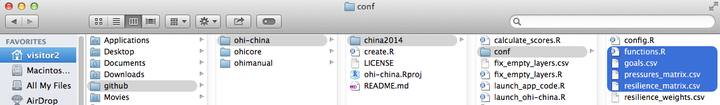

**Example: Removing carbon storage (CS) goal**

To completely remove the carbon storage goal from Index calculations, you will do the following.

1) Remove the carbon storage (CS) goal model from `functions.R`. Delete the highlighted text in the figure below that references the CS layers and calculates CS goal status, trend, and scores.


2) Remove the CS row from `goals.csv`. Delete the highlighted row in the figure below that contains the CS goal.


3) Remove all CS rows from `pressures_matrix.csv`. Delete the highlighted rows in the figure below that contain CS pressures.

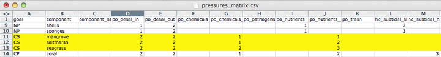

4) Remove all CS rows from `resilience_matrix.csv`. Delete the highlighted rows in the figure below that contain CS resilience.


## Removing Sub-goals from a Supra-goal

Sometimes a _supra-goal_ (ie. BD, LE, and FP), or a goal that has _sub-goals_, can be assessed as an individual goal by removing the sub-goals. For example, if the biodiversity in your area can be represented well with only species and not habitats, it is possible to only assess species (ie. only the SPP subgoal and not the HAB subgoal). But this would then make the BD goal only have one subgoal (SPP). It is better to remove that subgoal and make it clear that BD is the biodiversity goal for species.

Here we will use BD as an example to illustrate how you can delete the subgoals and make a supra-goal into a goal.

`ohicore` pulls information from several files and scripts to combine scores from subgoals to calculate overall goal scores. The process of removing subgoals thus involves removing subgoal information from all these files:

- `goals.csv`
- `functions.r`
- `pressures_matrix.csv`
- `resilience_matrix.csv`

_**NOTE**: These steps do not need to occur in this sequence._

### Remove subgoals from `goals.csv`

`goals.csv` is a table with information about the relationship between goals and sub-goals. Description of what each column means can be read in the [data layers](http://ohi-science.org/manual/#data-layers) section, under _goals.csv_.

As illustrated in the graph below, removing the subgoals involves simplifying how BD and its subgoals are registered in the columns:

- change the _order_ and _order_hierarchy_ to 10
- remove BD from the _postindex_function_ column & add to the _preindex_function_ column
- change the function call from `BD(scores)` to `BD(layers)`


### Remove subgoals from `functions.r`

`functions.r`contains the R codes to calculate status and trend for each goal and sub-goal, contained within individual functions. Calculations are done using prepared layers saved in the _layers_ folder and registered in _layers.csv_. As shown below, HAB and SPP each has its own function, calling data layers from _layers_. The BD function combines HAB and SPP scores, calling _scores_.

To remove the subgoals, you can delete functions for HAB and SPP completely, and write a function for BD as you would for any goal, calling _layers_.

> Remember that subgoal functions read in data _layers_ and calculated sub-goal scores; supra-goal reads in those sub-goal _scores_ to calculate scores for that supra-goal.  


### Remove subgoals from `pressures_matrix.csv`

This table indicates which individual pressures (stressors) affect which goal, sub-goals, or elements, and weights them from 1-3 based on the degree of impacts. To remove subgoals from this matrix, you can simply delete the rows for each subgoal (HAB and SPP), and add a new row for BD, and treat BD as you would an individual goal with no subgoals.


### Remove subgoals from `resilience_matrix.csv`

This table records information on which individual resilience measures affect which goal, sub-goals, or elements. Similar to what you would do with 'pressures_matrix.csv', you can delete the rows for HAB and SPP, and add a new row for BD.


# Calculate overall OHI Index Scores

Congratulations if you've finished all goal model modifications as they are the most time-consuming part of the Index calculation process! In the goal model modification step, you've calculated goal status and trend, there are only a couple of more steps to do to calculate the overall index score, including calculating pressures and resilience.

### Additional data layers for pressures and resilience calculations

So far you would have prepared the pressure and resilience matrices, as well as the appropriate data layers, a few more data layers are needed to complete the calculation. They are identified in `assessmentYEAR/conf/config.R` as follows:

```
# components describe the layer and level with which to aggregate resilience and pressures matrices for goals with categories
resilience_components = list('NP'  = c('layer'='np_harvest_product_weight' , 'level'='region_id-category'),  
                             'CS'  = c('layer'='cs_habitat_extent'         , 'level'='region_id'),
                             'CP'  = c('layer'='cp_habitat_extent_rank'    , 'level'='region_id'),          
                             'HAB' = c('layer'='hab_presence'              , 'level'='region_id'))
pressures_components  = list('NP'  = c('layer'='np_harvest_product_weight' , 'level'='region_id-category'),
                             'CS'  = c('layer'='cs_habitat_extent'         , 'level'='region_id'),
                             'CP'  = c('layer'='cp_habitat_extent_rank'    , 'level'='region_id'),
                             'LIV' = c('layer'='le_sector_weight'          , 'level'='region_id'),
                             'ECO' = c('layer'='le_sector_weight'          , 'level'='region_id'),
                             'HAB' = c('layer'='hab_presence'              , 'level'='region_id'))
```

`np_harvst_product_weight` is also used in NP and CS status calculations, and thus do not require special preparations. The rest of the data layers need additional preparations, which can be done in the `prep` folder).

`cs_habitat_extent` is calculated as `habitat_extent * rank`. Rank refers to relative contributions of each type of habitats to carbon storage. Here is an example calculation:

```
# cs_habitat_extent = Habitat extent * rank, per Carbon Storage habitat
#                   = extent * contribution

extent = layers$data[['cs_extent']] %>%
  select(rgn_id, habitat, extent = hectare)

contribution = layers$data[['cs_contribution']] %>%
  select(rgn_id, habitat, contribution = value)

result = full_join(extent, contribution, by = c('rgn_id', 'habitat')) %>%
  mutate(hectare = extent*contribution) %>%
  select(rgn_id, habitat, hectare)

```

`cp_habitat_extent_rank` is calculated as `habitat_extent * weight`. Weight refers to relative contributions of each type of habitats to coastal protection. See this example:

```
# cp_habitat_extent_rank = Habitat extent * rank, per Coastal Protection habitat
#                        = extent * weight

habitat.wt = c('saltmarshes' = 3,
               'mangroves' = 4,
               'seagrasses' = 1,
               'coral reef' = 4)

m = layers$data[['cp_extent']] %>%
  group_by(rgn_id, habitat) %>%
  filter(year == max(year)) %>% #choose the most recent year's data
  select(-layer,
         -year,
         extent = hectare) %>%
  mutate(weight = habitat.wt[habitat],
         extent_rank = extent * weight) %>%
  select(rgn_id, habitat, extent_rank)

```

`hab_presence` is calculated on a binary basis. All regions with a habitat is assigned "1". Example:

```
# hab_presence: 1 for presence

m = layers$data[['hab_extent']] %>%
  group_by(rgn_id, habitat) %>%
  filter(year == max(year)) %>%  #choose the most recent year's data
  select(-layer,
         -year,
         extent = hectare) %>%
  mutate(boolean = 1) %>%
  select(rgn_id, habitat, boolean)

```

`le_sector_weight` assigns relative importance of each sector listed in Livelihood & Economies goal. By default, all sectors are considered equal and assigned a weight of "1". One thing to pay special attention to is the `sector` names, which should match `component` names that were listed in the pressures matrix.

### Final calculation

Go back to `calculate_scores.r`, now you are ready for the final calculations:

```
# calculate scenario scores
scores = CalculateAll(conf, layers, debug=F)

# save scores as .csv file, tables and figures
write.csv(scores, 'scores.csv', na='', row.names=F)

```

After the calculation is done, you should be able to see the compiled score sheet for all goals in all regions in `sub-country/scores.csv`.

It is very likely that during the CalculateAll process you'll encounter problems and see error messages. In most cases, the error messages can specify what the error is and in which step it occurs, which should be helpful for trouble shooting. Some commonly occurring errors and how to fix them can be found in the Troubleshooting section of the manual.

# Toolbox Troubleshooting

The Toolbox prints messages during its processing to help guide error checking and debugging. Here are a few troubleshooting tips. This section will be updated frequently; please share any problems that you encounter.  

## General Software Errors
### rpostback-askpass error

Sometimes when RStudio won't push committed changes to GitHub, RStudio displays an `rpostback-askpass` error:

```
error: unable to read askpass response from 'rpostback-askpass'
fatal: could not read Username for 'https://github.com': Device not configured
```


To fix it, open the shell: Tools > Shell.

`git push -u origin master`


### Git not detected on system path

After downloading and installing git, sometimes RStudio is unable to locate git and will show the following error:


It is important to make sure you do in fact have git installed on your computer first. You can do this by opening up terminal (Mac OSX) or the cmd line (Windows) and typing:

  * `$ which git` for Mac/Linux,
  * `$ where git` for Windows

These commands will tell you where the `git.exe` file is located. Typically it will look something like this: `/usr/local/git/bin/git` or `/usr/bin/git` or some variation of those.

Once confirming the location of `git.exe` you need to tell RStudio where it is. Open up RStudio, got to Preferences and select the Git/SVN option:

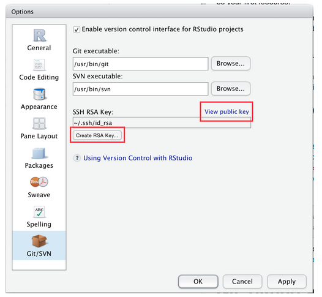

In the Git executable area, fill in the path to your git.exe. If RStudio does not let you manually enter your path, select Browse... and navigate to the `git.exe` file. If you are not able to navigate to the file it is likely a hidden file.

On a Mac, to make hidden files visible, close RStudio and do the following:

  * Open Terminal found in Finder > Applications > Utilities.
  * In Terminal, paste the following: defaults write com.apple.finder AppleShowAllFiles YES.
  * Press return.
  * Hold the 'Option/alt' key, then right click on the Finder icon in the dock and click Relaunch.

And then reopen RStudio, go to Preferences -> Git/SVN -> Browse... and you should be able to navigate to the `git.exe`

You will then need to create an RSA Key. You can do this by clicking on 'Create RSA Key...' at the bottom of the Git/SVN panel, then 'View public key'. Copy the key you see, and add it to your GitHub account by using the instructions provided [here](https://help.github.com/articles/generating-ssh-keys/#step-4-add-your-ssh-key-to-your-account).


### Loading RWorkspace on Restart

When you restart your R Session (**Session > Restart R** on a Mac), if you see that it is trying to load `ohicore`, it may give you an error:

  > 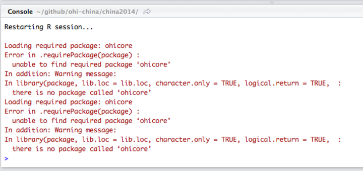

You do not want it to load `ohicore` or to save anything in your workspace. You will need to change the default setting from you **.Rproj** file. Steps to do this:

1. Go to Project Options, either in the pull-down menu or by double-clicking the .Rproj file:


  > 

  > 

2. Change all options to **No:**

  > 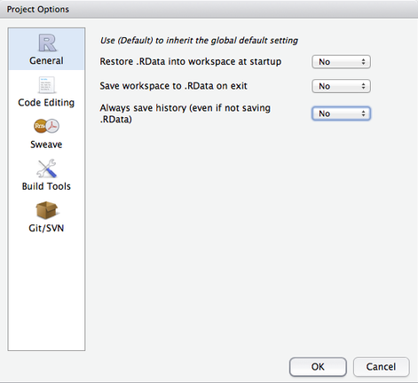

## Errors when Using the Toolbox
### Useful Errors when Calculating Scores

  TIP: You can use the *layers* function in `calculate_scores.R` to error-check whether you have registered your files in `layers.csv` correctly or not. If you haven't, you will get an error message regarding 'missing files'. 

### `CheckLayers()` error due to 'Rows Duplicated...'

  After registering and uploading data layers, you would run `CheckLayers` in `calculate_score.R` to make sure there is no errors with the data files. For example, this error appeared after uploading SPP species data

  

  You can use the `duplicated` function to check which rows in that file is duplicated. Here we checked the first two columns in that file, rgn_id and sciname:

  ````r
  d[duplicated(d[c('rgn_id', 'sciname')]),]

     rgn_id                sciname CHN_class IUCN_class value       layer
  29       2       Chlidonias niger         1             0.46 spp_species
  270     10 Stenella longirostris          2         DD  0.17 spp_species

  ````

### `Layers()` error due to 'row.names: duplicate 'row.names' are not allowed'

The following error means that within `layers.csv`, there are duplicate rows with the same layernames.

The warning message identifies several layer names to investigate...
```
Error in `row.names<-.data.frame`(`*tmp*`, value = c(2L, 1L, 7L, 14L,  :
  duplicate 'row.names' are not allowed
In addition: Warning message:
non-unique values when setting 'row.names': ‘cw_con_dioxin_status’, ‘cw_con_dioxin_trend’, ‘cw_con_ices6_status’, ‘cw_con_ices6_trend’, ‘cw_con_pfos_status’, ‘cw_con_pfos_trend’, ‘cw_nu_status’, ‘cw_nu_trend’, ‘fis_bbmsy’, ‘fis_ffmsy’, ‘fis_landings’, ‘ico_status’, ‘le_gdp_region’
```
...and when inspecting `layers.csv`, there are indeed duplicate entries for the same layernames.


To fix these errors, ensure there are only single entries for each layer name; delete any duplicated rows.

### Calculating Pressures...

#### 'The following components for [goal] are not in the aggregation layer [layer]...'

Example:

> 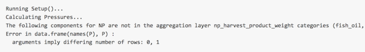

  >   

This error means you should update your pressures matrix because it expects there to be components that your region does not have.

#### 'Error in matrix... '

Example:
  >   

This error means there is an empty column in `pressures_matrix.csv`, and the Toolbox cannot handle empty columns.

#### `Error in ... length of 'dimnames' [2] not equal to array extent`
If you get the following error message when running `calculate_scores.r`:

```r

scores = CalculateAll(conf, layers, debug=F)
Calculating Status and Trend for FIS...
Calculating Status and Trend for MAR...
reference point for MAR is: 1.16739059262319 (region 8)
Calculating Status and Trend for AO...
Calculating Status and Trend for NP...
Calculating Status and Trend for CS...
Calculating Status and Trend for CP...
Calculating Status and Trend for TR...
Calculating Status and Trend for LIV...
Calculating Status and Trend for ECO...
Calculating Status and Trend for ICO...
Calculating Status and Trend for LSP...
Calculating Status and Trend for CW...
Calculating Status and Trend for HAB...
Calculating Status and Trend for SPP...
Calculating Pressures...

Error in matrix(as.matrix(d.p[, -1]), nrow = nr, ncol = np, dimnames = list(region_id = d.p[[1]],  :
  length of 'dimnames' [2] not equal to array extent

```

It is because not all the pressures layers listed in `pressures_matrix.csv` are layers listed in `layers.csv`.

We troubleshooted this by putting a `browser()` in `ohicore::CalculatePressuresAll.r` on L35 (after searching in that file for 'dimnames' to try to triangulate to the problem. Then, when rerunning `calculate_scores.r` with the browser, we looked at the following variables and found the mismatch between the list of layers in `pressures_matrix.csv` (the `p.layers` variable, top) and the list of available layers (bottom) which EXCLUDES `po_pathogens`.

```r

Browse[1]> p.layers
 [1] "cc_acid"             "cc_slr"              "cc_sst"              "cc_uv"               "fp_art_hb"           "fp_art_lb"           "fp_com_hb"           "fp_com_lb"          
 [9] "fp_targetharvest"    "hd_destruction_rate" "hd_intertidal"       "hd_subtidal_hb"      "hd_subtidal_sb"      "po_chemicals"        "po_nutrients"        "po_pathogens"       
[17] "po_sedimentation"    "po_trash"            "sp_alien"            "sp_genetic"          "ss_wgi"      

list(region_id=d.p[[1]], pressure=names(d.p)[-1]
+ )
$region_id
 [1]  1  2  3  4  5  6  7  8  9 10 11

$pressure
 [1] "cc_acid"             "cc_slr"              "cc_sst"              "cc_uv"               "fp_art_hb"           "fp_art_lb"           "fp_com_hb"           "fp_com_lb"          
 [9] "fp_targetharvest"    "hd_destruction_rate" "hd_intertidal"       "hd_subtidal_hb"      "hd_subtidal_sb"      "po_chemicals"        "po_nutrients"        "po_sedimentation"   
[17] "po_trash"            "sp_alien"            "sp_genetic"          "ss_wgi"             


```


Double-checking `pressures_matrix.csv` showed that `po_pathogens` was indeed there, but on `layers.csv`, there was a typo and it was entered as `po_pathoges`. So it was registered properly as a layer but never used--so passed through `ohicore::CheckLayers` original checking


Also: capital `Q` quits you from the `browser()`

### Calculating Resilience ...

#### 'Error in match(x, table, nomatch = OL) : object id_num not found'

  > 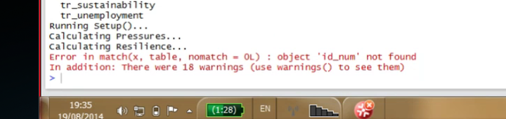  

This error means you should check that there is at least one entry for each goal (for each row) in `resilience_matrix.csv`.

####
Error message `Each goal in resilience_matrix.csv must have at least one resilience filed`

```r
Calculating Resilience...
Note: each goal in resilience_matrix.csv must have at least one resilience field
 Show Traceback

 Rerun with Debug
 Error: all(t %in% resilience_categories) is not TRUE

```

means that the list of resilience layers listed in `resilience_matrix.csv` does not match the list in `resilience_weights.csv`.

`CalculateResilienceScore.r L112` is where this error was generated (called from `CalculateResilienceAll.r`.

# Appendix 1: Toolbox Software

The OHI Toolbox is open-source and can be downloaded and installed for free. It is essentially a workflow building off the following software: [**R**](https://cran.r-project.org/),  [**RStudio**](https://www.rstudio.com/), [**git**](https://git-scm.com/), and  [**GitHub**](https://www.github.com/)  

<!-- You are able to navigate through these files both at `www.github.com/OHI-Science` and on your own computer once you have cloned the repository to your computer. Your assessment repository is located at *github.com/OHI-Science* and we recommend saving it to your computer so that you can sync changes back online to save versions and facilitate collaboration. Conducting an OHI assessment using GitHub enables collaboration and transparency, and will provide access to the latest developments in the Toolbox software, allowing the OHI team to provide support remotely if necessary.
This section explains the GitHub workflow and how to access and setup required software. You can use GitHub to upload any modifications you make so that you can work collaboratively with your team.  -->

  > 

The OHI workflow depends on the above software. Here is a quick introduction to the software and how they work together.

## Introduction

### GitHub and git

GitHub has an online interface and a desktop application for the version-control software called ** git**, where your project repository and any changes done to it are kept and recorded. It is an open-source development platform that enables easy collaboration and versioning, which means that all saved versions are archived and attributed to each user. It can be accessed remotely by all members of your team and enables team members to synchronize their work together. Because all versions are saved, you can return to previous work and also compare different points in history to track how changes you make affect the output scores.

To allow multiple users to work on the same repository at the same time, there are steps involved to 'commit' your modifications so they can merge with the work of others without problems. GitHub has specific words for each of these steps.

**GitHub Vocabulary:**

* **clone** ~ download an online repository to your computer to your local machine with syncing capabilities enabled
* **commit** ~ message associated with your changes at a point in time, before being able to sync back to the online repository
* **pull** ~ pull changes from an online repository to your computer
* **push** ~ push committed changes back to the online repository with your version, only possible after committing
* **sync** = pull + commit + push

> TIP: While you can edit files in the online GitHub repository, we do not recommend this. It is good practice to track changes through commits and syncing.

The example below illustrates GitHub's collaborative workflow:


There are also many great resources available online with more in-depth information:

* **Git and GitHub** by Hadley Wickham: [r-pkgs.had.co.nz/git.html](http://r-pkgs.had.co.nz/git.html)
* **Collaboration and Time Travel: Version Control with Git, GitHub and RStudio** video tutorial by Hadley Wickham: [www.rstudio.com/resources/webinars](http://www.rstudio.com/resources/webinars/)
* **Good Resources for Learning Git and GitHub** by GitHub: [help.github.com/articles/good-resources-for-learning-git-and-github/](https://help.github.com/articles/good-resources-for-learning-git-and-github/)


### R and RStudio

**R and RStudio allow you to work locally on your own computer**, modifying the files in the repository to reflect the desired modifications your team has identified for your assessment. All changes within your local repository will be tracked by GitHub regardless of the software you use to make the changes. This means that you can delete or paste files in the Mac Finder or Windows Explorer and edit *.csv* files in Excel or a text editor, and still sync these changes with the online repository. We recommend doing as much data manipulation as possible in a programming language like R, to maximize transparency and reproducibility.

* **R** is a free computing and graphical software where all the modifications to your OHI repository are done.

* **RStudio** is a user-friendly R interface that can be used to synchronize any modifications you make to files in your assessment’s repository. It is where model modifications and calculations occur.

Through RStudio, you can perform all the steps mentioned before (_clone, commit, push, and pull_) and _sync_ with the online Github repository.

### Syncing Github and RStudio

RStudio can sync files with Github directly. It will capture the changes made to any files within the repository, no matter which software was used to modify them. In RStudio, you sync by first pulling and then pushing (separately).

Launch your project in RStudio by double-clicking the `.Rproj` file in the assessment folder on your local hard drive.


When you modify or add a file, the file will appear in the 'Git' window once it has been saved. In the example below, the file `test.R` was created.

<span style="font-size:0.9em">

1. Clicking the '_Staged_' (checked) box and the '_Commit_' button opens a new window where you can review changes.
2. Type a commit message that is informative to the changes you've made.
  - Note 1: there will often be multiple files 'staged' at the same time, and so the same commit message will be associated with all of the updated files. It is best to commit changes often with informative commit messages.
  - Note 2: clicking on a staged file will identify additions and deletions within that file for your review
3. Click '_Commit_' to commit the changes and the commit message.
4. "Pull" any changes that have been made to the online repository. This is important to ensure there are no conflicts with updating the online repository, especially if you are working with collaborators who might be working on the same files as you are.
5. "Push" your committed changes to the online repository. Your changes are now visible online.
</span>

> TIP: If you aren't seeing your changes in the 'Git' window, try saving the file again.


_Note_: Another option to syncing your edits on a repo with the online version is to use **Command Lines**, if you are familiar with it. There are resources available online on how to do so.    

## Setting up Github and RStudio

In this section, you will learn how to successfully set up your _tailored_ toolbox by following these step-by-step instructions:

1. Create your online _Github_ account and set up _git_ on your local computer
2. Install _R_ and _RStudio_ on your local computer
3. Clone your tailored repository from Github to your local computer via RStudio
4. Install `ohicore` package

Let's get started!

### Set up a Github Account and git

<!-- GitHub has an online interface and a desktop application for the version-control software called ** git**, where your project repository and any changes done to it are kept and recorded. All changes within your local, desktop repository will be tracked by GitHub regardless of the software you use to make the changes, and saved shared via its online interface. This means that you can delete or paste files in the Mac Finder or Windows Explorer and edit *.csv* files in Excel or a text editor, and still sync these changes with the online repository. To do so, you will need to create a GitHub account online and install git, R, and RStudio on your local computer. All are freely available. -->

You can create a GitHub account at http://github.com. Choose a username and password. You will use this username and password when you install and set up *git* on your computer.

#### Install *git* software

**git** is available for download at [https://git-scm.com/downloads](https://git-scm.com/downloads). How you install *git* will depend on whether you are working on a Windows or Mac computer. It will also depend on your operating system version. If you have problems following these instructions, it is likely because your operating system requires a previous version of *git*. Previous versions are available from http://www.wandisco.com/git/download (you will need to provide your email address).

**For Windows:**

* Download *git* at http://git-scm.com/downloads and follow the install instructions.

* When running the Windows installer, use all default options except "Adjusting your PATH environment": instead, select "_**Run Git from the Windows Command Prompt**_". This will allow later compatibility with RStudio.  

  > 

**For Mac:**

* Download *git* at http://git-scm.com/downloads and follow the install instructions.
* Apple's [Xcode](https://developer.apple.com/xcode/) has a command line tools option during install which can override the preferred *git* command line tools. To ensure you are using the latest preferred version of *git*, you will need to launch  Terminal and type the following few lines of code:
* Access Terminal from the Applications folder: **Applications > Utilities > Terminal**. When you launch Terminal a window will appear with your computer’s name followed by a `$`. When you type, your commands will appear after the `$`.

Add access your 'bash profile' by typing:

```
pico ~/.bash_profile
```

You are now able to edit your ‘bash profile’ and your screen will change; it will look like this:

> 

Now type:

```
export PATH=/usr/local/git/bin:$PATH
```

Exit pico by entering:

> control-X  
y  
return/enter


Exit Terminal by typing:

```
exit
```

Finally, quit Terminal.

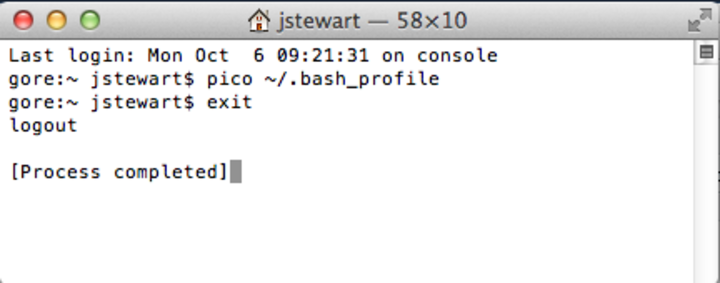


#### Set up your Git Identity

After downloading and installing *git*, you will need to set up your **Git Identity**, which identifies you with your work. *Note*: if you have any problems with the following instructions, it is likely because of incompatibility between the version of your operating system and the version of git you downloaded in the previous section. In this case, find and download a compatible version at [www.wandisco.com/git/download](www.wandisco.com/git/download) and then follow the instructions below.

You will set up your GitHub identity using the command line specific to Windows or Mac:

* **Windows**: Start > Run > cmd
* **Mac**: Applications > Utilities > Terminal

In the window, you will see a cursor where you are able to type. Type the following and press return (or enter) at each step. Make sure all spaces and symbols are identical to the example below, including all spaces ( ) and dashes (-).

Substitute your GitHub username instead of jdoe:
```
git config --global user.name jdoe
```
and then: substitute the email address you used to create your GitHub account:
```
git config --global user.email johndoe@example.com
```

You can check settings with the following:

```
git config --list
```

Quit the Terminal after typing:
```
exit
```

<!-- ### Install the GitHub application

There are several options to clone your repository to your local machine. When getting started, we recommend using the GitHub application. This is freely available for download. Follow the default instructions for downloading and installing from the following:

* **Windows**: https://windows.github.com/.

* **Mac**: https://mac.github.com/. -->

#### Create a folder called *github* on your computer

Because you will use GitHub to collaborate with your team or request support from the OHI team, it is important you save files in places where the file path that is universal and not specific to your computer. When team members save files in different places, this will create a lot of problems when collaborating, particularly between Macs and Windows machines.

**Please create a folder called github in your root directory**. The file path for this folder will be:

* **Windows**: `Users\[User]\Documents\github\`
* **Mac**: `Users/[User]/github/`

This folder can be identified by any computer as `~/github/`.  

> TIP: You can check the location of your `github` folder by right-clicking the folder icon and selecting 'Get Info' on a Mac or 'Properties' on Windows.


#### Update permissions

You need to **email your username to ohi-science@nceas.ucsb.edu** for permission to upload modifications to your GitHub repository (you only need to do this once). Only team members who will be modifying files will need to do this; all other members can view online and download the repository without these permissions.  


### Download R and RStudio

You can download R, and RStudio for free from their perspective websites and install the latest versions allowed by your operating system on your computer:

**R**: [http://cran.r-project.org/](http://cran.r-project.org/)

**RStudio**: [https://www.rstudio.com/](https://www.rstudio.com/)

**R and RStudio update frequently**. If you already have those software installed, check on the websites for the most recent version. In general, it's good practice to check periodically for updates. When you run into unexplained errors while modifying contents in RStudio, check first if your versions of R or RStudio are out-of-date. For R, you can see what you already have on your computer by typing "sessionInfo( )" into your R console.

**If you are working on a _Mac_,** you will need to tell RStudio to use the proper version of Git by doing the updating the preferences for 'Git executable':

**RStudio > Preferences... > Git/SVN > Git executable: /usr/local/git/bin/git**

> TIP: if you are working on a Mac, the git file is hidden. To find it easily, hold *shift+command+g* and paste /usr/local/git/bin/git in the pop-up window. Select git (which should be already preselected) and select Open, then Ok.

## Cloning a repository to your local computer

In order to sync GitHub and RStudio, you need to clone your GitHub repository to RStudio. Here is a guide on how to do so:


## Install `ohicore`

`ohicore` is a R package containing all the essential functions you will use to calculate the final OHI scores. You will install `ohicore` as you would other R packages and will only need to do this once. You can find the script `install_ohicore.r` in your scenario folder (eg. chn/province2015/). Source it, and now your Toolbox is all set up and ready to go!

> Although `ohicore` is a package you would not normally interact with, it can be useful to have the folder cloned to your computer for debugging, particularly with pressures and resilience calculations for goals that have components in the matrix. To do so, you will clone the repository (https://github.com/OHI-Science/ohicore) as you would your assessment repository.

# Appendix 2: R Tutorials for OHI

Ocean Health Index R code uses several packages and best practices to faciliate
understanding and collaboration. These approaches are presented here, along with
examples using data included in global OHI assessments.

This document describes several packages that are used extensively in OHI assessments and
introduces you to typical coding practices commonly seen in OHI scripts and functions.

Also see the accompanying R script to test examples using these packages.

### R Very Basics:
* Have you already downloaded and installed [R](http://www.r-project.org/)?
* Have you already downloaded and installed [RStudio](http://www.rstudio.com/)?
* Have you walked through the excellent interactive tutorials
from [swirl](http://swirlstats.com/students.html)?

### `tidyr` functions

'Tidy' up your messy data using `tidyr` to make it easier to work with.  The
'tidy tools' functions in the `dplyr` package work best with tidy data.

From Hadley Wickham's [*Tidy Data* paper:](http://vita.had.co.nz/papers/tidy-data.html)
>It is often said that 80% of data analysis is spent on the cleaning and preparing data. And it's not just a first step, but it must be repeated many over the course of analysis as new problems come to light or new data is collected. To get a handle on the problem, this paper focuses on a small, but important, aspect of data cleaning that I call data tidying: structuring datasets to facilitate analysis.

From [RStudio's introduction to `tidyr`](http://blog.rstudio.org/2014/07/22/introducing-tidyr/):

> The two most important properties of tidy data are:
1. Each column is a variable.
2. Each row is an observation.

> Arranging your data in this way makes it easier to work with because you have a
consistent way of referring to variables (as column names) and observations
(as row indices). When you use tidy data and tidy tools, you spend less time
worrying about how to feed the output from one function into the input of
another, and more time answering your questions about the data.


`gather()` is arguably the most useful function in `tidyr`, and is explained in
more detail below.  `spread()` and `separate()` are other useful functions in
`tidyr`.

Other 'tidyr' references:
* [Hadley Wickham's *Tidy Data* paper:](http://vita.had.co.nz/papers/tidy-data.html)
Download the pre-print version for the whys and hows of tidy data.
* [Cran tidy data vignette:](http://cran.r-project.org/web/packages/tidyr/vignettes/tidy-data.html)
An informal and code heavy version of Hadley's full *Tidy Data* paper.
* [RStudio Blogs: Introducing tidyr:](http://blog.rstudio.org/2014/07/22/introducing-tidyr/)
Basics and philosophy of `tidyr`
* [swirl tutorial package:](http://swirlstats.com/students.html) A tutorial
package built directly into R.  Section 2: 'Getting and Cleaning Data' runs you
through `dplyr` and `tidyr` basics
* [R data wrangling cheat sheet:](http://www.rstudio.com/wp-content/uploads/2015/02/data-wrangling-cheatsheet.pdf)
A quick reference guide to `tidyr` and `dplyr` functions

#### tidyr::gather()

**Description**  

`gather()` takes data organized in rows and collapses them into a column format (a
key column and a value column), duplicating all other columns as needed. Use
`gather()` when your data is organized in "wide" format, in which some of your
variables are in row form, rather than column form.  Another `tidyr` function,
`spread()`, is more or less the reverse of `gather()`, to reformat long data
into wide data. It is more difficult to work with wide data, but may be
more convenient for examining data in a table format.

Note: `gather()` essentially replaces `melt()` in `plyr` package.

**Example**  

The sample data set (see intro) contains harvest data of a number of marine
commodities, separated by country, commodity, and year.  In its original form,
the harvest data (in tonnes) is spread across five different harvest years.
* Counter to 'tidy data' principles, we have multiple columns (X2007:X2011)
representing a single variable (year), and multiple observations of harvest
tonnage in each row.
* To transform this into 'tidy data' we will gather the five annual harvests
into a single column called 'tonnes' and note the year of harvest in a new column
called 'year'.

The example in the figure below shows how the original wide data is transformed into long
data using the command `gather`. Here are two ways of acheiving this:

1. Here, information from columns X2007 through X2011 are gathered into a single column called `year`, and the information in each column are put into a new column called `tonnes`.

```
data_long <- data_wide %>% gather(year, tonnes, X2007:X2011)
```

2. Here, the `-` unselects the named columns, so they will not be gathered; all other columns are gathered into columns named `year` and `tonnes`. This approach will  yield the same result.

```
data_long <- data_wide %>% gather(year, tonnes, -Country, -Commodity, -Trade)
```


### `dplyr` functions

The `dplyr` package includes a number of functions to easily, quickly, and
intuitively wrangle your data. Here is a quick introduction with examples from data used in the Ocean Health Index.

From [RStudio's introduction to `dplyr`](http://blog.rstudio.org/2014/01/17/introducing-dplyr/):

> The bottleneck in most data analyses is the time it takes for you to figure
out what to do with your data, and `dplyr` makes this easier by having individual
functions that correspond to the most common operations...

> Each function does one only thing, but does it well.

The most important `dplyr` functions to understand for data processing will be
 `group_by()`, `mutate()`, and `summarize()`. Also important, `dplyr` introduces
the ability to perform subsequent functions in a logical and intuitive manner,
using the `%>%` chain operator.

* `%>%` (chaining operator): allows sequential
chaining of functions for cleaner, easier-to-read code
* `dplyr::select()`: selects variables to be retained or dropped from dataset
* `dplyr::filter()`: filters data set by specified criteria
* `dplyr::arrange()`: sorts dataset by specified variables
* `dplyr::mutate()`: adds variables or modifies existing variables
* `dplyr::summarize()`: uses analysis functions (sum, mean, etc) to summarize/aggregate specified variables
* `dplyr::group_by()`: groups data by specified variables, allowing for group-level data processing.

Other `dplyr` references:

* [RStudio blogs: Introducing dplyr:](http://blog.rstudio.org/2014/01/17/introducing-dplyr/): philosophy, examples, and basics of `dplyr`
* [Cran dplyr vignette:](http://cran.rstudio.com/web/packages/dplyr/vignettes/introduction.html) Walkthrough of `dplyr` with examples
* [`dplyr` and pipes: the basics:](http://seananderson.ca/2014/09/13/dplyr-intro.html) More examples of `dplyr` functions, and more depth on `%>%`
* [swirl tutorial package:](http://swirlstats.com/students.html) A tutorial package built directly into R.  Section 2: 'Getting and Cleaning Data' runs you through `dplyr` and `tidyr` basics
* [R data wrangling cheat sheet:](http://www.rstudio.com/wp-content/uploads/2015/02/data-wrangling-cheatsheet.pdf) a quick reference guide to `tidyr` and `dplyr` functions

#### %>% operator

**Description**  

The `%>%` operator allows you to 'pipe' or 'chain' a number of function calls,
in which the output dataframe of one function is fed directly into the next
function as the input dataframe.
This lets you avoid creating temporary variables to store intermediate values,
and lets you avoid nesting multiple functions.  Using `%>%` makes your code more elegant, streamlined, and easy to read since you are able to write your code on multiple indented lines.  From
[`dplyr` and pipes: the basics:](http://seananderson.ca/2014/09/13/dplyr-intro.html)  

> OK, here's where it gets cool. We can chain `dplyr` functions in succession.
This lets us write data manipulation steps in the order we think of them and
avoid creating temporary variables in the middle to capture the output. This
works because the output from every `dplyr` function is a data frame and the
first argument of every `dplyr` function is a data frame.

**Usage**  

```
data_out <- f(data_in, args)
  # standard function call

data_out <- data_in %>% f(args)
  # function call using %>% operator. data_in is passed as first argument
  # of function().

data_out <- data_in %>%
  f1(args1) %>%
  f2(args2) %>%
  f3(args3) %>% ...
  # Output of function can be passed to another function immediately,
  # without need for temporary storage. Indented format for legibility,
  # see how pretty it looks?
```

**Example**  

```
### Bad!  Nested functions: read from inside out - hard to decipher
  h_recent_totals1 <- arrange(mutate(filter(group_by(harvest, country, commodity),
    year >= 2009), harvest_tot = sum(tonnes, na.rm = TRUE)), country, commodity)

### Better: Line by line. Easier to read, but have to wait for the end to see
### what it does.  Temp variables add more places for errors and bugs.
  h_temp <- group_by(harvest, country, commodity)
  h_temp <- filter(h_temp, year >= 2009)
  h_temp <- mutate(h_temp, harvest_tot = sum(tonnes, na.rm = TRUE))
  h_recent_totals2 <- arrange(h_temp, country, commodity)

### Best!  Chained format intuitively links together the functions. Saves
### typing, fewer opportunities for errors, easier to debug. The %>% operator
### automatically indents each following line for easy reading.
  h_recent_totals3 <- harvest %>%
    group_by(country, commodity) %>%
    filter(year >= 2009) %>%
    mutate(harvest_tot = sum(tonnes, na.rm = TRUE)) %>%
    arrange(country, commodity)
```

#### dplyr::select()

**Description**  

`select()` allows you to choose specific columns/variables from your dataset,
and drop all others.  Alternately, you can select specific variables to drop,
leaving others in place.  `rename()` is a relative of `select()` that allows
you to rename variables, while leaving all variables in place.


**Examples**  

The sample dataset  includes the annual harvest, in tonnes, of a number of
commodities exported by two countries.  Type of trade provides no information
(it is all Export), so that variable can be dropped.  The names of all the
variables should be converted to lower-case, to match the OHI style guide.
See the figure below.

```
### Example 1:
harvest <- harvest %>%
  select(Country, Commodity, year, tonnes)
  ### Selects the named variables, and drops all others.  Useful to choose a
  ### subset of key variables from a complicated data set.

### Example 2 (same result as example 1):
harvest <- harvest %>%
  select(-Trade)
  ### Using the '-' drops 'Trade' column and leaves other variables intact.
  ### Useful if you would like to clear out temporary variables.

harvest <- harvest %>%
  rename(country = Country, commodity = Commodity)
  ### Drops no variables. Syntax: rename(new_var_name = old_var_name) w/o quotes.
```

Using the chain operator, we can string these two functions into one smooth,
easy-to-read flow:
```
harvest1 <- harvest %>%
  select(-Trade) %>%
  rename(country = Country, commodity = Commodity)
```
The `harvest` data is fed into `select()`, and the output is fed into
`rename()`. The final output of this complete flow is assigned to the new
variable `harvest1`.


#### dplyr::filter()

**Description**  

`filter()` allows you to select observations (rows) that match search criteria,
using values in specified variables (columns).  Drops all observations that do
not match the criteria.
* Use logical operators & and | to filter on multiple criteria simultaneously

**Example**  

```
harvest_vnm  <- harvest %>%
  filter(country == 'Vietnam')
  ### Single criterion filter: keeps only data with country matching 'Vietnam'.

h_vnm_recent <- harvest %>%
  filter(country == 'Vietnam' & year >= 2009)
  ### filter with multiple criteria: selects 'Vietnam' data from 2009 or later.
```

#### dplyr::arrange()

**Description**  

`arrange()` sorts observations (rows) based upon a specified variable or list of
variables.  Does not actually change the data in any way, only the appearance.
Useful for inspecting your data after each processing step.

**Example**  

```
harvest_sorted <- harvest %>%
  arrange(country, commodity, year)
  ### Sorts commodity harvest values for each country, chronologically

harvest_sorted <- harvest %>%
  arrange(country, commodity, desc(year))
  ### Sorts harvest values by most recent year (descending order)
```

#### dplyr::mutate()

**Description**  

`mutate()` is a powerful and useful tool for processing data.  You can add new
variables or modify existing variables, using all variety of functions to
perform operations on the dataset. `mutate()` works well with `group_by()` to
perform calculations and analysis at a group level rather than dataset level.

**Example**  

From the sample data set (see figure below), we would like to:

* Remove the 'X' from the 'year' values.
* Translate the text codes in 'tonnes' into numbers and NAs.  These codes are
specific to FAO's data reporting format: `...` is the same as `NA`, and `0 0`
means greater than zero, but less than half a tonne.
* Convert these text fields into numeric fields so they can be analyzed properly.


```
library(stringr)   ### to access 'str_replace()' string functions

harvest1 <- harvest %>%
  mutate(  
    year   = str_replace(year,   fixed('X'),    ''),  # remove the 'X'
    tonnes = str_replace(tonnes, fixed('...'),  NA),  # replace '...' with 'NA'
    tonnes = str_replace(tonnes, fixed('0 0'), 0.1),  # replace '0 0' with '0.1'
    tonnes = ifelse(tonnes =='', NA, tonnes)) %>%
  mutate(
    tonnes = as.numeric(as.character(tonnes)),
    year   = as.integer(as.character(year)))
```
Notes:
* In this example, no new variables were added. Multiple variables can be
changed with one call to `mutate()`. Multiple modifications to 'tonnes' happen
sequentially, so order is important.
* The `as.numeric(as.character(...))` gets around the fact that these text
variables are stored as 'factor' class, rather than 'character' class.
`as.character()` forces them into character class, and then the `as.numeric()`
can convert the character strings to numeric where applicable. Similar for
`as.integer(...)`


#### dplyr::summarize() ( or summarise() )

**Description**  

`summarize()` combines multiple values of a variable into a single summary
value. `summarize()` works well with `group_by()` - for grouped data, each
group will be summarized and reported separately. For ungrouped data, the
summary covers the entire dataset.

* `summarize()` compresses the dataset and drops individual observations. To
maintain individual observations, consider creating a summary variable using
`mutate()` instead.
* `NA` values can be problematic - use `na.rm=TRUE` or similar methods.

**Example**  

To determine the total harvest of each country, for each commodity:
```
h_summary <- harvest %>%
  group_by(country, commodity) %>%
  summarize(harvest_tot = sum(tonnes, na.rm = TRUE)) %>%
  ungroup()
```


#### dplyr::group_by()

**Description**  

`group_by()` allows you to easily group a dataset by one or more variables/columns.  
By itself, it does nothing to change your data.  But once your dataset has
been sorted into useful groups, other `dplyr` functions will operate on each
group separately, rather than operating on the entire dataset.
* The function `groups(data)` reports back the current grouping status of
dataframe `data`.  

* `group_by()` alters the grouping, but does not alter the sort order.  
`arrange()` does not alter the current grouping - it will sort by groups
first, then sorts within each group.
* Multiple calls to `group_by()` will reset the groupings each time (by
  default), rather than adding additional layers of groups.
* Once you have finished with your operation at the group level, it is a good
practice to use the `ungroup()` function to remove the groupings, to avoid
unintended consequences due to forgotten `group_by()` calls.

**Example**  

If you want to find the total tonnage harvested for each commodity for each
country, you would want to group by country and by commodity, and then perform
a `sum()` function on the grouped data.  Two options presented here:
`summarize()` to collapse data to just the summary, and `mutate()` to add a
new column that includes the summary values.
```
h_tot_sum <- harvest %>%
  group_by(country, commodity) %>%
  summarize(harvest_tot = sum(tonnes, na.rm = TRUE))
    ### Summarize information by collapsing each group to a single summary value
    ### (total tonnage by commodity by country). Note ungroup() at end.

h_tot_mut <- harvest %>%
  group_by(country, commodity) %>%
  mutate(harvest_tot = sum(tonnes, na.rm = TRUE)) %>%
  arrange(country, commodity) %>%
  ungroup()
    ### Summarize information by creating a new variable to contain summary
    ### value; report value for every observation. Note ungroup() at end.
```


### Coding style

> Code unto others as you would have them code unto you.

Why style? ask Hadley Wickham, developer of many wonderful R packages:

> Good style is important because while your code only has one
author, it’ll usually have multiple readers. This is especially true when you’re
writing code with others. In that case, it’s a good idea to agree on a common
style up-front. Since no style is strictly better than another, working with
others may mean that you’ll need to sacrifice some preferred aspects of your style.

The Ocean Health Index is founded upon principles of open-source science, so our code should be not just available, but legible to others.  For OHI+, we expect people to modify code to implement new goal models, and we may need to provide support in developing and debugging their code.

Certain coding techniques are more efficient than others (e.g. in R, looping across elements in a vector is much slower than operating on the entire vector at once), but rarely does OHI code push any performance envelopes.  Much more of our time is spent writing code, translating old code into new models, and debugging.  Transparent, readable code will save more time in the future than a perfectly-optimized but opaque algorithm.  

Readable code is:

* collaborative
* easier for others to understand and debug
* easier for others to update and modify
* easier for 'future you' to interpret what 'past you' meant when you wrote that chunk of code.

Check out Hadley Wickham's [style guide: ](http://r-pkgs.had.co.nz/style.html)

* How many of these suggestions are second-nature to you? how many are you guilty of breaking?
* Note that these are guidelines, not rules; non-stylish code can still work.  

#### Best practices for coding in OHI assessments:

* use a consistent format for variable names, filenames, function names, etc.
    * `lower_case_with_underscores` (preferred) or `camelCase` (ok I suppose)
        * not `periods.in.between`
    * use names that are brief but intuitive
* Comment clearly for your own purposes, and for others.
    * Comment on the purpose of each important block of code.
    * Comment on the reasoning behind any unusual lines of code, for example an odd function call that gets around a problem.
* Take advantage of R Studio section labels functionality:
    * If a comment line ends with four or more -, =, or # signs, R Studio recognizes it as a new section.
    * Text within the comment becomes the section name, accessible in the drop-down menu in the bottom left of the RStudio script window.
* use <- to assign values to variables (not necessary, but preferred)
* use %>% to create intuitive chains of related functions
    * one function per line
    * break long function calls into separate lines (e.g. multiple mutated variables)
* use proper spacing and formatting for legibility
    * don't crowd the code - use spaces between math operators and after commas
    * use indents to indicate nested or sequential/chained code
    * break sequences or long function calls into separate lines logically -
    e.g. one function call per line
* use functions to add intuitive names to chunks of code
* Use 'tidy data' practices - take advantage of `tidyr`, `dplyr`
    * clean up unused columns using `select(-colname)`
* if you are working on an older script, spend a few extra minutes to update it according to these best practices
    * technical debt - you can do it quickly or you can do it right.  Time saved now may cost you or someone else more time later.

#### Writing functions
http://nicercode.github.io/guides/functions/
Why write functions?
* name a chunk of code for easier reading
* easily reuse a chunk of code

What makes a good function:
* It’s short
* Performs a single operation
* Uses intuitive names

#### Directories and files
    * Store files in a folder called 'github' in your home directory; access it with `~/github` so that users with different operating systems can work smoothly with your files

# Appendix 6: Frequently Asked Questions (FAQs)

This document provides answers to some frequently asked questions about conducting regional assessments using the Ocean Health Index. A few questions are related to general concepts in the Ocean Health Index, but mostly those topics are covered at http://www.oceanhealthindex.org/About/FAQ/. Here, the FAQ are primarily technical questions regarding regional assessments and using the OHI Toolbox. This document will be updated continually as we have more questions. Questions are arranged by theme, and have the format Q: (question) and A: (answer).

## Conceptual

**Q: Are regional assessment scores comparable with global assessment scores?**

A: Regional Index scores cannot be directly compared to global Index scores, or to other regional Index scores calculated through separate efforts. This is because data and indicators (both what they measure and their quality), reference points (set using local knowledge and priorities), and specific goal models are often different for the areas being compared.

However, because scores for each goal are scaled to a reference point, qualitative comparisons can be made. For example, a score of 71 in the US West Coast compared to 66 in Brazil says that the US West coast is closer to fully meeting its sustainable goals (i.e., meeting regional reference points). Furthermore, use of the same Ocean Health Index framework across regional assessments permits fruitful discussion and general comparisons even if data inputs differ. Ocean Health Index assessments at any scale always work within a standardized definition of ocean health, using information to capture the philosophy of the ten goals that have been identified (and undergone scientific peer-review) prior to compiling relevant data. Use of the ten-goal framework is important both to ensure that all aspects of ocean health are captured and to allow better comparison across regional assessments than would be possible if the different regions used different methods.

**Q: How does the Index account for ecosystem benefits?**

A: The OHI is not an index of ecosystem services. The Index prefers to describe benefits from a healthy ocean and emphasize their relevance, but the ideas are closely related. The ten goals roughly fall into areas of ecosystem services such as food provisioning (**Food Provision**), regulatory services (**Carbon Storage**), cultural services (**Tourism and Recreation**,**Special Places**), supporting services (**Clean Waters**, **Biodiversity**), and other values (**Livelhoods and Economies**).

*(Source: OHI Baltic workshop)*

**Q: Where is climate change measured in the Index?**

A: Four different aspects of climate change -- increases in sea surface temperature (SST), sea level rise (SLR), ultraviolet radiation (UV), and ocean acidification (OA) -- are included as pressures to many goals in the Index, including Natural Products, Carbon Storage, Coastal Protection, Sense of Place, Livelihoods & Economies and Biodiversity.  Mitigation of climate change through carbon storage is one of the ten goals.


**Q: Why are food provision and artisanal fishing opportunities goals separated?**

A: These goals measure different aspects of how people relate to fishing. The catch of fish made by artisanal (=small-scale, subsistence type) fisheries is captured in the food provision goal. Jobs, wages and income from both the food provision and artisanal fishing goals are captured in the livelihoods & economies goal. The purpose of the artisanal fishing opportunity goal is to evaluate the opportunity for people to pursue this fishing in relation to their need to do so.  

**Q: Can 10 goals really capture all the ocean’s values? Shouldn’t we talk about ocean’s values in more detailed terms?**

A: This question speaks of the interdisciplinary nature of OHI. It is a part of the design of the model. It takes experts from all fields many years to develop the 10 goals, and each goal includes different aspects. Ten goals can easily become 100. For example, the economy goal can be divided into individual goals of tourism, transportation, production, value added (eg. fish to burger) etc. However, getting solid scores for 100 goals could take more than a year or two, and trying to communicate all the information to stakeholders and managers will be cumbersome. But we can communicate with people across fields about 10 goals (and their pressures and resilience) without being overwhelming.

Ten goals may seem simplified. But they are useful for talking to people across fields without compromising scientific validity.

<!-- Ning: above is from CHN Beijing meeting, Johanna's answer. But should we also emphasize, the ten goals summarize all the major benefits from the ocean. It's difficult to think of something that's not covered. At least I can't...  -->

**Q: How are the goals weighted to calculate the final score?**

A: By default, we weighed them equally because we don’t have solid, better information to do otherwise, even though we understand that each goal may/should have different weights depending on regional conditions and needs. We didn't put emphasis on goal weighing because ten individual goal scores are more important than one total score, and can tell more about the status of ocean health. If you are interested in seeing how weighing affects the total index score, you can try the following:

- Scenario studies.  The OHI framework is flexible so that you can change the weights and see how scores change
- Studies on people’s preferences or management needs to weigh goals differently

**Q: How should we compare regional scores, spatially or temporally?**

A: Temporal comparison is good for repeated measurements in one location, so that managers can see how goal conditions change and whether their policies take effect.
Spatial comparison is used to compare regional differences in your country.

For OHI+, the most helpful comparison is temporal comparison. Management goals are different spatially, and data are different. We can’t compare spatially unless they use the same model and data. The goal of OHI is to help local agencies adapt and improve ocean resources management. Therefore it may be an unnecessary burden to compare spatially. Without worrying about comparisons, different regions can still learn from one another.

**Q: We calculate trends based on 5 years of data. Wouldn’t it be more scientifically valid to have a 20 or 30 year trend?**

A: Yes you can use more years of data if available. But 5 years is a good compromise between scientific validity and meaningulness for local stakeholders. On one hand, we have to do it scientifically vigorous with a solid reference. But on the other hand, a 5-yr trend is more helpful and actionable to stakeholders than a 30-yr trend.

**Q: Is OHI an internationally recognized monitoring system? What other partnership does OHI have?**

A: OHI is gaining recognition from world governance organizations, NGOs, and local governments. There is only limited amount of funds for conservation. If we work together, we can reach maximum return on investment. We partner with UCSB, who is on the scientific frontier. They innovate science and technology, develop toolbox, fill data gap, and provide technical support for local OHI assessments. Conservation International focuses on external partnerships. CI is always looking at multilateral agreements. Some of our active partnerships include:

- The United Nations. Many countries follow UN leads.
- World Bank and The Nature Conservancy, who has good research on economics, and is interested in incorporating OHI in their monitoring systems that are already in place.
- World Wildlife Fund, who is interested in using OHI in all of their 14 global sites.
- Clinton Climate Initiative.

**How to draw spatial boundary: ecosystem or jurisdictional boundary?**

A. We recommend jurisdictional boundary. It comes down to who will care, and who will take responsibility for the results and act on the results.

**There seems to be overlapping between goals, for example, habitats data re used for CS, CP, and HAB. Is that double counting?**

A. No. There is no complete overlap of data. Different habitat data are used for different goals. For example, habitats good for CS aren’t necessarily appropriate for CP.

OHI is also human benefits-driven, not ecologically-driven. It happens that CS, CP, and HAB are affected by similar factors, but they provide non-overlapping benefits. It is the design of OHI to show the connectivity among goals. If certain habitats are good for multiple goals, there is strong incentive to focus energy and resources to protect those habitats.


## Timing and Resources

**Q: How much does it cost to produce a regional assessment?**

A: Regional assessments can be completed at (varying costs depending on the local context).Funds are needed for a management and scientific team, workshops and meetings (including travel), communications, policy engagement, and operating costs. Therefore, securing funding is an important component to satisfactorily complete the assessment. We encourage the development of a local proposal or strategic action plan that details a timeline of activities and the resources needed to accomplish them.


**Q: How many people are required in a team?**

A: rather than a specific number of individuals, what is required are specific skill sets. For example, if the scientific analysts were capable of effectively conducting the R analysis, then a dedicated R analyst would not be required. In current assessments, teams range between 2 and 8 people.


**Q: How long does it take to calculate OHI at a regional scale?**

A: The duration of an OHI assessment depends on a number of factors, such as the budget and number of people involved, the scale of the study area and whether new regions will need to be created, how easily data can be acquired, how much local data can be incorporated, how many goal models need to be changed. Additionally, decisions about setting reference points require input from experts. For independent assessments (OHI+), we have found that the average time has ranged from 1.5 to 3 years (See **Task Timeline** in the **Conceptual Guide**).


**Q: How much time will modifications by an R analyst take?**

A: This will depend on if you are changing any models, and potentially data layers--but a lot of changing data layers just requires registering them properly in `layers.csv` (and maybe `pressures_matrix.csv` and resilience_matrix.csv if they are pressures or resilience files) and having the `functions.R` file call those layers. That is more 'bookkeeping' than actual R programming.


**Q: How much time will modifications by a GIS analyst take?**

A: this will depend on how many layers you are processing: you are clipping spatial data? That will take some time because there are quite a few files, but maybe not too long since it is pretty small scale and once there is a clipping mask created I think you apply it to other files.


**Q: Which goals require a GIS analyst?**

A: All goals using spatial data could potentially require a GIS analyst. These goals are commonly: habitat-based goals and sub-goals: (Coastal Protection, Carbon Storage, Habitats—a sub-goal of Biodiversity), Food Provision, Sense of Place, Species—a sub-goal  of Biodiversity, Clean Waters

## Structure

**Q: Can we remove or add goals to the OHI?**

A: A lot of deliberation went into defining the ten goals, and they seem to do a pretty good job of covering many if not most ocean uses, so additional goals may not be necessary. But it could be that they eclipse or replace an existing goal.


**Q: What is sector evenness?**

A: Sector evenness (also called a diversity index) is an economic concept that is included in OHI to enable comparison across many different sectors included in the Livelihoods & Economies goal. This goal evaluates jobs, wages and revenues for nine marine employment sectors. The distribution of employment across these nine sectors is an effective indicator of resilience. If total employment within a community is primarily based in one or two sectors, the overall economic system will be excessively vulnerable to downturns in those sectors.  Conversely, if employment is spread relatively evenly throughout all nine sectors, the overall system will be more robust and resistant to such disturbances. Overall revenue within the community will remain more stable during such downturns, and workers displaced by a downturn in their sector may be able to find employment in another sector without leaving the community. Sector evenness was used as a resilience measure for Livelihood & Economies goal.

## Appropriate data layers

<!-- **Q: Shipping and port activity are hardly affected by the health of the ecosystem. Why are these included in the Index?**

A: Shipping and port activity are included as pressures only -->


**Q: Can oil spills be included in OHI?**

A: Yes, oil spills could be included as a pressure and in the Clean Waters goal.


**Q: Is seasonal (non-permanent) sea ice included in OHI habitats?**

A: No, sea ice only includes permanent sea ice.


<!-- **Q: Can seaweeds be included in the Carbon Storage goal?**

A: Because they store carbon for less than 100 years, seaweeds and corals are not included in the carbon storage goal. While the pelagic oceanic carbon sink (phytoplankton) plays a large role in the sequestration of anthropogenic carbon, the pelagic ocean mechanisms are not amenable to local or regional management intervention. Phytoplankton and contribute to carbon fixation when they die and sink to the sea bottom at sufficient depth, because it is effectively out of circulation. However, if those phytoplankton are eaten, the carbon is cycled back into the system and not sequestered. Something that could potentially be included in the carbon storage goal is mollusc shells, if they are added to a landfill and not recycled in the sea. So if information on mariculture production and waste disposal are available, this could be an interesting addition to carbon storage at a regional scale.


**Q: Is coastal engineering included in Coastal Protection? What if it reduces erosion?**

A: We did not include an assessment of the protection afforded by  man-made structures, such as jetties and seawalls, because these structures cannot be preserved without maintenance, may have other negative side effects (e.g. alter sedimentation rates causing erosion in new locations), thus they do not constitute long-term sustainable services.
Coastal engineering (jetties, harbours, marina and breakwater) is not natural, and is mostly seen as a pressure. It will also be evident in the status of due to decreased natural habitat. It gets tricky when structures are built to help reduce coastal erosion--they are still manmade and therefore not a natural benefit that the ocean provides. But if available data allow, it might be possible to include tradeoff effects: maybe in areas where natural habitats are degraded and man-made structures have been built to reduce erosion, we could reduce the pressure that would otherwise be applied. -->


**Q: How is seawater used for cooling on-shore power plants incorporated into OHI?**

A: The use of cooling water for on-shore power plants would be a pressure on the ocean, since it causes entrapment of fishes, larvae, etc, and usually is circulated back into the ocean at higher temperatures (and maybe other chemicals, minerals, etc). Since the energy is coming from land-based activities, there isn't a service that the ocean is providing that 'benefits' people, it is only a pressure from the OHI perspective.


**Q: How is freshwater production through desalination incorporated into OHI?**

A: Desal would be incorporated into OHI in several places. The benefit is that there is freshwater produced, which could be incorporated into the Natural Products goal (or potentially into its own goal). Data required would be the volume of freshwater created based on the volume of seawater involved and spatial extent. Setting the reference point would not be based on how much can be produced, but some other targets perhaps set by government (percentage of the population served).
Similar to the mariculture sub-goal and tourism goals, any negative effects caused by desal that affect other goals (example: species) do not influence the ability to obtain desalination targets now and in the future. Therefore, the sustainability coefficient only measures the ability to sustain that goal, but not the impacts on other goals: instead, they are taken into account as pressures when calculating the other goals. Desal should be included as a pressure similar to cooling on-shore power plants since the discharge brine is dense, doesn't plume very well and there are chemicals involved.

**Q: Where do energy activities fit in to OHI?**

It depends. Energy could be part of a **Natural Products** goal, for instance, such as wave energy -- but then the question is, what is the reference point? It is partially accounted for in **Livelihoods & Economies** through sectoral jobs data. The infrastructure is also something to consider. It could also be a pressure or resilience factor if there is a measurable footprint of the activity. You may want to consider for resilience, do you have governance measures that promote more sustainable practices in the energy industry?

<!--- Anna: How does the Index consider anoxic waters? --->

<!---From Baltic Discussion 2015--->

<!-- incorporated into practical_goals:
## Food Provision

 **Q: Could the culture of marine fish in closed pools on-shore be included in the Mariculture sub-goal?**

A: This should not be included because onshore aquaculture does not require a marine environment.


**Q: Can aquaculture farms that receive seawater supply and return seawater back to the sea be included in the food provision goal?**

A: This would be more appropriately included in the Mariculture sub-goal, and with finer-scale data additional pressures due to the intake pipes and the processed brine back into the marine system could be incorporated as well.
Natural Products


**Q: If natural products are all produced through on-land aquaculture, should this goal be removed?**

A: In this case you would probably have good reason to exclude the natural product goal due if this was defendable through discussions with experts and any reports/papers on the topic. This would also depend on the origin of these natural products--are they from the region’s waters?


**Q: I have fish that are used as feed for other fish (e.g., sprat) in my country. Can I include them in this goal?

 A: It would be more appropriate to include them in Natural Products rather than Food Provision. This is because they are not being consumed directly. Fish such as sprat, for example, may be used to feed pigs in addition to other fish, and therefore you would need to know how much (tonnage) is being produced, and where it is going to be able to accurately distinguish these categories to avoid double-counting.

 *(Source: OHI Baltic Workshop, February 2015)*

**Q: How is coral health calculated?**

A: Coral health was estimated by compiling point data from multiple studies of percent live coral cover. In other words, estimates of coral cover within transects of certain sites were repeated in time and we used that rate of change in time as an indication of health of the reefs in the whole region. The difficulty lies in 1) having enough different locations sampled that you can say something about the whole region and 2) finding studies that did repeated measures in time, in the same location, over at least 20 years. In the Global 2013 assessment, there were so few datasets that satisfied this condition that we had to pool observations from different locations.


**Q: Is it possible to calculate habitat goals when there is only one year of habitat data?**

A: With only one year of habitat data, it is not possible to calculate the trend (which requires 5 years of data). Instead, it might be best to use the available habitat data to calculate the current status and then to overlay pressures for the last 5 years to calculate trend.

## Livelihoods & Economies

**Q: Benefits gained from Wild-caught fisheries, Mariculture, Tourism & Recreation are included in specific goals. Why are these counted again in Livelihoods & Economies?**

A: The quantity of fish, mariculture, and participation in T&R are considered separately in goals whereas the monetary component is captured in L&E.


**Q: Why are revenue data from shipping, boat building, ports and harbors included as revenue? Do these activities rely on a healthy ocean?**

A: These sectors are included in the Ocean Health Index because the demand for some of those boats (fishing boats, sailboats, yachts) is dependent on a healthy ocean.


**Q: Why isn’t oil and gas industries included in revenue?**

A: The Natural Products goal does not include non-living items such as oil, gas, and mining products, because these practices are not considered to be sustainable. They are also done at such large scales that including them would essentially make OHI an index for oil and mining--and they are not truly an ocean product. Because these products are not included in terms of quantity extracted, it did not seem appropriate to include information regarding jobs, wages or revenue.

## Tourism & Recreation

**Q: How do I calculate the sustainability term for TR?**

A: The best way is to use a local indicator or measure of tourism sustainability or competitiveness, otherwise use the TTCI value from the Global 2013 assessment for the study area (applied evenly across all regions.

## Natural Products

**Q: Where do Natural Products come from?**

A: In the global assessments, Natural Products data come from the UN’s Food and Agriculture Administration (www.fao.org/fishery/statistics/software/fishstatj/en). These data are compiled and reported by product for each country, and available by downloading the FishStatJ software.

## Species

**Q: Can species and iconic species model scores be penalized if there are local flagship species that have not been evaluated?**

Global data are based on IUCN assessments. For these evaluations, IUCN chooses a taxon (e.g. sharks) and a group of world experts assess it comprehensively. Locally identified species identified in a regional assessment may not be in the IUCN database because they do not belong to one of the taxa that have been selected for assessment, or because the experts that did the assessment did not know that information existed. In either case, there is no connection between what IUCN reports and what assessments are done locally. Therefore, it might not be fair to penalize a study area for missing species. For biodiversity, it is unrealistic to expect that all species are assessed, so it seems unfair to penalize for un-assessed species. In the fisheries goal, there are penalties for species that are exploited but not assessed, because if there are landings data, it means they are somewhat measurable, and so it is reasonable to expect they should be at least monitored.

It might be reasonable to penalize unassessed iconic species. It is a smaller list of species that are specifically identified as being of interest, for one reason or other. This would work for species that have some form of assessment - unless that information already exists, it might be unrealistic to try to produce the data layer required to develop a new model.

## Sense of Place

**Q: Data are only available for marine protected areas, not terrestrial protected areas. Can we still calculate the Lasting Special Places sub-goal?**

A: Yes, it is possible to calculate only the marine component of this sub-goal: this is not ideal but OHI is flexible to work with the data available.

**Q: Should we calculate each category used in our assessment (e.g., antiquities, MPAs, beaches of special interest) independently, and then give the same weight (e.g., a third of the goal score) to the three categories, or should we instead pool the actual areas of the 3 categories?**

A: Whether you group them together or calculate each category separately depends on reference points. Maybe you want 10% of offshore water to be in MPAs, but only 5% of coastlines to be beaches and 3% Antiquities, for example; in this case, you would calculate them separately and then add them together. But if you want 10% of your country's coast to have any combination of these things, you would keep them together.

*(Source: OHI Israel assessment discussions, 2014-2015)*

## Pressures

**Q: How are single ecological pressures (si in Equation S8) calculated?**

A: Data included in pressures calculations are accessed in the same manner as any other data layer, and rescaled from 0-1 with an appropriate reference point. For further information, see HowTo_GatherAppropriateData and HowTo_CalculatePressures from ohi-science.org.


**Q: Does the pressures matrix need to be changed?**

A: It is likely that the pressures matrix will not need to be changed. The weights assigned in the matrix were set using information from the literature and by experts; the matrix was created by Halpern et al. 2012.


**Q: How is commercial high and low bycatch calculated?**

A: Commercial high and low bycatch are categorical values that were set based on fishing gear type. This began as a list of gear types used, producing a range of potential bycatch frequencies (from local reports when possible), which can be rescaled.-->

