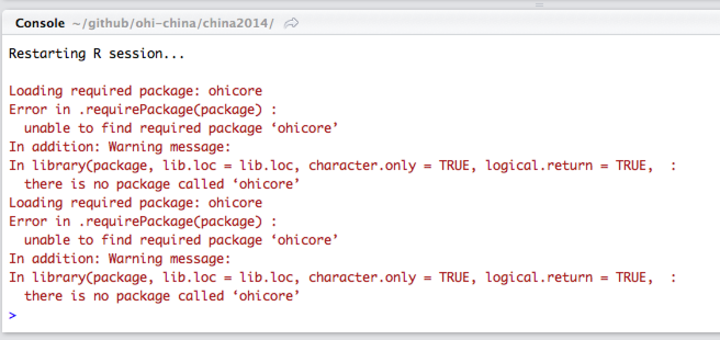
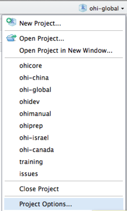
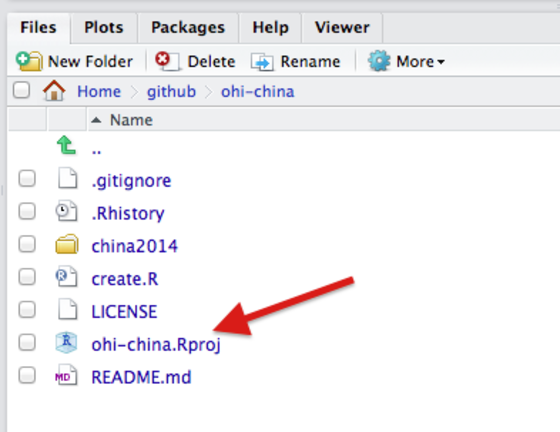
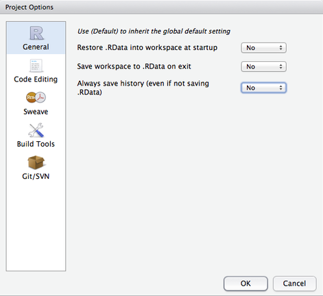
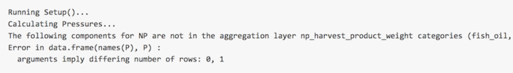
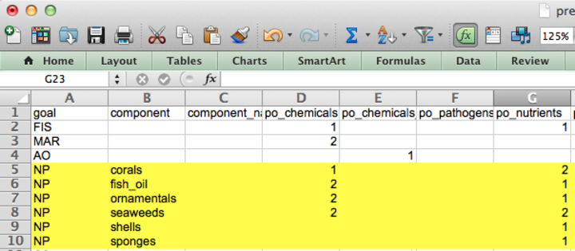
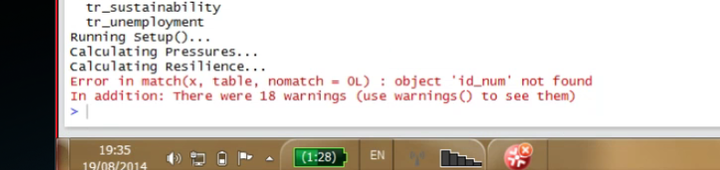

# Toolbox Troubleshooting

The Toolbox prints messages during its processing to help guide error checking and debugging. Here are a few troubleshooting tips. This section will be updated frequently; please share any problems that you encounter.  

## General Software Errors
### rpostback-askpass error

Sometimes when RStudio won't push committed changes to GitHub, RStudio displays an `rpostback-askpass` error:

```
error: unable to read askpass response from 'rpostback-askpass'
fatal: could not read Username for 'https://github.com': Device not configured
```


Here's how we fixed it: we updated `git.exe` to the latest version, 2.2.1, edited the search path to point to the new version, made sure the *git* credential.helper was configured to be able to access the OS X keychain, and pushed a test commit from terminal to store the username and password in the keychain, where it can be accessed from other apps like RStudio. Easy peasy!

1. To check your current version of `git.exe`, type this at the terminal command line:
    * `$ git --version` should return something like:
    * `git version 2.2.1` (check online to see if this is the latest version)
2. To update, go to http://git-scm.com/download/mac, download the latest *git* for OS X, install it.  
3. In terminal, type  `git --version` and verify that it reports the new version.  If it shows the new version, great!  Skip to Step 5.
    * Don't be sad if it doesn't!  If you still see the old version, the installer put the new version into a different directory, which has a lower priority in the search path, so now to update the search path.  The default Apple *git* seems to install the `git.exe` into `/usr/bin/` directory, this particular updater seems to install into `/usr/local/git/bin/` directory.  The search path needs to be updated to look for `git.exe` in the new directory first.
4. To change the search path, open up the paths file in `nano` editor using `sudo`:
    * `$ sudo nano /etc/paths`
    * At the top line of the paths file, add the directory for the updated *git*: `’/usr/local/git/bin’`(without the quotes) so it looks like the top line here:

    * Then hit `control-X` to exit, then `Y` in response to the save prompt.
5. Make sure your `git config` is up to date, including `credential.helper`:
    * `$ git config --global -l` should return something like:
    * `user.name="Casey O'Hara"`
    * `user.email=ohara@nceas.ucsb.edu`
        * see https://github.com/OHI-Science/ohiprep/wiki/Setup#git_identity for help on updating user.name and user.email
    * `credential.helper=osxkeychain`
        * (if you need to configure the credential helper: https://help.github.com/articles/caching-your-github-password-in-git/)
6. Now while you are in Terminal, it is important to sync with a repository to establish your security credentials. You must clone a repository and push a 'test' commit, and then once you are prompted for your username and password your information will get stored in the keychain. Here are the steps:
    * Change your working directory to your local github directory: `$ cd github`
       * (Tip: you can check if you're in the right folder by entering `pwd`, short for "print working directory"; or you could look at the line of code preceding the "$".)
    * Clone into a repository with a URL *for which you have permissions*. As an example, the following steps use a repository called 'ZAF' but you should use your own URL with a three-letter country code in place of 'ZAF':
       * `$ git clone  https://github.com/omalik/zaf.git`
    * Change your working directory to the folder you just created (here, 'ZAF'): `$ cd zaf`
    * Push a test commit to repository 'ZAF':
       * `$ touch test.md`
       * `$ git add test.md`
       * `$ git commit -m "testing"`
       * `$ git status`
       * `$ git push`
       * Check your status again: `$ git status`
         * (TIP: You can check your status with `$ git status` and you can use 'ls' to see if your new changes have registered in this repository.)
7. Now that *git* is updated and your username and password are set, make sure RStudio knows the location of the new `git.exe`.  In RStudio, select **Tools > Global Options…**, select the `Git/SVN`, and browse to the new `Git executable` (it should appear as `/usr/local/git/bin/git` if you updated your *git* version as above).


Next time you push a commit from RStudio, it should remember the username and password from your test commit in Step 6, and you should be good to go.


### Git not detected on system path

After downloading and installing git, sometimes RStudio is unable to locate git and will show the following error:


It is important to make sure you do in fact have git installed on your computer first. You can do this by opening up terminal (Mac OSX) or the cmd line (Windows) and typing:

  * `$ which git` for Mac/Linux,
  * `$ where git` for Windows

These commands will tell you where the `git.exe` file is located. Typically it will look something like this: `/usr/local/git/bin/git` or `/usr/bin/git` or some variation of those.

Once confirming the location of `git.exe` you need to tell RStudio where it is. Open up RStudio, got to Preferences and select the Git/SVN option:


In the Git executable area, fill in the path to your git.exe. If RStudio does not let you manually enter your path, select Browse... and navigate to the `git.exe` file. If you are not able to navigate to the file it is likely a hidden file.

On a Mac, to make hidden files visible, close RStudio and do the following:

  * Open Terminal found in Finder > Applications > Utilities.
  * In Terminal, paste the following: defaults write com.apple.finder AppleShowAllFiles YES.
  * Press return.
  * Hold the 'Option/alt' key, then right click on the Finder icon in the dock and click Relaunch.

And then reopen RStudio, go to Preferences -> Git/SVN -> Browse... and you should be able to navigate to the `git.exe`

You will then need to create an RSA Key. You can do this by clicking on 'Create RSA Key...' at the bottom of the Git/SVN panel, then 'View public key'. Copy the key you see, and add it to your GitHub account by using the instructions provided [here](https://help.github.com/articles/generating-ssh-keys/#step-4-add-your-ssh-key-to-your-account).


### Loading RWorkspace on Restart

When you restart your R Session (**Session > Restart R** on a Mac), if you see that it is trying to load `ohicore`, it may give you an error:

  > 

You do not want it to load `ohicore` or to save anything in your workspace. You will need to change the default setting from you **.Rproj** file. Steps to do this:

1. Go to Project Options, either in the pull-down menu or by double-clicking the .Rproj file:


  > 

  > 

2. Change all options to **No:**

  > 

## Errors when Using the Toolbox
### Useful Errors when Calculating Scores

  TIP: You can use the *layers* function in `calculate_scores.R` to error-check whether you have registered your files in `layers.csv` correctly or not. If you haven't, you will get an error message regarding 'missing files'. 

### `CheckLayers()` error due to 'Rows Duplicated...'

  After registering and uploading data layers, you would run `CheckLayers` in `calculate_score.R` to make sure there is no errors with the data files. For example, this error appeared after uploading SPP species data

  

  You can use the `duplicated` function to check which rows in that file is duplicated. Here we checked the first two columns in that file, rgn_id and sciname:

  ````r
  d[duplicated(d[c('rgn_id', 'sciname')]),]

     rgn_id                sciname CHN_class IUCN_class value       layer
  29       2       Chlidonias niger         1             0.46 spp_species
  270     10 Stenella longirostris          2         DD  0.17 spp_species

  ````

### `Layers()` error due to 'row.names: duplicate 'row.names' are not allowed'

The following error means that within `layers.csv`, there are duplicate rows with the same layernames. 

The warning message identifies several layer names to investigate... 
```
Error in `row.names<-.data.frame`(`*tmp*`, value = c(2L, 1L, 7L, 14L,  : 
  duplicate 'row.names' are not allowed
In addition: Warning message:
non-unique values when setting 'row.names': ‘cw_con_dioxin_status’, ‘cw_con_dioxin_trend’, ‘cw_con_ices6_status’, ‘cw_con_ices6_trend’, ‘cw_con_pfos_status’, ‘cw_con_pfos_trend’, ‘cw_nu_status’, ‘cw_nu_trend’, ‘fis_bbmsy’, ‘fis_ffmsy’, ‘fis_landings’, ‘ico_status’, ‘le_gdp_region’ 
```
...and when inspecting `layers.csv`, there are indeed duplicate entries for the same layernames. 


To fix these errors, ensure there are only single entries for each layer name; delete any duplicated rows. 

### Calculating Pressures...

#### 'The following components for [goal] are not in the aggregation layer [layer]...'

Example:

> 

  >   

This error means you should update your pressures matrix because it expects there to be components that your region does not have.

#### 'Error in matrix... '

Example:
  >   

This error means there is an empty column in `pressures_matrix.csv`, and the Toolbox cannot handle empty columns.

#### `Error in ... length of 'dimnames' [2] not equal to array extent`
If you get the following error message when running `calculate_scores.r`:

```r

scores = CalculateAll(conf, layers, debug=F)
Calculating Status and Trend for FIS...
Calculating Status and Trend for MAR...
reference point for MAR is: 1.16739059262319 (region 8)
Calculating Status and Trend for AO...
Calculating Status and Trend for NP...
Calculating Status and Trend for CS...
Calculating Status and Trend for CP...
Calculating Status and Trend for TR...
Calculating Status and Trend for LIV...
Calculating Status and Trend for ECO...
Calculating Status and Trend for ICO...
Calculating Status and Trend for LSP...
Calculating Status and Trend for CW...
Calculating Status and Trend for HAB...
Calculating Status and Trend for SPP...
Calculating Pressures...

Error in matrix(as.matrix(d.p[, -1]), nrow = nr, ncol = np, dimnames = list(region_id = d.p[[1]],  :
  length of 'dimnames' [2] not equal to array extent

```

It is because not all the pressures layers listed in `pressures_matrix.csv` are layers listed in `layers.csv`.

We troubleshooted this by putting a `browser()` in `ohicore::CalculatePressuresAll.r` on L35 (after searching in that file for 'dimnames' to try to triangulate to the problem. Then, when rerunning `calculate_scores.r` with the browser, we looked at the following variables and found the mismatch between the list of layers in `pressures_matrix.csv` (the `p.layers` variable, top) and the list of available layers (bottom) which EXCLUDES `po_pathogens`.

```r

Browse[1]> p.layers
 [1] "cc_acid"             "cc_slr"              "cc_sst"              "cc_uv"               "fp_art_hb"           "fp_art_lb"           "fp_com_hb"           "fp_com_lb"          
 [9] "fp_targetharvest"    "hd_destruction_rate" "hd_intertidal"       "hd_subtidal_hb"      "hd_subtidal_sb"      "po_chemicals"        "po_nutrients"        "po_pathogens"       
[17] "po_sedimentation"    "po_trash"            "sp_alien"            "sp_genetic"          "ss_wgi"      

list(region_id=d.p[[1]], pressure=names(d.p)[-1]
+ )
$region_id
 [1]  1  2  3  4  5  6  7  8  9 10 11

$pressure
 [1] "cc_acid"             "cc_slr"              "cc_sst"              "cc_uv"               "fp_art_hb"           "fp_art_lb"           "fp_com_hb"           "fp_com_lb"          
 [9] "fp_targetharvest"    "hd_destruction_rate" "hd_intertidal"       "hd_subtidal_hb"      "hd_subtidal_sb"      "po_chemicals"        "po_nutrients"        "po_sedimentation"   
[17] "po_trash"            "sp_alien"            "sp_genetic"          "ss_wgi"             


```


Double-checking `pressures_matrix.csv` showed that `po_pathogens` was indeed there, but on `layers.csv`, there was a typo and it was entered as `po_pathoges`. So it was registered properly as a layer but never used--so passed through `ohicore::CheckLayers` original checking


Also: capital `Q` quits you from the `browser()`

### Calculating Resilience ...

#### 'Error in match(x, table, nomatch = OL) : object id_num not found'

  >   

This error means you should check that there is at least one entry for each goal (for each row) in `resilience_matrix.csv`.

####
Error message `Each goal in resilience_matrix.csv must have at least one resilience filed`

```r
Calculating Resilience...
Note: each goal in resilience_matrix.csv must have at least one resilience field
 Show Traceback

 Rerun with Debug
 Error: all(t %in% resilience_categories) is not TRUE

```

means that the list of resilience layers listed in `resilience_matrix.csv` does not match the list in `resilience_weights.csv`.

`CalculateResilienceScore.r L112` is where this error was generated (called from `CalculateResilienceAll.r`.
