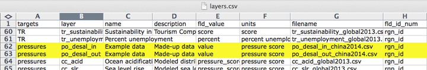
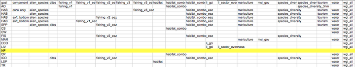

## Modifying Pressures Categories and Matrix

Your team will identify if any pressures layers should be added to the pressures matrices, and if so, which goals the pressure affects and what weight they should have (see Appendix 6 for guidance on Pressure and Resilience). You can transfer this information in `pressures_matrix.csv` (located in the `[assessment]/subcountry2014/conf` folder). It is important to note that the matrix identifies the pressures relevant to each goal, and which weight will be applied in the calculation. Each pressure is a data layer, located in the `subcountry2014/layers` folder. This means that pressure layers need information for each region in the study area, and some layers will need to be updated with local data. In modifying pressures, you will need to consider whether data layers can be updated or added, and whether data layers map onto goals appropriately in the local context.

Adding a new pressure to the pressures matrix requires the following steps:

> 1. Create new pressure layer(s) and save in the `layers` folder
> 2. Register pressure layer(s) in `layers.csv`
> 3. Register in `pressures_categories.csv`
> 4. Register in `pressures_matrix.csv`
  + a. Identify the goals affected and set the weighting
> 5. Modify Config.R for goals that have elements

### Create the new pressure layers and save in the `layers` folder

If you create a new data layer, give it a short but descriptive name that also includes a prefix that signifies the pressure category (for example: *po_* for the pollution category). There are five physical categories and one social category:

* *po_* = pollution
* *hd_* = habitat destruction
* *fp_* = fishing pressure
* *sp_* = species pollution
* *cc_* = climate change
* *ss_* = social pressure  

So for example, `po_trash` is a pollution layer with trash on beaches, and `sp_alien` is species pollution due to alien (invasive) species.

These new layers will have scores from 0 to 1, with values for each region in your study area, and will be saved in the `layers` folder.

### Register the new pressure layers in `layers.csv`

Add two new rows in `layers.csv`, and register the new pressure layers by filling out the first eight columns for *po_desal_in*, and *po_desal_out*.

### Register in `pressures_categories.csv`

This is a table to record the _name_ of each pressures data layer, its _category_, and _sub-category_. Each data layer name  is the same name that's saved in the `layers` folder and is registered in `layers.csv`. Each layer falls under one of two categories -  ecological or social pressures, and one of several sub-categories to further represent the origin of the pressure (eg. climate change, fishing, etc), which is also indicated by a prefix of each data layer name.

Each pressure category is calculated separately before being combined with the others, so it is important to register the new pressure with the appropriate category prefix decided by your regional assessment team.  

### Register in `pressure_matrix.csv`  

`pressures_matrix.csv` identifies the different types of ocean pressures with the goals that they affect. Adding a new pressures layer to `pressures_matrix.csv` requires adding a new column with the pressure layer name.

The columns `element` (and `element_name`) record habitat types for habitat-specefic goals (eg. CS and CP) and industrial sectors for economy-based goals (eg. ECO).

The rest of the column headers of the pressures matrix are the layer names of the pressures layer file that are saved in the `layers` folder and registered in `layers.csv`, matching what's recorded in the _pressures_categories.csv_.

_**NOTE**: Make sure to remove unused pressures layers from the `layers.csv`, `pressures_marix.csv` and `pressures_categories.csv`. Otherwise ohicore will search for all the layers registered in those files and calculations will halt if it encounters pressure layers that do not exist._

#### Identify the goals affected and set the weighting

This step also requires transferring prior decisions into `pressures_matrix.csv`. Mark which goals are affected by this new pressure, and then set the weighting. Pressures weighting by goal should be based on scientific literature and expert opinion (3 = highly influential pressure, 2 = moderately influential pressure, 1 = not very influential pressure). Remember that the rankings in the pressures matrix are separate from the actual data within the pressures data layers. The rankings ensure that within a particular goal (e.g. within a row of the pressures matrix), the stressors that more strongly influence the goal’s delivery have a larger contribution to that goal’s overall pressure score. Therefore, the rankings are assigned independently of the actual pressure scores, and only determine their importance within the calculations.

#### Modify Config.R for goals that have components

If in _pressures_matrix.csv_, the columns `element` (and `element_name`) are filled, you need to update `Config.R` in `conf` folder.  

## Modify Resilience Categories and Matrix

Resilience is included in OHI as the sum of the ecological factors and social initiatives (policies, laws, etc.) that can positively affect goal scores by reducing or eliminating pressures. The addition of new pressure layers may therefore warrant the addition of new resilience layers that were not previously relevant. Similarly, the removal of pressure layers may warrant the removal of now irrelevant resilience layers. You can then transfer this information into `resilience_matrix.csv`and `resilience_categories.csv` (located in the `[assessment]/subcountry2014/conf` folder).

<!-- Each goal must have a resilience measure associated with it. In the figure below, the Toolbox would give an error because there are no resilience layers indicated for the natural products (NP) goal.

 -->

### Steps involved in modifying resilience information

Adding a new resilience to the resiliences matrix requires the following steps:

> 1. Create new resilience layer(s) and save in the `layers` folder
> 2. Register resilience layer(s) in `layers.csv`
> 3. Register resilience layer(s) in `resiliences_categories.csv`
  + a. Set the resilience category  
  + b. Set the weighting
> 3. Register resilience layer(s) in `resiliences_matrix.csv`
  +  Identify the goals affected
> 4. Modify Config.R for goals that have elements

### Create new resilience layers, save in `layers` folder and register in `layers.csv`

This process is similar to what you have done for the pressures data layers. Prefixes are also used for these layers, see _layer_ and _subcategory_ columns snapshot of the Resilience Categories below for more details.

### Register in Resilience Categories

<!-- The first step is to determine which resilience layers from the global assessment are relevant to your assessment, and whether others need to be added. --> `resilience_categories.csv` records general information on each resilience data layer. The full list of layers included in the global resilience matrix are shown in the `resilience_matrix.csv`:

Each _resilience layer_ indicated in the table is a data layer just like all the other data layers you have formatted, saved in the layers folder, and registered on _layers.csv_. Each layer falls under a `category` of resilience - ecological or social, and one of three `category-type`s - ecosystem, regulatory, or social, representing the origin of each resilience layer. The `Subcategory` column indicates what specific pressure each layer of resilience is targered at. The prefix of each data layer corresponds to its Subcategory (eg. po, li, g, etc).

In addition, the `Weight` column respresents level of institutional governnace. Governance is a function of 1) institutional structures that address the intended objective (eg. wheter appropriate laws/regulations exist, etc), 2) a clear process for _implementing_ the institution is in place, and 3) whether the institution has been _effective_ at meeting stated objectives. At global scales it is very difficult to assess these three elements; we usually only had information on whether institutions exist. However, in some cases we had detailed information on institutions that enabled us to assess whether they would contribute to effective management, and thus, increased ocean health. In those latter cases, we gave more weight to those measures. In the `resilience_categories.csv` pre-loaded from OHI-Global 2016 to your repository, there are two weights assigned to each layer:

- _0.5_ means that a law or regulation exists, or a country has signed an appropriate treaty
- _1_ means that there are evidence of implementation of the laws and regulations.

However, you can redefine how the weights are set to available information in your regions.

### Register in Resilience Matrix

`resilience_matrix.csv` maps the different types of resilience (columns) with the goals that they affect (rows). Whether a resilience layer has any influence on a goal, or an element of the goal, is represented by an *x*, or its absence. For example, `po_water` layer is relevant to the _salt marsh_ element of _CP_ goal, as shown by the *x* in the cell. On the other hand, that data layer does not apply to the _mangrove_ element of the same goal, hence the absence of an *x*.

New resilience layers may be added to `resilience_matrix.csv` based on finer-scale local information either in response to a new pressures layer, or as a new independent measure. Any added layer must be associated with a pressures layer that has a weight of 2 or 3 in the OHI framework so that resilience measures can mitigate pressures in each region.

<!-- ### Updating resilience matrix with local habitat information

In this example we will borrow from the experience of `ohi-israel`, where they assessed habitats in the Habitats (HAB) sub-goal that were not included in global assessments `ohi-global`. Therefore, the resilience matrix needed some revision.  

The habitats assessed for `ohi-israel` are:

> `rocky_reef`, `sand_dunes`, `soft_bottom` -->

### How to modify Config.R

<!-- ### Determining how to modify these resilience layers

* To determine whether `species_diversity_3nm` or `species_diversity_eez` should be used:
    + `sand_dunes` should use `species_diversity_3nm`,
    + `soft_bottom` should use `species_diversity`,
    + is `rocky_reef` mainly coastal? if so it should use `tourism` and `species_diversity_3nm`.
* If the habitats can be affected by mariculture plants (e.g. eutrophication and decreased water quality can occur if mariculture plants are close by and have poor wastewater treatment), then the `mariculture` resilience score should be added.
    + are there any mariculture plants in Israel? If yes, on which habitats do they occur?
* The remaining layers are the `fishing_v...` and `habitat..` layers, which are composite indicators obtained from different combinations of the following indicators:

**Questions to consider**:

The first objective is to determine whether the general `fishing_v..` or `habitat_...` categories are relevant to each of the habitats.  For example, fisheries regulations do not affect the conservation of sand dunes, so this habitat should not use any of the fisheries combos.
If the general resilience categories are relevant to the habitat, the next step is to select one resilience layer within the `fishing_v…` and `habitat...` categories that most adequately captures the suite of combined resilience variables that affect the habitat.  For example, the sand dune habitat is a strictly coastal habitat, so the most appropriate resilience layer would be the one that uses the MPA_coast (i.e., `habitat_combo`). The rocky reef and soft bottom, on the other hand, should definitely include fisheries and habitat regulations. So, you'll need to choose a fisheries and a habitat combo for these two habitats.  To do so, consider:

1) For which habitats should you use both a fishery and a habitat combo, or just use a habitat combo?
* fisheries regulations do not affect the conservation of sand-dunes, so this habitat should not use any of the fisheries combos. Also, this is a strictly coastal habitat, so choose the habitat layer that uses the `MPA_coast` instead of the `MPA_eez`, i.e. `habitat_combo` (and, as mentioned above, choose the coastal version of biodiversity, i.e. `species_diversity_3nm`).
* The rocky reef and soft bottom, on the other hand, should definitely include fisheries regulations. So you'll need to choose a fisheries and a habitat combo for these two habitats.
2) Which fisheries and habitat combos for `rocky_reef` and `soft_bottom`? The choice depends on two things:
* whether they are coastal habitats (within 3nm of the coast) or EEZ-wide habitats
      + if coastal, use the fisheries and habitat combos with `MPA_coast` (`fishing_v1`, `fishing_v3`, `habitat_combo`), and the `species_diversity_3nm` layer
      + if EEZ-wide, use the fisheries and habitat combos with `MPA_eez` (`fishing_v1_eez`, `fishing_v2_eez`, `fishing_v3_eez`, `habitat_combo_eez`), and the `species_diversity` layer
* whether the fisheries occurring on that habitat are mainly artisanal, mainly commercial, or both
    + if only commercial fisheries, use a layer that only uses the `Mora` data `fishing_v1..`)
    + if only artisanal/small-scale fisheries, use a layer that only uses the `Mora_s4` data (`fishing_v3..`)
    + if both, use a layer that uses both `Mora` and `Mora_s4` data (`fishing_v2..`)
3) It may also be that the existing global combo layers are not appropriate for your habitats.  For example, if rocky reef is mainly coastal, and it is fished by both commercial and artisanal methods, then we need a new combo that uses `Mora`, `Mora_s4`, `CBD_hab`, and `MPA_coast` (this is the same as `fishing_v2_eez`, but we use the `MPA_coast` layer instead of the `MPA_eez`). All other combinations are already present.
4) Another issue to consider is whether local data are available to improve the pressure layers (that are based on global data).  For example, if  there are local data on Marine Protected Areas (MPAs) and any areas with special regulations, this should be used to generate the `MPA_coast` and `MPA_eez` layers.You may know that only certain types of protected areas are closed to fisheries, and may want to only include those. Also, local datasets may be more accurate and regularly updated. **NOTE: in the global study, these are the same datasets used to calculate the status of Lasting Special Places (LSP).

5) How to update `resilience_matrix.csv`?
* write the complete list of layers you want to use for each habitat. Based on the above, for example, `soft bottom` in Israel matches the combination of layers called *soft bottom, with corals* in the default `resilience_matrix.csv`. But the `rocky_reef` and `sand_dunes` don't seem to match any existing combination, so you'll probably need to delete some of the rows, e.g. the *coral only*, and replace with new ad-hoc rows.
-->
