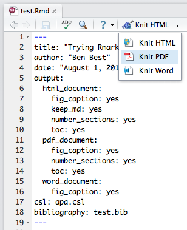

# Rmarkdown Tips
# testing

## Rmarkdown
[Rmarkdown](http://rmarkdown.rstudio.com/) is a simple formatting tool for creating HTML, PDF, presentations, and Microsoft Word documents, and it can render R code within those formats. Here are a few examples of documents written in Rmarkdown, rendered in [.html](file:///Library/Frameworks/R.framework/Versions/3.1/Resources/library/dplyr/doc/introduction.html) and [.pdf](http://cran.r-project.org/web/packages/dplyr/dplyr.pdf) formats. See this [great post](https://github.com/bbest/rmarkdown-example#writing-with-rmarkdown) about its capabilities.

### Getting started
To get started writing in Rmarkdown, first, [update R and RStudio](https://github.com/OHI-Science/ohimanual/blob/master/tutorials/accessing_a_repo/accessing_a_repo.md#getting-started).  
Then, in RStudio, install `Rmarkdown` and `pandoc` by pasting this into the console:

```
install.packages(c('rmarkdown', 'pandoc'))
```
  
Then, open a new [.Rmd document](https://github.com/bbest/rmarkdown-example#process). Instead of a blank document, it will give a template that you can **Knit** to see how it renders.  

   > > > > >   

### Editing

To add your own content, follow instructions about [syntax](http://rmarkdown.rstudio.com/authoring_basics.html). When you click the **Knit** button, a document will be generated that includes both content as well as the output of any embedded R code chunks within the document.  
  
Rmarkdown is a powerful tool that can create publication-worthy documents, and has a lot of built-in options. However, like any new language or software, it takes a bit of time to learn how to use it. If there is something you are trying to do, Google your problem because it is likely that someone else has had the same question, and that someone else has had the answer. For example, this solved a problem with [continuing numbered lists](http://stackoverflow.com/questions/18088955/markdown-continue-numbered-list).


