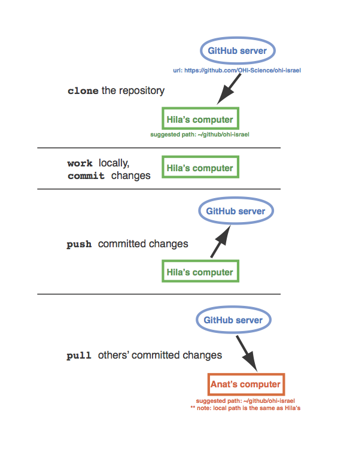

Accessing GitHub Repositories
-----------------------------

**The Ocean Health Index (OHI)** project was created with a strong foundation in communication and collaboration. Following the initial publication by [Halpern et al. 2012](http://www.nature.com/nature/journal/v488/n7413/abs/nature11397.html) in *Nature*, we have conducted annual global assessments to track changes in global ocean health. At the same time, we have been developing the **OHI Toolbox**: software that will enable others to conduct assessments on their own using the OHI framework.

### OHI and GitHub

OHI uses [GitHub](http://github.com), an [open-source development platform](http://en.wikipedia.org/wiki/GitHub) to develop and share its software and data. GitHub has powerful versioning capabilities, which allow changes to be archived and tracked with the user identified.

OHI has several repositories where data and code are stored. From the [GitHub glossary](https://help.github.com/articles/github-glossary#repository):

> A repository is the most basic element of GitHub. They're easiest to imagine as a project's folder. A repository contains all of the project files (including documentation), and stores each file's revision history. Repositories can have multiple collaborators and can be either public or private.

[OHI-Science](https://github.com/OHI-Science) is the 'owner' of OHI repositories, and individual users (such as [bbest](https://github.com/bbest) or [jules32](https://github.com/jules32)) are able to contribute to these repositories when they have permission to do so. Repositories are called 'repos' for short.

### OHI regional assessments and GitHub

We recommend that groups interested in conducting OHI assessments do so through GitHub. This will enable collaboration and transparency, and will provide access to the latest developments in the Toolbox software. To get started, follow the steps below for creating a GitHub user account. The OHI team can create a repository for your regional assessment.

Here is a simple diagram of GitHub's collaborative workflow :

> 

Sign up for GitHub
------------------

To get started, [signup](http://github.com) for a GitHub account, and provide your username to <bbest@nceas.ucsb.edu> or <lowndes@nceas.ucsb.edu> so you can access your ohi-[assessment] repository.

<https://github.com/OHI-Science/ohiprep/wiki/Using-GitHub>

Create your ohi-[assessment] repo
---------------------------------

Contact the OHI team (<bbest@nceas.ucsb.edu> or <lowndes@nceas.ucsb.edu>) to create a repository for your group. The repository will be called `OHI-Science/ohi-[assessment]`: for example, `OHI-Science/ohi-israel` or `OHI-Science/ohi-china`.

Clone your repo to your computer
--------------------------------

Once there is a repository for your Ocean Health Index regional assessment called `OHI-Science/ohi-[assessment]`, you can decide whether you will [clone and work](https://github.com/OHI-Science/ohiprep/wiki/Setup#github_fork) directly from that repository directly or from a forked repository. There are benefits to both approaches:

-   Working directly from the repository is simplest: you can make changes on your local machine and push them directly to the online repository. You do not need to send pull requests; simply clone from `OHI-Science/ohi-[assessment]` and push/pull from there. You will need to provide your GitHub username
-   [Forking](https://help.github.com/articles/fork-a-repo) a repository is best when you have multiple collaborators working on the same repository. This would allow you to commit changes to your local version, push commits up to github for offsite archiving, and eventually make a pull request to have those changes merged back to `ohi-science/ohi-[assessment]` while your collaborators do the same. This is a good way for someone who is not in the core team of the assessment to contribute comments.

With either approach, we recommend cloning the repository to this file path: `~/github/ohi-[assessment]`. See [Setup](https://github.com/OHI-Science/ohiprep/wiki/Setup) for installation of git, GitHub and RStudio.

### Cloning options

There are several options to clone the ohi-[assessment] repository to your local machine:

1.  [The command line](https://help.github.com/articles/fork-a-repo#keep-your-fork-synced).
2.  The GitHub app for [Mac](https://mac.github.com/) or [Windows](https://windows.github.com/).
3.  RStudio. This is best after the initial clone, since RStudio occassionally has trouble with setting the username / password.

Note that for each of these options, you will need to first [set up git](https://help.github.com/articles/fork-a-repo#step-1-set-up-git). From the [git documentation](http://git-scm.com/book/en/Getting-Started-First-Time-Git-Setup#Your-Identity):

> "This is important because every Git commit uses this information, and it’s immutably baked into the commits you pass around."

Launch Terminal in Mac or go to command line in Windows (Start \> Run \> cmd) and substitute your user information with the user John Doe:

`{bash} git config --global user.name jdoe git config --global user.email johndoe@example.com git config --list`

You can check settings with the following:

`{bash} git config --list`

Committing locally
------------------

Commit locally, associating a message with each set of changes.

Push commits to GitHub ohi-[assessment] repository.
---------------------------------------------------

Pull commits to get changes from anyone else.
---------------------------------------------

More Information
----------------

-   [presentation: Reproducible science with the Ocean Health Index](http://bbest.github.io/talks/2014-06_OHI-repro-sci/#1)
-   see [oceanhealthindex.org](www.oceanhealthindex.org) and [ohi-science.org](ohi-science.org) for more information and resources.
