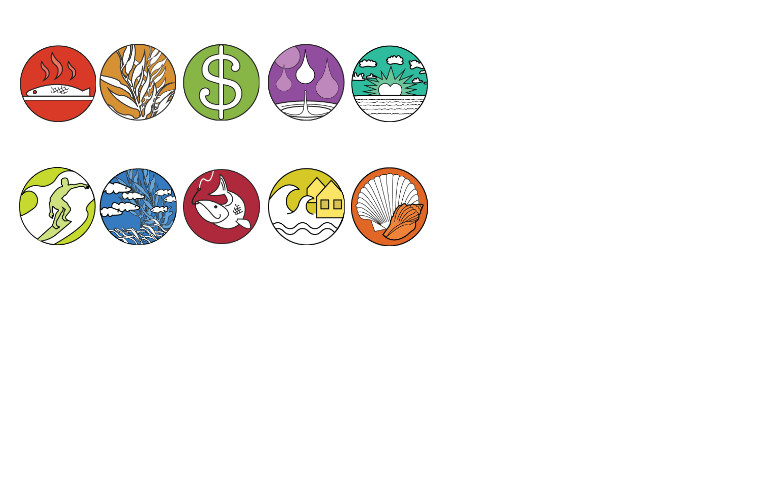
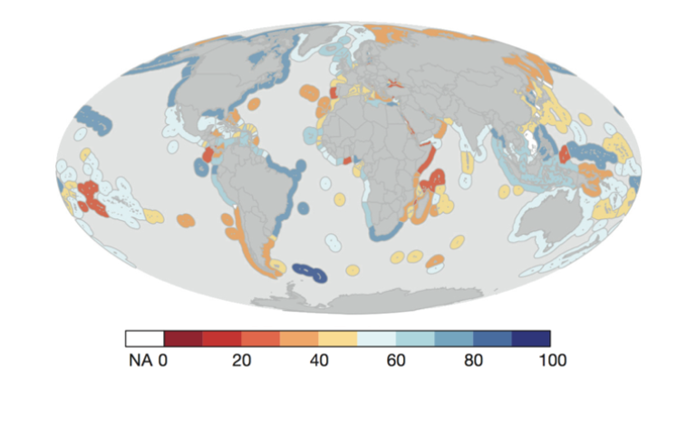
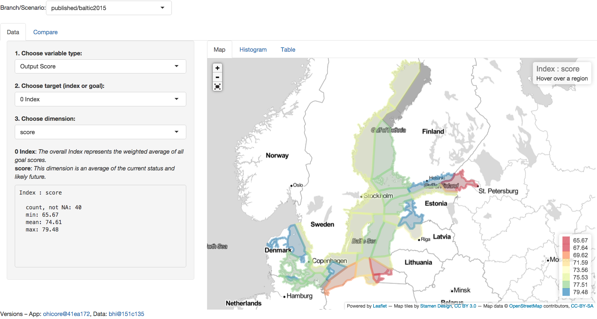
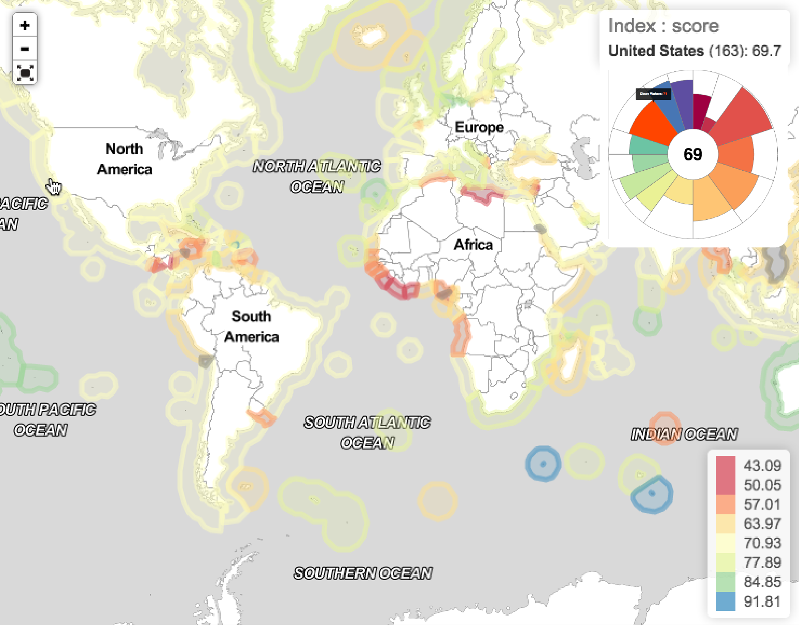

## Ocean Health Index 

  

> setup: prelaunch in new tab: http://ohi-science.nceas.ucsb.edu/bhi; add: `?presentme=true` to URL, click `p` for notes

- The Ocean Health Index measures ocean health based on the best publicly available data and scientific methods at **local, regional, national and global** scales.
- Governments at many levels are **mandating policy** to increase ocean health, but there wasn't a way to do this. 
- The OHI defines 'ocean health' around benefits provided to people, so it can be more directly useful for policy.
- It uses **data from multiple ocean-related activities** and services and **scores them in categories** like fishing, tourism, and clean waters 

## Ocean Health Index 

  

- These **categories, called goals, are scored from 0-100** and represented as **petals** on this flower plot. 
- A single score is also calculated, **distilling** all information and goals into a single value. 
- This **reductionist approach** appeals to a very wide audience, and depending on your interest, you can dive deeper and deeper into an activity and the data behind it etc. 

## Ocean Health Index 

  

- Scores are also displayed on **maps**, and we do **annual assessments at the global scale**, calculating scores for each coastal nation and territory.
- There has been a lot of **uptake**: The **UN** is in the process of adopting OHI principles, and many countries around the world are using our methods to inform their national or local ocean policy.

- This map shows countries using our OHI methods
- We've developed a **workflow and provide tools and support** to enable groups to do this. We make github repos of R scripts and template inputs they can modify with their data. 
- The maps and flower plots have a lot of information, and **Shiny has proven an excellent tool** to enable both a high level view for policy makers, and deep inspection by analysts. 
- We're really excited to be using Shiny and other open-source tools to help improve the health of our oceans--Ben will describe the app now in more detail.

## OHI+ Baltic

- The OHI Shiny app enables interactive visualization of output scores and input layers. Each of these can be visualized across these **tabs**: spatially "Map" tab, or as a ["Histogram"] or ["Table"].
- We can [**zoom, pan and hover**] to see specific values with the interactive map. 
- We can also dive into the hierarchical elements of OHI. The **dropdowns** on the left are conditional based on the selections above, whether looking at "Output Scores"" or ["Input Layers"] and the sub-elements therein.
- The app syncs with the **Github** repository having branches for draft vs published stages of data. Travis continuous integration checks the draft data commits for any errors and if none, continues to update the published branch and static outputs like figures and tables on the gh-pages website branch. 

## Next Steps for OHI Shiny Dev

> 1. Migrate custom [`rCharts`](https://github.com/OHI-Science/rCharts) &rarr; [`leaflet`](http://rstudio.github.io/leaflet/)
>
> 1. Add [source layers](https://www.nceas.ucsb.edu/globalmarine), eg 1km raster shipping (leaflet::[addRaster, tileOptions](https://github.com/rstudio/leaflet/blob/7631cfa1404d54bcb0f4dc813e775bdc1af0d584/R/layers.R#L114-L219)) 
>    
>
> 1. Embed [interactive flower plot](http://bl.ocks.org/bbest/2de0e25d4840c68f2db1) on map rollover 
>     &nbsp;&nbsp; 

- The original app was developed with Ramnath's **rCharts** package. The RStudio **leaflet** package has since become available and offers some appealing new features to motivate migration, including use of **TopoJSON** for smaller storage and faster loading. 
- A common misunderstanding about OHI is that it's a "crude" assessment of ocean health from looking at the initial global study. However the spatial crudeness is based upon the underlying layers and the user chosen spatial units to which the layers get aggregated, whether at a country, state or even county level. In keeping with the hierarchical reductionist theme and to make the input layer values even more transparent, we want to make all input layers in their original spatial units visible, whether vector or raster. Many of these pressure layers, for instance, are based on 1 km global rasters. We hope to integrate raster tiling, a feature in development with the leaflet package, to show these and other original input data layers at the finest possible scale to fully communicate the strengths and weaknesses of the raw data.
- Finally, we've found the flower plot to be a very effective visualization to communicate results. We've developed a D3 implementation of this which we'll make appear in the upper right for on hover events of the map when looking at the default output scores.

# Thank You!

Huge thanks to the developers of:

- Shiny
- RStudio 
- "Hadley-verse" of packages

Please visit us at: [**ohi-science.org**](http://ohi-science.org)

# Backup Slides

...

