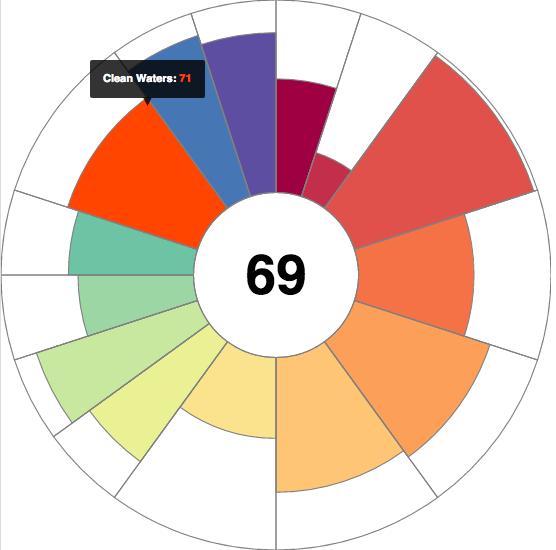

## Ocean Health Index 

  

not working: add `?presentme=true` to URL to see notes in popup window, per http://rmarkdown.rstudio.com/ioslides_presentation_format.html

rm bullets below b/c incremental:true steps through these notes too when advancing slides

The Ocean Health Index is a way to measure ocean health at local, regional, national and global scales. 
The Index uses data from multiple ocean-related activities and services including fishing, tourism, and clean waters to name a few.
Began as an academic exercise - UCSB/NCEAS and Conservation International, now being adopted by governments around the world to inform how they measure and manage for the health of their oceans (*this could be transition sentence to the map*).

## OHI Global

click on image to launch app in new window

## OHI Assessments

  

JA: *Thinking that while this is up on the screen, we can talk about how we developed a shiny app to enable users in Colombia, Ecuador, Baltic (name drop a few cool ones) to do their own assessment and effectively communicate their results directly to policy makers. Really get people excited about how Shiny is directly helping people improve the health of our oceans...something along those lines!*

## OHI Baltic

click on image to launch app in new window

## Next Steps for OHI Shiny Dev

1. Migrate custom [`rCharts`](https://github.com/OHI-Science/rCharts) &rarr; [`leaflet`](http://rstudio.github.io/leaflet/)

1. Add [source layers](https://www.nceas.ucsb.edu/globalmarine), eg 1km raster shipping (leaflet::[addRaster, tileOptions](https://github.com/rstudio/leaflet/blob/7631cfa1404d54bcb0f4dc813e775bdc1af0d584/R/layers.R#L114-L219))

    

1. Embed [interactive flower plot](http://bl.ocks.org/bbest/2de0e25d4840c68f2db1) on map rollover

     &nbsp;&nbsp; 

# Thank You!

Huge thanks to the developers of:

> - Shiny
> - RStudio 
> - "Hadley-verse" of packages

Please visit us at: [**ohi-science.org**](http://ohi-science.org)

# Backup Slides

...

