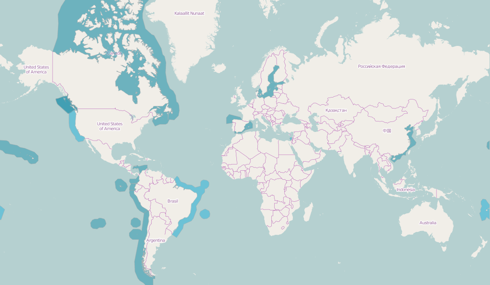
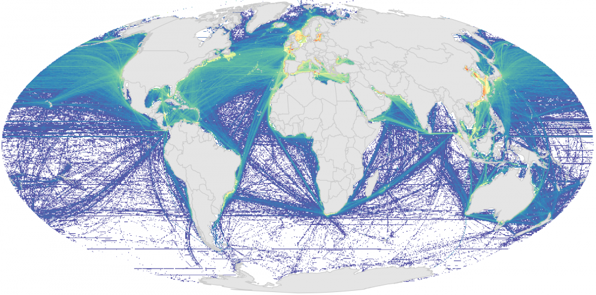

## Ocean Health Index 

  

before starting, prelaunch in new tab: http://ohi-science.nceas.ucsb.edu/ohi-global, http://ohi-science.nceas.ucsb.edu/bhi

not working: add `?presentme=true` to URL to see notes in popup window, per http://rmarkdown.rstudio.com/ioslides_presentation_format.html

rm bullets below b/c incremental:true steps through these notes too when advancing slides

The Ocean Health Index a method our group developed to measure ocean health.
This is important because governments at many levels are mandating ocean policy to increase ocean health, but there wasn't a way to do this. 
The OHI defines 'ocean health' around benefits provided to people, so it can be more directly useful for policy.
It uses data from multiple ocean-related activities and services including fishing, tourism, and clean waters to name a few, and these are all scored on the same scale and compared together in this flower plot. 
This was developed as an academic exercise - UCSB/NCEAS and Conservation International, assessed at the global scale: all coastal nations and territories. 
---JSL:  I suggest we animate this first slide to show a non-shiny global map here. 

## OHI Global

---JSL: I suggest we delete this slide

[Click on preloaded tab w/ http://ohi-science.nceas.ucsb.edu/ohi-global.]

The OHI Shiny app enables interactive visualization of output scores and input layers. Each of these can be visualized spatially in this "Map" tab, or as a "Histogram" [click] or "Table" [click].

We can [zoom, pan and hover] to see specific values with the interactive map. 

We can also dive into the hierarchical elements of OHI. Rather than overall Index score, we could look at individual goals [click FP], or even the sub-dimensions such as current [status] or [future] trend.

Or we can look at the [input layers] used to calculate the goals, such as... [carefully choose... it can crash easily!]. The dropdowns on the left are conditional based on the selections above.

## OHI Assessments

  

now being adopted by governments around the world to inform how they measure and manage for the health of their oceans. 
in Colombia, Ecuador, Baltic (name drop a few cool ones)
We've developed a lot of tools enable groups to do this on their own. We make github repos of the scripts and inputs we've used that they can modify with their data and interact with our R package. 
We developed a shiny app to enable users  to do their own assessment and effectively inspect their work as it's developed and communicate their results to policy makers. 
Really get people excited about how Shiny is directly helping people improve the health of our oceans...something along those lines!*

## OHI Baltic

---JSL: If we delete the global one, here's where we'd say here's how it works: 
click on image to launch app in new window

## Next Steps for OHI Shiny Dev

1. Migrate custom [`rCharts`](https://github.com/OHI-Science/rCharts) &rarr; [`leaflet`](http://rstudio.github.io/leaflet/)

1. Add [source layers](https://www.nceas.ucsb.edu/globalmarine), eg 1km raster shipping (leaflet::[addRaster, tileOptions](https://github.com/rstudio/leaflet/blob/7631cfa1404d54bcb0f4dc813e775bdc1af0d584/R/layers.R#L114-L219))

    

1. Embed [interactive flower plot](http://bl.ocks.org/bbest/2de0e25d4840c68f2db1) on map rollover

     &nbsp;&nbsp; 

# Thank You!

Huge thanks to the developers of:

> - Shiny
> - RStudio 
> - "Hadley-verse" of packages

Please visit us at: [**ohi-science.org**](http://ohi-science.org)

# Backup Slides

...

