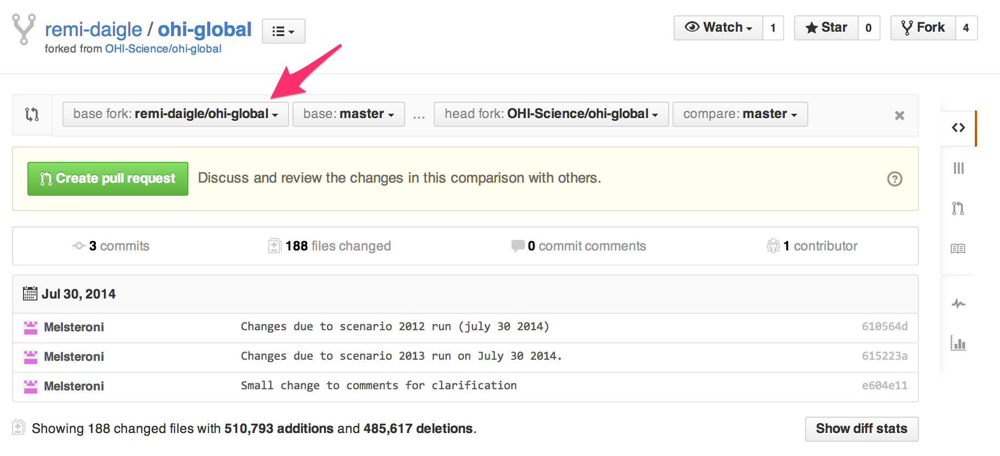
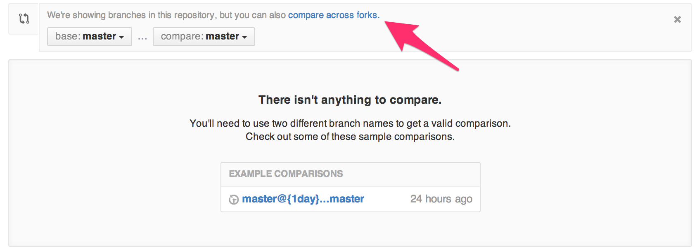
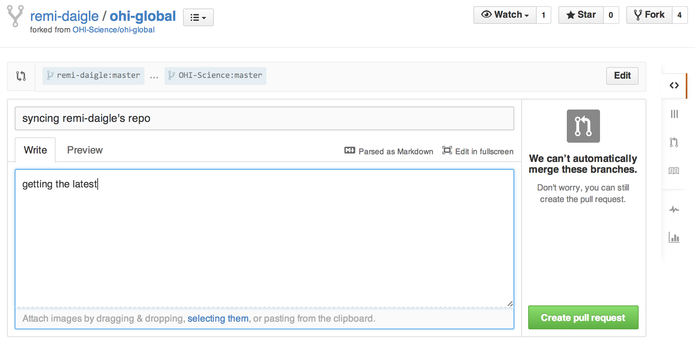
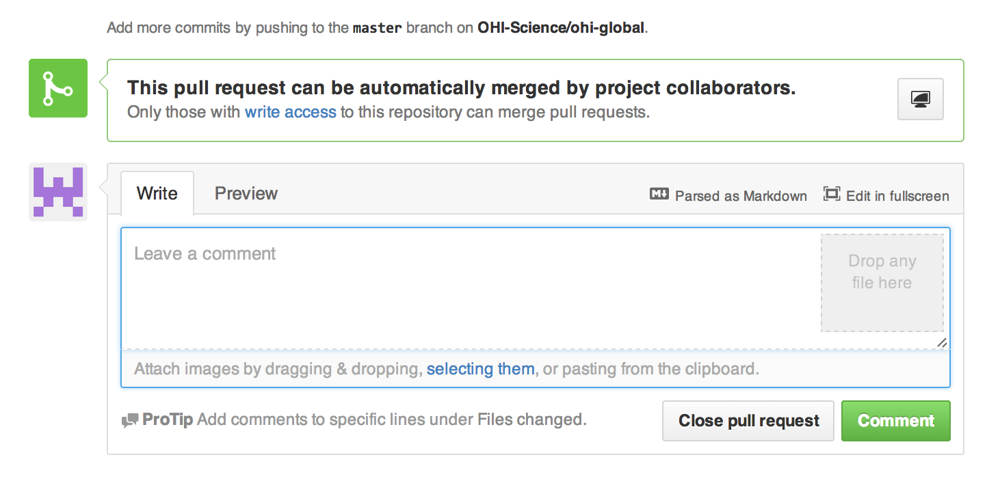
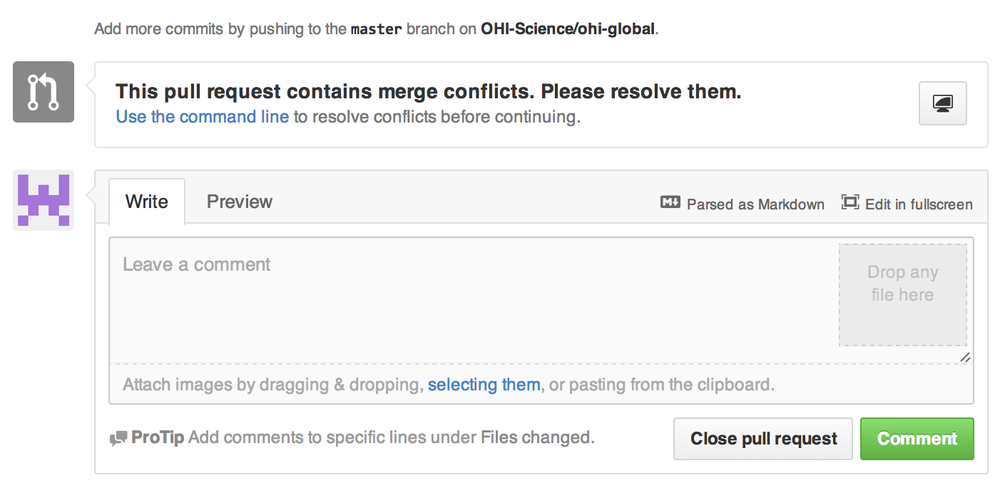
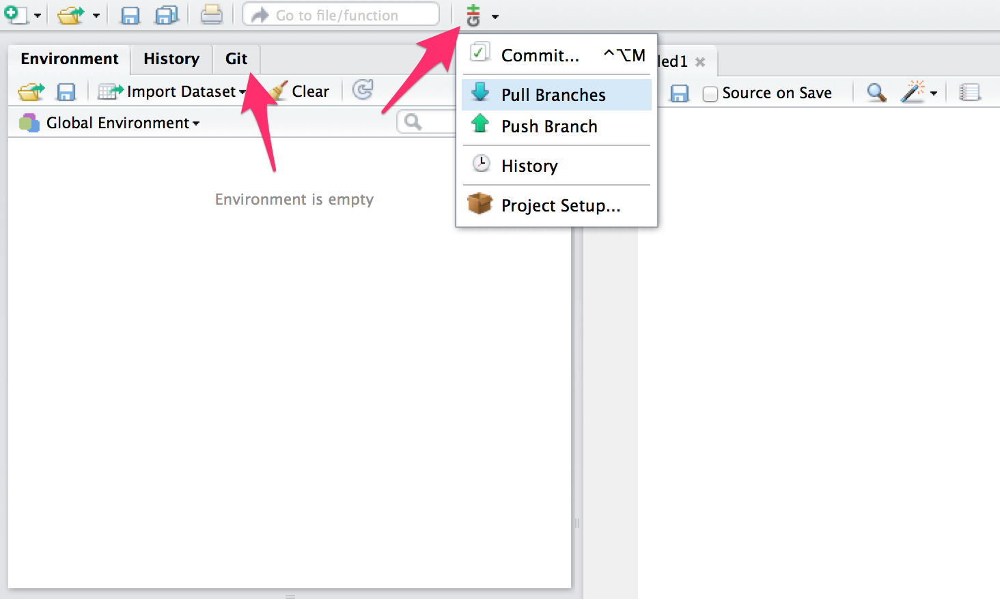

While you've been working on your forked repository locally on your
computer (ex: `remi-daigle/ohi-global`), there may be committed updates
in the owner's repository that is 'upstream' (ex:
`OHI-Science/ohi-global`). To ensure that you are working with the most
updated repository, you need to update your fork by creating a **pull
request**. See some tips on process
[here](https://github.com/OHI-Science/ohiprep/wiki/Using-GitHub#process).

Updating your fork
------------------

To do this on the command line, see
[help.github.com](https://help.github.com/articles/syncing-a-fork).

To do this through Github:

1.  Go to the repository ('repo') belonging to the project owner
    'upstream'. In this example, the owner is called `OHI-Science` and
    the repo is `ohi-global`. Note that there are recent updates by user
    Melsteroni. To pull the most recent version of `ohi-global` from
    `OHI-Science`, click on the green button.

> 

1.  You will need to sync forks (the default is to sync branches).

> 

1.  Change the base fork to your repo: in this example it is
    `remi-daigle\ohi-global`. The head fork is the owner's repo:
    `OHI-Science\ohi-global`. You can see those most recent commits by
    Melsteroni. Now you can click 'Create pull request'.

> 

**Note:**

-   when the base fork and head fork are identified, we are in the
    forked repo \`remi-daigle/ohi-global'. It is also possible to create
    a pull request the the head fork from this location.

-   if that if you get an error *There isn't anything to compare*, make
    sure you are still comparing forks, not branches.

> 

1.  Enter a Title and a comment, when then allows you to click *Create
    pull request*

> 

1.  Scolling down on the next screen, you should either see:

-   that you have been granted access 
-   that you must request permission before merging
-   you will be notified once you have been granted permission; then
    continue to step 6 below
-   that you must resolve conflicts before merging 
-   to resolve these conflicts, follow instructions from
    [OHI-Science](https://github.com/OHI-Science/ohiprep/wiki/Using-GitHub#resolving-conflicts).

1.  Once your repo on on github.com is has been updated, you can pull
    your updated fork to your workspace in RStudio either from the Git
    pulldown menu or from the Git tab. 
