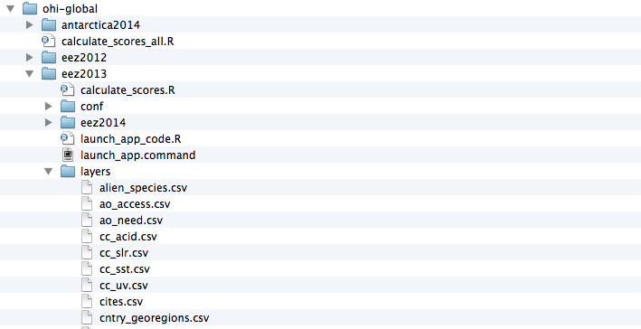
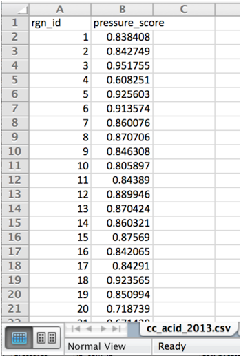

# Step_4 File System

## File System
Within the ohi-global folder is a folder called eez2013 which contains all the data, functions and other files required to calculate the Ocean Health Index. The default data and models are from the global 2013 analysis. To calculate the Index for a different region or with new data or models, the user will modify the files within this folder.

### eez2013
Each of the elements (files and folders) within ohi-global/eez2013 are critical to the proper functioning of the Toolbox App.

*OHI Toolbox file systems on a Mac. Note that on a Mac, launch_App.command is how to run the Toolbox App by double-clicking, and on a PC, launchApp.bat is the correct file to double-click.*

### launchApp.command (for Mac), launchApp.bat (for Windows)
After the eez2013 folder has been installed on the user’s computer, further launches of the App can be done without the software program R. Instead, PC users can double-click the 'launchApp.bat' file and Mac users can double-click the ‘launchApp.command’ file.  It is also possible to relaunch the App using the instructions above in ‘Launching the Toolbox App’.

### launchApp_code.R
The App can also be launched through R by running the code in lauchApp_code.R. 

### layers.csv
layers.csv is the registry that manages all data to be called by the Toolbox App. 

The first eight columns (columns A-H) contain information inputted by the user; other columns are generated later by the Toolbox App as it confirms data formatting and content. Each row of information represents a specific data layer. Columns A-H have the following information:

 + **targets:** indicates how the data layer related goals or dimensions. Goals are indicated with two-letter codes and sub-goals are indicated with three-letter codes, with pressures, resilience, and spatial layers indicated separately
 + **layer:** is the identifying name of the data layer, which will be used in R scripts like functions.R and .csv files like pressures_matrix.csv and resilience_matrix.csv. This is also displayed on the Toolbox App under the drop-down menu when the variable type is ‘input layer’.
 + **name:** is a longer title of the data layer; this is displayed on the Toolbox App under the drop-down menu when the variable type is ‘input layer’.
 + **description:** is further description of the data layer; this is also displayed on the Toolbox App under the drop-down menu when the variable type is ‘input layer’.
 + **citation:** is for book-keeping purposes, indicating where to find further information about the layer from the supplemental information of the 2012 Nature publication.
 + **units:** importantly describes which field (column header) is the value from the data layer.
 + **filename:** is the .csv filename that holds the data layer information, and is located in the folder called ‘layers’.
 + **fld_value:** indicates the units along with the units column.
 
### layers folders
The layers folder contains every data layer as an individual .csv file. The names of the .csv files within the layers folder correspond to those listed in the filename field of the layers.csv file described above.

Note that each file has a specific format that the Toolbox expects and requires in order to run properly. Comma separated value files (.csv files) can be opened with text editor software, or will open by default by Microsoft Excel (if it is installed). Below is an example of proper data formatting using the file cc_acid_2013.csv. Note the unique region identifier (rgn_id) with a single associated pressure_score, and that the data are presented in ‘long format’ with minimal columns. Please see HowTo_FormatDataForToolbox (available from ohi-science.org) for further details and instructions on data formatting requirements.

### scenario.R
scenario.R is a script in R that identifies which data layers and models should be used to calculate OHI scores using the Toolbox App. This combination of data layers, models, and all supporting files are called a ‘scenario’. Currently, the default scenario is using Global 2013 assessment files, and is the folder within ohi-global, called eez2013. When conducting regional assessments, the best way to start is by copying the folder eez2013, renaming it to indicate the desired study area, and changing the working directory within the scenario.R file to identify that folder. The name of the folder should begin with ‘scenario.’, and indentify the year of study. For example, if conducting a California regional assessment, the folder could be named scenario.California2014, and has all the contents identical to the original eez2013 folder, and in scenario.R, the third line would be changed to read:

> Users/jstewart/ohi-california

### scores.csv
scores.csv is a record of the calculated scores for the assessment (Global 2013 scores). Scores are reported for each dimension (future, pressures, resilience, score, status, trend) for each reporting region, and are presented in ‘long’ format. 

### conf folder
This folder includes includes R functions (config.R and functions.R) and .csv files containing information that will be accessed by the R functions (goals.csv, pressures_matrix.R, resilience_matrix.csv, and resilience_weights.csv).

 + **config.R:** is an R script that configures labeling and constants appropriately.
 + **functions.R:**  contains functions for each goal and sub-goal model, which calculate the status and trend using data layers identified as ‘layers’ in layers.csv. 
 + **goals.csv:** is a list of goals and sub-goals and their weights used to calculate the final score for each goal. Other information includes the goal description that is also presented in the Toolbox App. Changing goal weights will be done here by editing the value in the ‘weight’ column. Weights do not need to be 0-1 or add up to 10; weights will be scaled as a percentage of the goal totals. Goals can be removed by setting the weight to 0.
goals.csv also indicates the arguments passed to functions.R. These are indicated by two columns: preindex_function (functions for all goals that do not have sub-goals, and functions for all sub-goals) and postindex_function (functions for goals with sub-goals). 
 + **pressures_matrix.csv:** describes the layers (‘layers’ column in layers.csv) needed to calculate pressure categories. The matrix has weights assigned that were determined by Halpern et al. 2012 (Nature) based on scientific literature and expert opinion. Please see the OHI Conceptual Guide, HowTo_CalculatePressures and HowTo_CalculateResilience for more details. 
 + **resilience_matrix.csv:** describes the layers (‘layers’ column in layers.csv) needed to calculate resilience categories.  Please see the OHI Conceptual Guide, HowTo_CalculatePressures and HowTo_CalculateResilience for more details. 
 + **resilience_weights.csv:** describes the weight of various resilience layers, were determined by Halpern et al. 2012 (Nature) based on scientific literature and expert opinion.

### spatial folder 
The spatial folder contains components of shapefiles to delineate the 2013 OHI reporting regions that are created and read by spatial analysis software like ESRI’s ArcGIS. When conducting regional assessments, the files within this folder will need to be replaced by new files created for the study area and regions. See an example below in ‘Scenarios’. 

