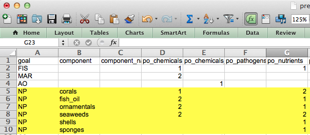

# Calculate regional assessment scores

\*\* **Note: this page is under development**

It is at this point that it is possible to incorporate all of the decisions your team has made into the OHI framework:

* Goals:
    + which goals to include? 
    + how will the goals be weighted?
* Spatial scale:
    + what are the regions within the study area?
* Data:  
    + which data layers can be updated?
    + which data layers must be changed to develop new goal models?
* Goal models:
    + develop any goal models with the best available data
    
Understanding how the Toolbox is structured can help identify what must be modified for a regional assessemt, particularly with data and models.      

## Modifying and registering data layers
Become familiar with the layers that are included in the global OHI assessment. Each data layer is saved as a separate *.csv* file in the `layers` folder. 
  
- updated data layers
- new data layers

- updating layers.csv

- updating pressures_matrix.csv

- updating resilience_matrix.csv

Troubleshooting: this error means you should update your pressures matrix because it expects there to be components that your region does not have: 

```
Running Setup()...
Calculating Pressures...
The following components for NP are not in the aggregation layer np_harvest_product_weight categories (fish_oil, ornamentals, seaweeds): corals, shells, sponges
Error in data.frame(names(P), P) : 
  arguments imply differing number of rows: 0, 1
```  
  
  >   

## Updating goal models
- functions.r

