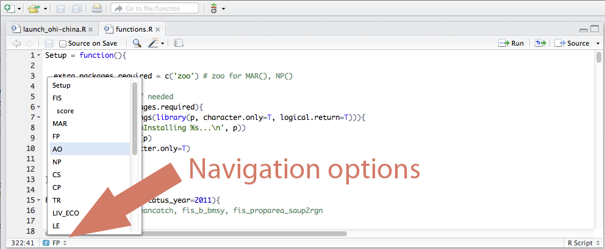
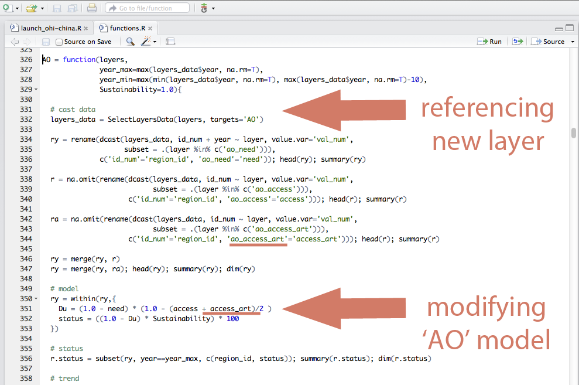
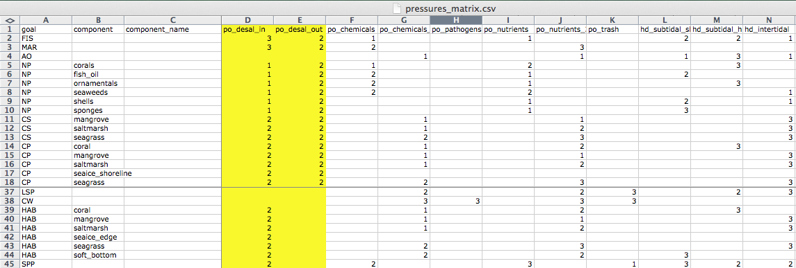
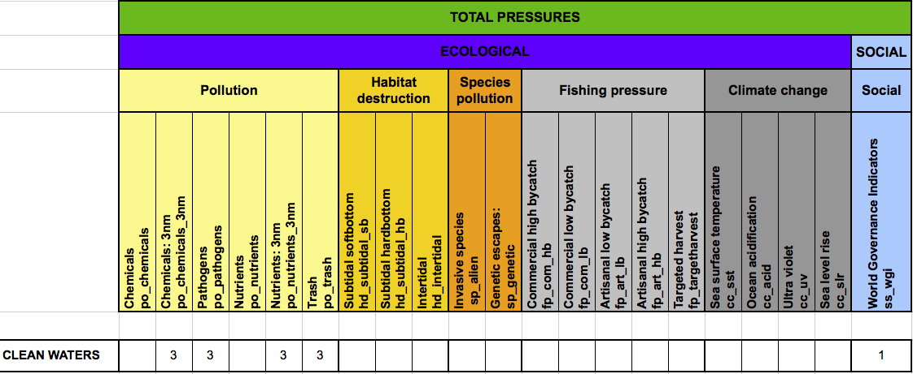

# Calculate regional assessment scores

\*\* **Note: this page is under development**

It is at this point possible to incorporate all of the decisions your team has made into the OHI framework.

First, you must learn how to appropriately [gather](https://github.com/OHI-Science/ohimanual/blob/master/tutorials/toolbox_manual/gathering_appropriate_data.md#gathering-appropriate-data) and [format](https://github.com/OHI-Science/ohimanual/blob/master/tutorials/toolbox_manual/formatting_data_for_toolbox.xlsx). Having a good understanding of how the Toolbox is structured can help identify what must be modified for a regional assessement, particularly with data and models.

## Overview

  1.  [Modifying existing data layers](https://github.com/OHI-Science/ohimanual/blob/master/tutorials/toolbox_manual/calculate_regional_assessment_score.md#modifying-existing-data-layers)
  
  2.  [Creating new data layers](https://github.com/OHI-Science/ohimanual/blob/master/tutorials/toolbox_manual/calculate_regional_assessment_score.md#creating-new-data-layers)

  3.  [Registering the layers](https://github.com/OHI-Science/ohimanual/blob/master/tutorials/toolbox_manual/calculate_regional_assessment_score.md#registering-goal-inputs)

  4.  [Updating goal models](https://github.com/OHI-Science/ohimanual/blob/master/tutorials/toolbox_manual/calculate_regional_assessment_score.md#updating-goal-models)

  5.  [Registering goal inputs](https://github.com/OHI-Science/ohimanual/blob/master/tutorials/toolbox_manual/calculate_regional_assessment_score.md#registering-goal-inputs) 

  6.  [Updating pressures and resilience matrix](https://github.com/OHI-Science/ohimanual/blob/master/tutorials/toolbox_manual/calculate_regional_assessment_score.md#updating-pressures-and-resilience-matrix)

## Modifying existing data layers
The default data layers to be modified for the regional assessment are located in the layers folder (as shown for the China assessment below), and each data layer is saved as a separate *.csv* file in the `layers` folder.

New data layers will be added, and old layers modified directly in this folder.

Suppose for instance that finer resolution data becomes available for the fisheries sub-goal during a regional evaluation; for example an improved B/Bmsy ratio for the 'Ablennes hians' species that was obtained through formal stock assessments and complex models developed for data-rich fisheries. The old ratios derived from the latest global assessment, say 1.03 in 2008 could then be replaced  with the new ratio, and the new score subsequently calculated.

## Creating new data layers
Suppose however that the methodology for a particular data layer needs to be modified, rather than data points just being updated as in the example above with the B/Bmsy ratio. In that case, a new data layer must be created, registered, and then updated the relevant goal models and pressure/resilience matrices.

  * To create a new data layer, simply create a new csv file in the layers folder, add the relevant data points, and save the file.  

  * In this case, additional 'access' data for the artisanal opportunities goal was added for each of the regions.

## Registering new data layers
Once the new data has been introduced into the appropriate layer file, it has to be registered as a new row in the layers.csv registry, which manages all the data that the Toolbox App uses:

Add a new row in the registry for the new data layer (example is highlighted in yellow), and fill in the first eight columns (columns A-H) as described below; other columns are generated later by the Toolbox App as it confirms data formatting and content.  

 + **targets:** Add the the goal/dimension that the new data layer relates to. Goals are indicated with two-letter codes and sub-goals are indicated with three-letter codes, with pressures, resilience, and spatial layers indicated separately
 + **layer:** Add an identifying name for the new data layer, which will be used in R scripts like functions.R and .csv files like pressures_matrix.csv and resilience_matrix.csv.
 + **name:** Add a longer title for the data layer.
 + **description:** Add a longer description of the new data layer.
 + **fld_value:** indicates the units along with the units column.
 + **units:** importantly describes which field (column header) is the value from the data layer.
 + **filename:** Add a filename for the new data layer that matches the name of the csv file that was created previously in the 'layers' folder.
 + **fld_id_num:** Area designation that applies to the newly created data layer, such as: *rgn_id* and *fao_id*.

## Updating goal models
Running the Toolbox App once the new data layer is created and registered will allow R to read the new layer. The new data however will not be incorporated into the goal calculations unless the goals and models are themselves modified to include the new variable. It will therefore now be necessary to update the models and goals for which the new data layers were created. 

To do so, open the `functions.R` file in RStudio, which contains the functions for each goal and sub-goal model and has a navigation pane that can be used to navigate around the page:

If the AO (Artisanal Opportunities) option is selected for example, the user is redirected to the the AO section that contains the AO models and references to the data layers (in layers folder) that are used to calculate the status and trend. 

In other words, changes in **# cast data** allows the models to call on new layers, whereas changes in **# model** allows you to change the model.  

## Registering goal inputs
goals.csv: is a list of goals and sub-goals and their weights used to calculate the final score for each goal. Other information includes the goal description that is also presented in the Toolbox App.

Changing goal weights will be done here by editing the value in the ‘weight’ column. Weights do not need to be 0-1 or add up to 10; weights will be scaled as a percentage of the goal totals. Goals can be removed by setting the weight to 0. goals.csv also indicates the arguments passed to functions.R. These are indicated by two columns: preindex_function (functions for all goals that do not have sub-goals, and functions for all sub-goals) and postindex_function (functions for goals with sub-goals).

- Also, see: [update goals.csv](https://github.com/OHI-Science/ohimanual/blob/master/tutorials/toolbox_manual/update_goals.md#update-goalscsv)

## Updating pressures and resilience matrix

Updating (adding, modifying, and/or removing) pressures and resilience can be done in the relevant folders shown below.

- **pressures_matrix.csv:** Describes the layers (‘layers’ column in layers.csv) needed to calculate pressure categories. The matrix has weights assigned that were determined by Halpern et al. 2012 (Nature) based on scientific literature and expert opinion.

- **resilience_matrix.csv:** Describes the layers (‘layers’ column in layers.csv) needed to calculate resilience categories. for more details.

- **resilience_weights.csv:** Describes the weight of various resilience layers that were determined by Halpern et al. 2012 (Nature) based on scientific literature and expert opinion.

### Example: Adding 'desalination' pressure
Suppose for instance that a research group wished to include additional pressures that were excluded from the previous analysis such as the effects of desalination operations. To do so, first create and register the necessary new layers (for example: po_desal_in_china2014, and po_desal_in_china2014) as described [previously](https://github.com/OHI-Science/ohimanual/blob/master/tutorials/toolbox_manual/calculate_regional_assessment_score.md#creating-new-data-layers).

Then register the new layer in the pressure_matrix.csv and indicate how much the pressure affects the respective goals based on scientific literature and expert opinion (3=high pressure, 1=low pressure).

Notice that the pressures are grouped by category, indicated by a pre-fix (for example: po_ for pollution). Each category is calculated in a different way, so it is important to register the new pressure with the appropriate category pre-fix.

See: [calculate_pressures](https://github.com/OHI-Science/ohimanual/blob/master/tutorials/toolbox_manual/calculating_pressures.xlsx) for more details about calculating pressures.

Also See: [calculate_resilience](https://github.com/OHI-Science/ohimanual/blob/master/tutorials/toolbox_manual/calculating_resilience.xlsx) for more details about calculating resilience.

Once the changes have been added and regisered appropriately, save all changes (r.functions, )
